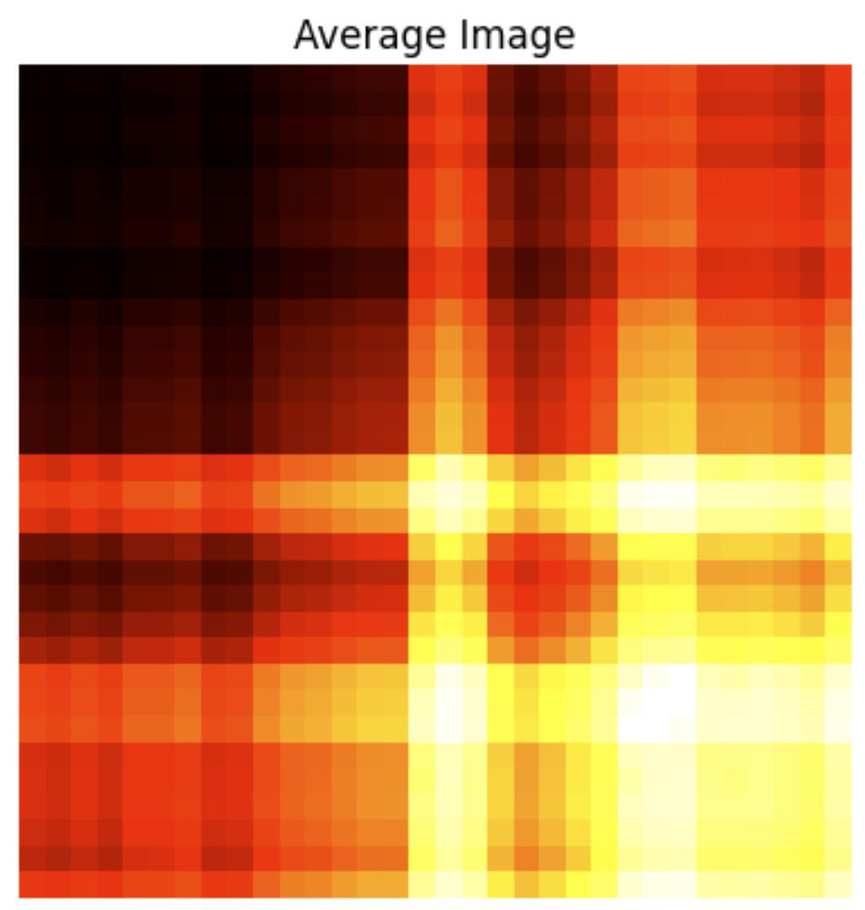
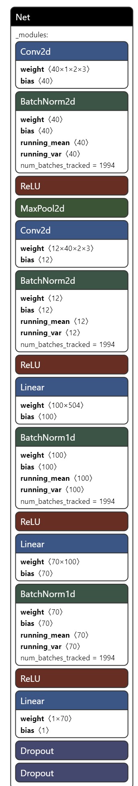

## Convolutional Neural Network to predict next day share price from a stock price time series

  

## Preface
This work in progress project focuses on using CNNs to predict the next-day share price of financial assets. So far GAF-encoded images as inputs have resulted in average prediction accuracy. These results suggest the temporal correlation between each pair of prices in the series in the form of GAF-encoded inputs may not be sufficiently robust to capture the temporal structure of prices.

You can follow the journey in this [blog](https://tapgaze.com/blog/neural-networks-and-gap-risk-in-finance).

---------------------------------------------

## Description
We train and optimize the hyperparameters for a LeNet5-design Neural Network to predict the next-day share price.
We test the model with the share price time series of the Sylicon Valley Bank for the period before and after bankruptcy. We then run evaluation on the Silvergate Bank stock time series.
The repo runs on python and leverages available pytorch libraries.

The share prices' day Low, High, Close, Open, Adjusted Close time series are encoded into 32x32 images using [pyts Gramian angular field (GAF)](https://pyts.readthedocs.io/en/stable/auto_examples/image/plot_single_gaf.html) to obtain a temporal correlation between each pair of prices in the series.
Render of a GAF 32-day share price time series window for each feature.

Render average GAF images:

A stack of 32x32 images with shape (5, 491, 32, 32) would represent each of the 5 share price features' time series. Each image represents a time series window of 32 days. I slide each window by 1 day from Ti to T(len time series -33) hence obtaining 491 time series windows or GAF images for each feature.

The actual share price for each window is its the next day share price.

## DATA
I use [Yahoo Finance](https://pypi.org/project/yfinance/) python package and historical daily share price database.

### Time series input/target data - Diagrams mostly generated by chatgpt😁!
As an example, for each of the 5 features (Close, High, etc) we have 524 (491+33) days of prices:

I slide each window by 1 day starting at Ti to T(i+32) hence obtaining 32 windows each containing 491 days.

<b>Sliding Window Process For Each Feature</b>

The time series within each window of each feature is the chunked in 32 data points, where each chunk is subsequent to the prior (i.e. there is no rolling window here). For example, for a time series of 524 data points, each window has 15 chunks (491/32=15) where 491=524-32-1 (the 1 is the last label). This produces 480 chunks per feature (32 windows * 15 chunks).

The chunks are encoded into GAF images which are the inputs to the network. The actual price (target) for each chunk is the price of the next day for that chunk.

Each image represents a time series window of 32 days but has 32x32=1024 data points (pixels) because GAF obtain a temporal correlation between each pair of prices in the series - a grid of prices.

## MODEL 
A LeNet5-design based Convolutional Neural Network visualized on Nitro:

The choice of model used leverages prior work and there is no other particular reason but to test the concept.

## ON-GOING RESULTS

username and password: visitor

## ACKNOWLEDGEMENTS
I found this [repo](https://github.com/ShubhamG2311/Financial-Time-Series-Forecasting) insightful to get started with time series image encoding.
