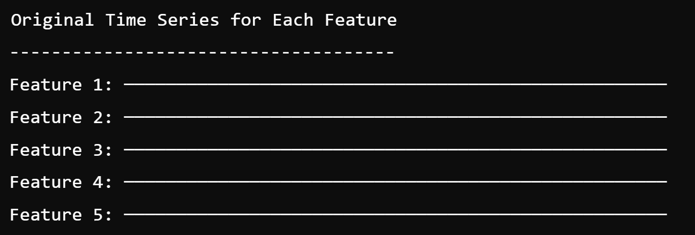
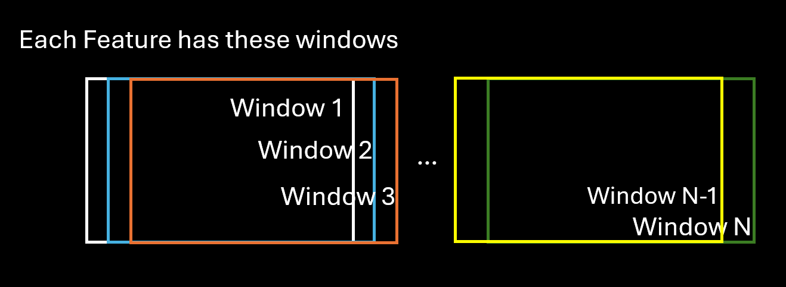
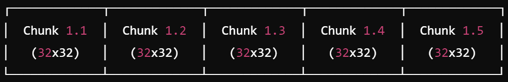
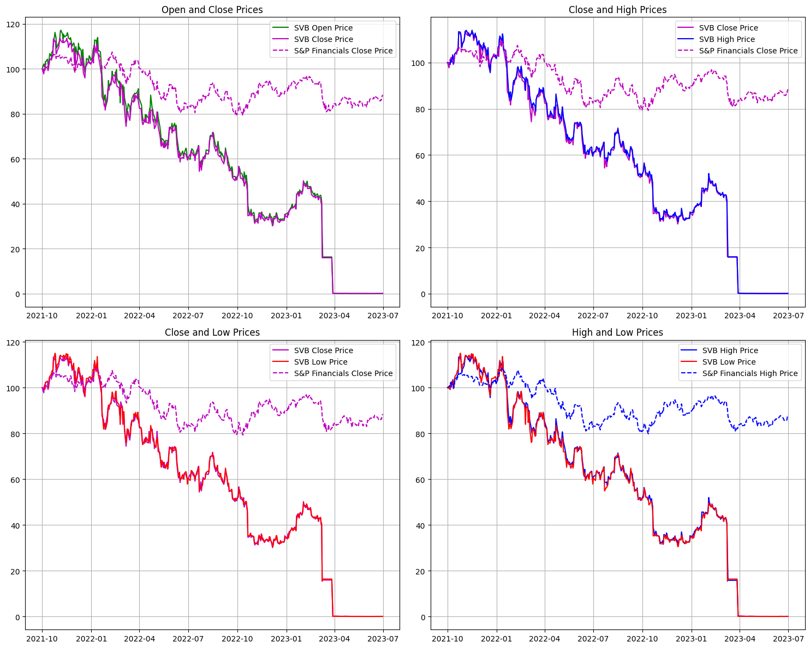

## Convolutional Neural Network with Bayesian hyperparameter optimization to predict next day share price from a stock price time series

Work In Progress

## Preface
This is the enhanced end project for a [6-month Professional Certification at Imperial Business School on Machine Learning and Artificial Intelligence](https://execed-online.imperial.ac.uk/professional-certificate-ml-ai) that I completed in June 2024.

It is work in progress and focuses on using CNNs to predict the next-day share price of financial assets. Bayesian optimization helps narrowing the search space to evaluate hyperparameters. Unfortunately, GADF-encoded images as inputs has resulted in low prediction accuracy. These results suggest the temporal correlation between each pair of prices in the series in the form of GADF-encoded inputs is not sufficiently robust to capture the temporal structure of prices. 

---------------------------------------------

## Description
I train and optimize the hyperparameters for a LeNet5-design based Convolutional Neural Network to predict the next-day share price.
I test the model with the share price time series of the Sylicon Valley Bank for the period before and after bankruptcy.
The repo runs on python and leverages available pytorch libraries.

The share prices' day Low, High, Close, Open, Adjusted Close time series are encoded into 32x32 images using [pyts summation Gramian angular field (GAF)](https://pyts.readthedocs.io/en/stable/auto_examples/image/plot_single_gaf.html) to obtain a temporal correlation between each pair of prices in the series.
Render of a GAF 32-day share price time series window for each feature:

Render average of the above GAF images:

I generate a stack of 32x32 images with shape (5, 491, 32, 32) which represents each of the 5 share price features' time series. Each image represents a time series window of 32 days. I slide each window by 1 day from Ti to T(len time series -33) hence obtaining 491 time series windows or GAF images for each feature.

The actual share price for each window is its the next day share price. 

The image dataset is split [80/20] into training/testing datasets.
The CNN is trained in mini-batches of 10 windows for each of the 5 features.

## DATA
I use [Yahoo Finance](https://pypi.org/project/yfinance/) python package and historical daily share price database for the period 2021-10-01 to 2023-12-01.

### Time series input/target data - Diagrams mostly generated by chatgpt😁!
For each of the 5 features (Close, High, etc) we have 524 (491+33) days of prices:

I slide each window by 1 day starting at Ti to T(i+32) hence obtaining 32 windows each containing 491 days.

<b>Sliding Window Process For Each Feature</b>

The time series within each window of each feature is the chunked in 32 data points, where each chunk is subsequent to the prior (i.e. there is no rolling window here). For example, for a time series of 524 data points, each window has 15 chunks (491/32=15) where 491=524-32-1 (the 1 is the last label). This produces 480 chunks per feature (32 windows * 15 chunks).

The chunks are encoded into GAF images which are the inputs to the network. The actual price (target) for each chunk is the price of the next day for that chunk.

Effectively, this process generates a stack of 32x32 images for each feature, which for four features we obtain the network input shape [(4, 480, 32, 32)]. 

Each image represents a time series window of 32 days but has 32x32=1024 data points (pixels) because GAF obtain a temporal correlation between each pair of prices in the series - a grid of prices.

### Data stack to train/test the model

We train the model with two inputs with the hope we can increase the learning of the model. Therefore, the model also expects two inputs to test it.

We observe the following correlation between these pairs of daily prices for SVB:
Correlation between Open and Close: 0.9985
Correlation between High and Low: 0.9992

Therefore, we use the images generated for Open and Close to train the model, and we use High and Low to test it.

## MODEL 
A LeNet5-design based Convolutional Neural Network which includes:
+ 1 Convolution Layer 1: It's output is processed through a Rectified Linear Unit ReLU activation function and Max Pool kernel.
+ 1 Convolution Layer 2: It's output is processed through a ReLU activation function and Max Pool kernel.
+ 1 Fully Connected Layer 1: It's output is processed through a ReLU activation function.
+ 1 Fully Connected Layer 2: It's output is processed through a ReLU activation function.
+ 1 Fully Connected Layer 3: It's output is processed through a ReLU activation function.
+ filter_size_1=(2, 2) applied to Convo 1
+ filter_size_2=(2, 3) applied to Max Pool
+ filter_size_3=(2, 3) applied to Convo 2
+ stride=2 for convo layers

The model incorporates drop out regularization on the fully connected layers.

The choice of model used leverages prior work and there is no other particular reason but to test the concept.

## HYPERPARAMETER OPTIMSATION
The repo optimizes the model's hyperparameters leveraging [BayesianOptimization library s_opt module](https://github.com/bayesian-optimization/BayesianOptimization).

I run up to 10,000 epochs and optimize the number of outputs for the Convolution Layer 1 and 2, learning rate and Dropout probability for 10 steps of bayesian optimization and steps of random exploration. See optimizer_results.txt for these results. The models are saved in /bayesian_optimization_saved_models:

    pbounds = {'output_conv_1': (40, 80), 'output_conv_2': (8, 16), 'learning_rate': (0.00001, 0.0001), 'dropout_probab': (0.0, 0.5), 'momentum': (0.8, 1.0)}

This is only an initial choice in the search space.

## RESULTS
# Summary of Results
The model predicts at low accuracy and mostly fails to converge to near zero loss when backpropagating, though the notebook's hyperparameters lead to convergence. Literature indicates a LetNet design is not optimal to fit the time series data as the model fails to capture temporal dependencies in time series data. Provided this results and the cost to run bayesian optimization it is not worth running further scenarios but explore alternatives.

# Bayesian Optimization
Bayesian optimization results helped to manually explore higher accuracy hyper-parameter and model parameters.

Best Bayesian optimization test dataset highest accuracy performance achieves accuracy of 3.125% at 2 d.p. of price for the output shown below. Bayesian simulations were run on an Azure Virtual Machine NC4as T4 v3 instance over four days.

    'params': {'dropout_probab': 0.49443054445324736, 'learning_rate': 7.733490889418554e-05, 'momentum': 0.8560887984128811, 'output_conv_1': 71.57117313805955, 'output_conv_2': 8.825808052621136}

# Highest Accuracy and Metrics
Bayesian optimization results helped me to manually explore hyper-parameters and model parameter optimal results: The model achieves percentage of predictions within:
2 decimal places: []%
1 decimal places: []%

    accuracy = (SUM(ABS(predicted_tensor - actual_tensor) <= decimal_place_target) / time series length)*100
    
    where decimal_place_target = decimal places targeted for accuracy, .e. 0.01

    'params': {'dropout_probab': 0, 'learning_rate': 0.0001, 'momentum': 0.9, 'output_conv_1': 40, 'output_conv_2': 12}

Actual vs Predicted:

GRAPH

A source for improvement may derive from running the network with log return inputs instead of outright prices.

## ACKNOWLEDGEMENTS
I thank [Yahoo Finance](https://pypi.org/project/yfinance/) for the time series data provided. I also thank for the inspiration [repo](https://github.com/ShubhamG2311/Financial-Time-Series-Forecasting), the [BayesianOptimization library s_opt module](https://github.com/bayesian-optimization/BayesianOptimization), and the clarity on RNNs advantages found [in this research paper](https://arxiv.org/pdf/1506.00019).
