<b>
==========Optimization Iteration==========
</b>

<b>transform_algo_type: 1 gaf_method: summation sample_range: (-1, 0) scaler: StandardScaler() dropout_probab: 0</b>
plot_price_comparison_stocks

quick_view_images

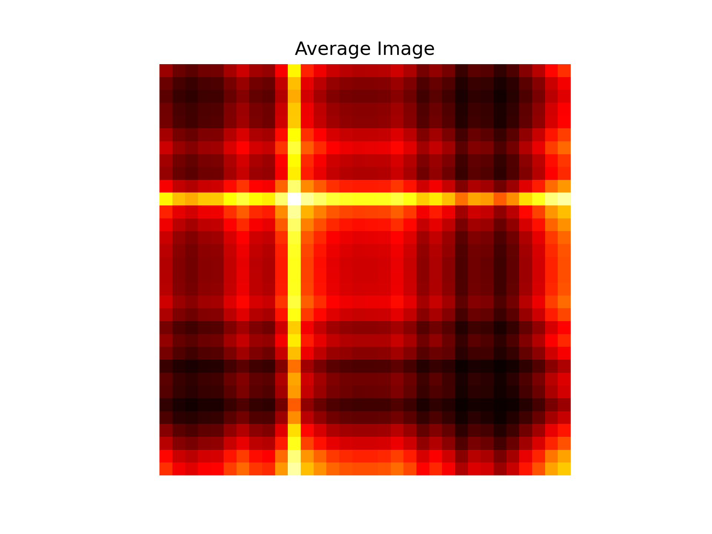Loss is less than 0.0001:9.36091091716662e-05 at 248. Stopping training.
error_pct_outside_iqr 0.0
Mean accuracy 2 decimal places: tensor([0.6696])% 
                Mean accuracy 1 decimal places: tensor([8.9286])% 
                 Percentage of predictions within 2 decimal places: tensor([[0.0000],
        [0.0000],
        [0.0000],
        [0.0000],
        [0.0000],
        [0.0000],
        [0.0000],
        [0.0000],
        [0.0000],
        [0.0000],
        [0.0000],
        [3.5714],
        [3.5714],
        [0.0000],
        [0.0000],
        [3.5714]])% 
                     1 decimal places: tensor([[ 7.1429],
        [ 3.5714],
        [ 0.0000],
        [17.8571],
        [ 7.1429],
        [ 7.1429],
        [ 3.5714],
        [ 7.1429],
        [ 7.1429],
        [14.2857],
        [14.2857],
        [ 7.1429],
        [14.2857],
        [14.2857],
        [ 7.1429],
        [10.7143]])%
scatter_diagram_onevar_plot_mean

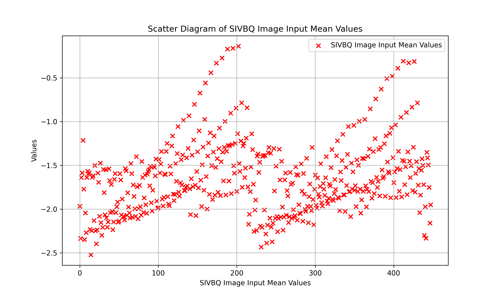Error Stats for SIVBQ
MAE: 0.6012429594993591
MSE: 0.573053240776062
RMSE: 0.7570028305053711
MAPE: 559.1763916015625
R2: 0.4258350729942322
<u>
==========Run External Stock Tests:==========
</u>
plot_price_comparison_stocks

quick_view_images

error_pct_outside_iqr 7.142857142857142
Mean accuracy 2 decimal places: tensor([0.6696])% 
                Mean accuracy 1 decimal places: tensor([8.2589])% 
                 Percentage of predictions within 2 decimal places: tensor([[0.0000],
        [0.0000],
        [0.0000],
        [0.0000],
        [0.0000],
        [0.0000],
        [0.0000],
        [0.0000],
        [0.0000],
        [3.5714],
        [0.0000],
        [0.0000],
        [0.0000],
        [0.0000],
        [7.1429],
        [0.0000]])% 
                     1 decimal places: tensor([[ 7.1429],
        [ 0.0000],
        [ 3.5714],
        [10.7143],
        [ 7.1429],
        [17.8571],
        [ 0.0000],
        [10.7143],
        [14.2857],
        [10.7143],
        [ 7.1429],
        [ 7.1429],
        [10.7143],
        [ 3.5714],
        [ 7.1429],
        [14.2857]])%
scatter_diagram_onevar_plot_mean

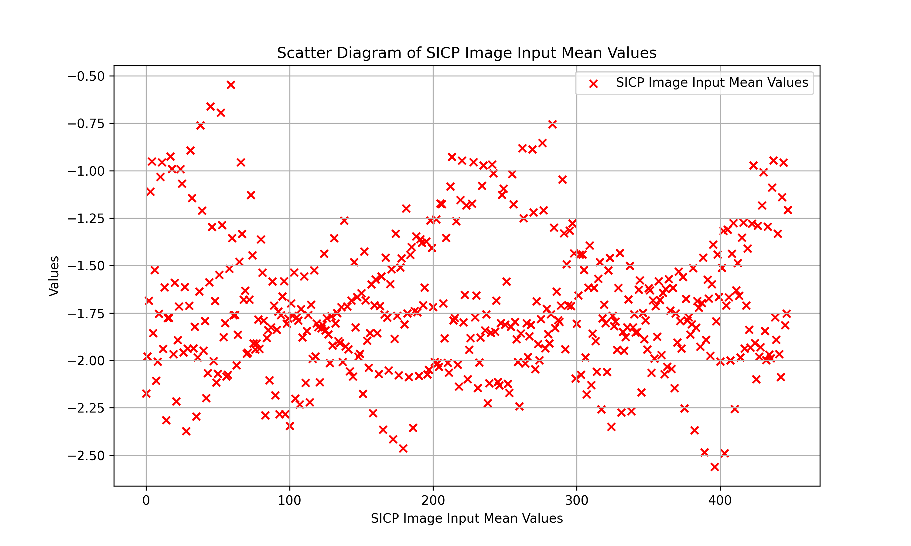Error Stats for SICP
MAE: 0.7398878335952759
MSE: 0.9036141633987427
RMSE: 0.950586199760437
MAPE: 283.7900390625
R2: 0.09638583660125732
scatter_diagram_twovar_plot_mean

plot_image_correlations

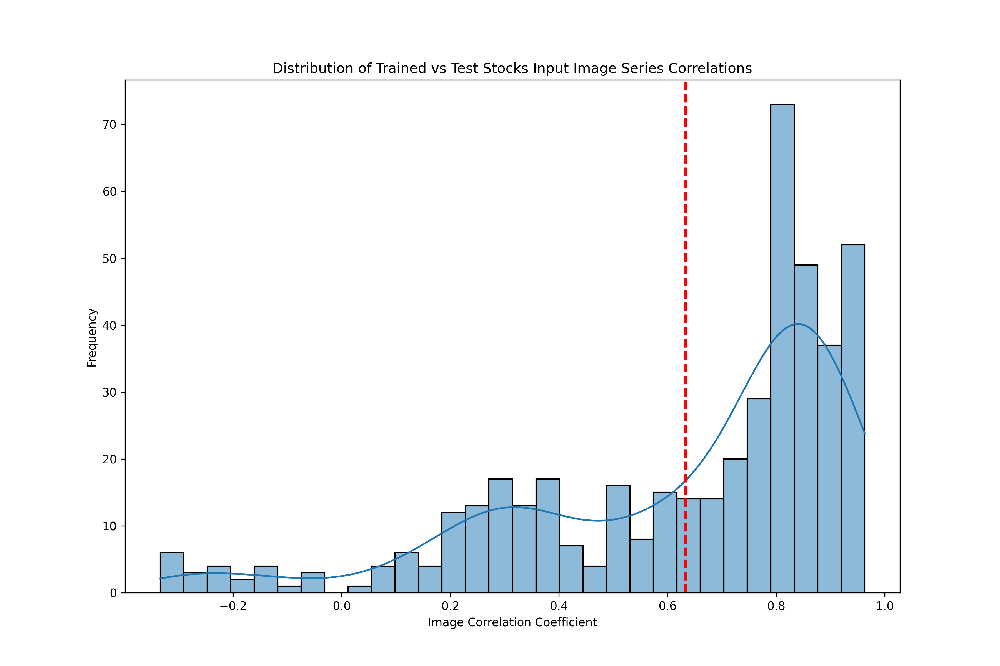<b>
==========Optimization Iteration==========
</b>

<b>transform_algo_type: 1 gaf_method: summation sample_range: (-1, 0.5) scaler: StandardScaler() dropout_probab: 0</b>
plot_price_comparison_stocks

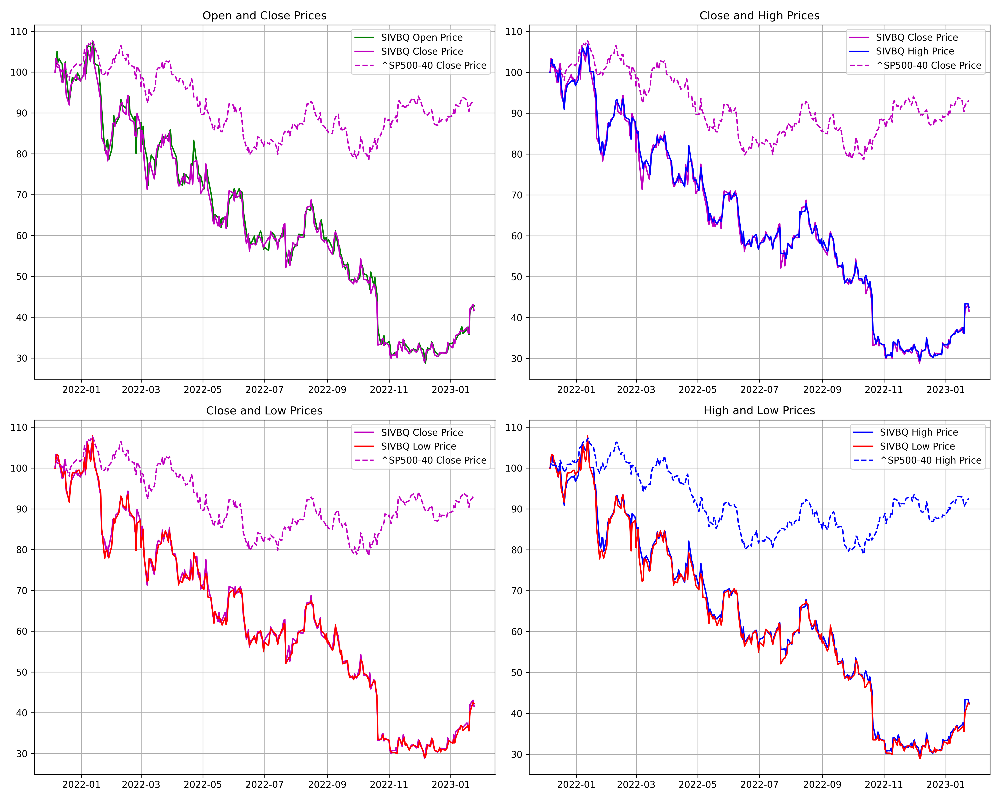quick_view_images

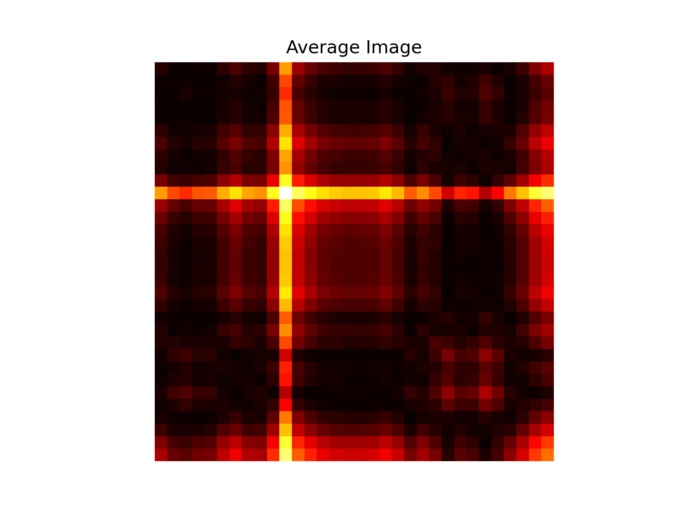Loss is less than 0.0001:9.983977361116558e-05 at 235. Stopping training.
error_pct_outside_iqr 0.0
Mean accuracy 2 decimal places: tensor([1.1161])% 
                Mean accuracy 1 decimal places: tensor([12.2768])% 
                 Percentage of predictions within 2 decimal places: tensor([[0.0000],
        [0.0000],
        [0.0000],
        [0.0000],
        [3.5714],
        [0.0000],
        [0.0000],
        [0.0000],
        [0.0000],
        [3.5714],
        [0.0000],
        [3.5714],
        [0.0000],
        [0.0000],
        [3.5714],
        [3.5714]])% 
                     1 decimal places: tensor([[ 7.1429],
        [ 3.5714],
        [17.8571],
        [ 3.5714],
        [14.2857],
        [14.2857],
        [21.4286],
        [14.2857],
        [ 7.1429],
        [ 7.1429],
        [17.8571],
        [14.2857],
        [ 3.5714],
        [17.8571],
        [10.7143],
        [21.4286]])%
scatter_diagram_onevar_plot_mean

Error Stats for SIVBQ
MAE: 0.5112919211387634
MSE: 0.39809587597846985
RMSE: 0.6309483647346497
MAPE: 413.0732421875
R2: 0.6011318564414978
<u>
==========Run External Stock Tests:==========
</u>
plot_price_comparison_stocks

quick_view_images

error_pct_outside_iqr 3.571428571428571
Mean accuracy 2 decimal places: tensor([0.6696])% 
                Mean accuracy 1 decimal places: tensor([10.2679])% 
                 Percentage of predictions within 2 decimal places: tensor([[0.0000],
        [0.0000],
        [7.1429],
        [0.0000],
        [0.0000],
        [0.0000],
        [0.0000],
        [0.0000],
        [0.0000],
        [0.0000],
        [0.0000],
        [3.5714],
        [0.0000],
        [0.0000],
        [0.0000],
        [0.0000]])% 
                     1 decimal places: tensor([[14.2857],
        [14.2857],
        [14.2857],
        [ 7.1429],
        [ 7.1429],
        [14.2857],
        [ 3.5714],
        [ 7.1429],
        [10.7143],
        [21.4286],
        [10.7143],
        [10.7143],
        [10.7143],
        [10.7143],
        [ 3.5714],
        [ 3.5714]])%
scatter_diagram_onevar_plot_mean

Error Stats for SICP
MAE: 0.7485824227333069
MSE: 0.883603572845459
RMSE: 0.940001904964447
MAPE: 273.45050048828125
R2: 0.11639642715454102
scatter_diagram_twovar_plot_mean

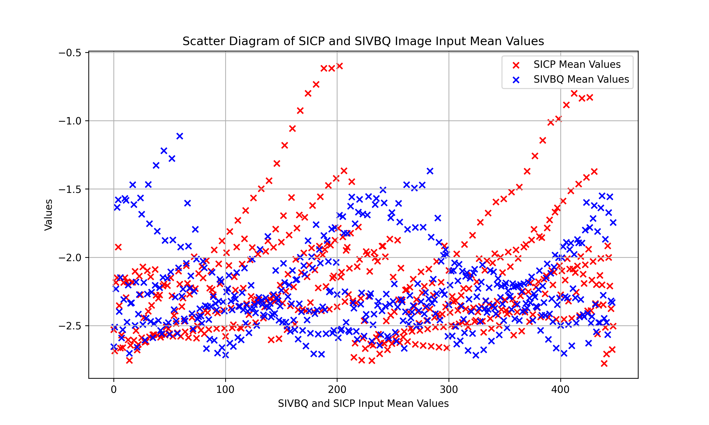plot_image_correlations

<b>
==========Optimization Iteration==========
</b>

<b>transform_algo_type: 1 gaf_method: summation sample_range: (-1, 1) scaler: StandardScaler() dropout_probab: 0</b>
plot_price_comparison_stocks

quick_view_images

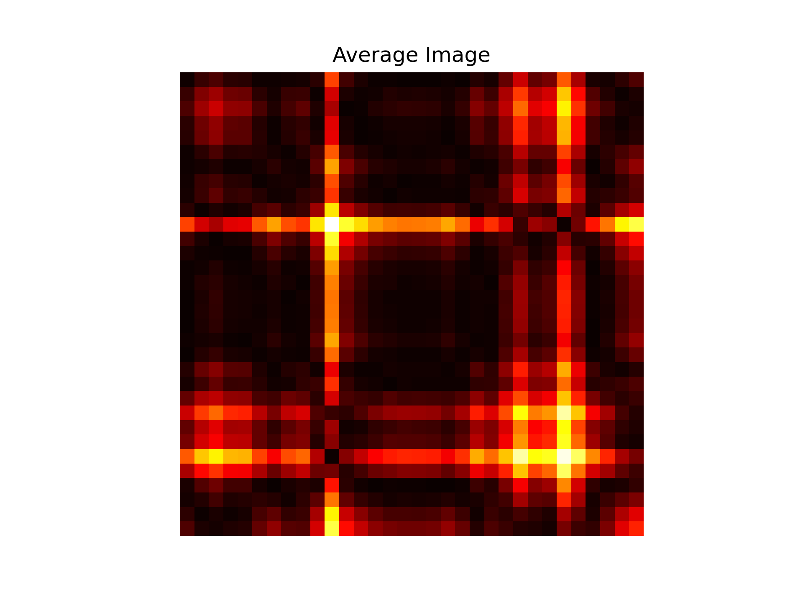Loss is less than 0.0001:9.604838851373643e-05 at 224. Stopping training.
error_pct_outside_iqr 0.0
Mean accuracy 2 decimal places: tensor([3.3482])% 
                Mean accuracy 1 decimal places: tensor([14.2857])% 
                 Percentage of predictions within 2 decimal places: tensor([[ 0.0000],
        [ 0.0000],
        [ 7.1429],
        [ 7.1429],
        [ 7.1429],
        [ 0.0000],
        [ 0.0000],
        [10.7143],
        [ 0.0000],
        [ 7.1429],
        [ 0.0000],
        [ 3.5714],
        [ 3.5714],
        [ 0.0000],
        [ 3.5714],
        [ 3.5714]])% 
                     1 decimal places: tensor([[10.7143],
        [ 7.1429],
        [14.2857],
        [ 7.1429],
        [28.5714],
        [10.7143],
        [14.2857],
        [17.8571],
        [ 7.1429],
        [25.0000],
        [14.2857],
        [25.0000],
        [14.2857],
        [17.8571],
        [10.7143],
        [ 3.5714]])%
scatter_diagram_onevar_plot_mean

Error Stats for SIVBQ
MAE: 0.46498480439186096
MSE: 0.3483051657676697
RMSE: 0.5901738405227661
MAPE: 392.2408447265625
R2: 0.6510191559791565
<u>
==========Run External Stock Tests:==========
</u>
plot_price_comparison_stocks

quick_view_images

error_pct_outside_iqr 3.571428571428571
Mean accuracy 2 decimal places: tensor([0.8929])% 
                Mean accuracy 1 decimal places: tensor([7.5893])% 
                 Percentage of predictions within 2 decimal places: tensor([[3.5714],
        [0.0000],
        [0.0000],
        [3.5714],
        [0.0000],
        [0.0000],
        [0.0000],
        [3.5714],
        [0.0000],
        [3.5714],
        [0.0000],
        [0.0000],
        [0.0000],
        [0.0000],
        [0.0000],
        [0.0000]])% 
                     1 decimal places: tensor([[10.7143],
        [ 7.1429],
        [ 0.0000],
        [10.7143],
        [10.7143],
        [ 7.1429],
        [ 7.1429],
        [10.7143],
        [ 7.1429],
        [10.7143],
        [ 3.5714],
        [ 7.1429],
        [ 0.0000],
        [ 7.1429],
        [14.2857],
        [ 7.1429]])%
scatter_diagram_onevar_plot_mean

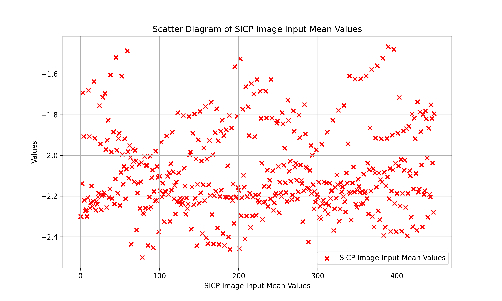Error Stats for SICP
MAE: 0.8546536564826965
MSE: 1.1747719049453735
RMSE: 1.0838689804077148
MAPE: 458.31451416015625
R2: -0.17477190494537354
scatter_diagram_twovar_plot_mean

plot_image_correlations

<b>
==========Optimization Iteration==========
</b>

<b>transform_algo_type: 1 gaf_method: summation sample_range: (-0.5, 0) scaler: StandardScaler() dropout_probab: 0</b>
plot_price_comparison_stocks

quick_view_images

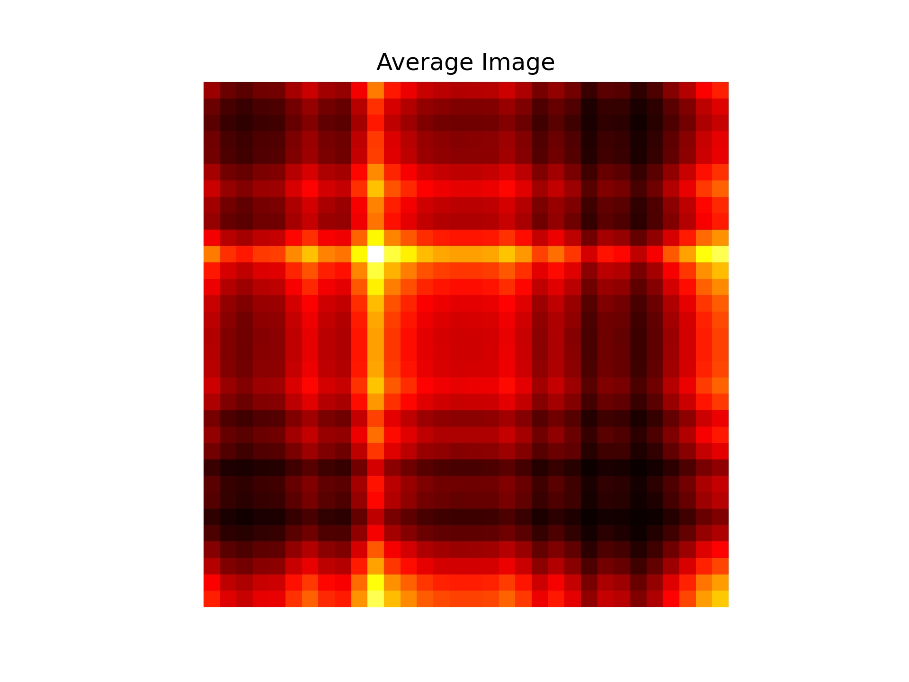Loss is less than 0.0001:9.453484381083399e-05 at 243. Stopping training.
error_pct_outside_iqr 0.0
Mean accuracy 2 decimal places: tensor([2.0089])% 
                Mean accuracy 1 decimal places: tensor([11.3839])% 
                 Percentage of predictions within 2 decimal places: tensor([[0.0000],
        [0.0000],
        [0.0000],
        [0.0000],
        [0.0000],
        [3.5714],
        [0.0000],
        [3.5714],
        [3.5714],
        [7.1429],
        [3.5714],
        [3.5714],
        [3.5714],
        [0.0000],
        [0.0000],
        [3.5714]])% 
                     1 decimal places: tensor([[ 7.1429],
        [ 0.0000],
        [10.7143],
        [ 7.1429],
        [14.2857],
        [ 7.1429],
        [ 0.0000],
        [14.2857],
        [14.2857],
        [17.8571],
        [10.7143],
        [ 7.1429],
        [25.0000],
        [21.4286],
        [14.2857],
        [10.7143]])%
scatter_diagram_onevar_plot_mean

Error Stats for SIVBQ
MAE: 0.5696433782577515
MSE: 0.5101924538612366
RMSE: 0.7142775654792786
MAPE: 523.0667724609375
R2: 0.48881781101226807
<u>
==========Run External Stock Tests:==========
</u>
plot_price_comparison_stocks

quick_view_images

error_pct_outside_iqr 0.0
Mean accuracy 2 decimal places: tensor([1.1161])% 
                Mean accuracy 1 decimal places: tensor([8.4821])% 
                 Percentage of predictions within 2 decimal places: tensor([[0.0000],
        [3.5714],
        [0.0000],
        [0.0000],
        [0.0000],
        [0.0000],
        [3.5714],
        [0.0000],
        [3.5714],
        [0.0000],
        [0.0000],
        [0.0000],
        [0.0000],
        [0.0000],
        [7.1429],
        [0.0000]])% 
                     1 decimal places: tensor([[ 7.1429],
        [ 7.1429],
        [ 7.1429],
        [ 7.1429],
        [10.7143],
        [14.2857],
        [ 7.1429],
        [ 3.5714],
        [10.7143],
        [ 7.1429],
        [ 7.1429],
        [ 3.5714],
        [ 0.0000],
        [17.8571],
        [14.2857],
        [10.7143]])%
scatter_diagram_onevar_plot_mean

Error Stats for SICP
MAE: 0.7331300377845764
MSE: 0.8443129658699036
RMSE: 0.9188650250434875
MAPE: 300.401611328125
R2: 0.15568703413009644
scatter_diagram_twovar_plot_mean

plot_image_correlations

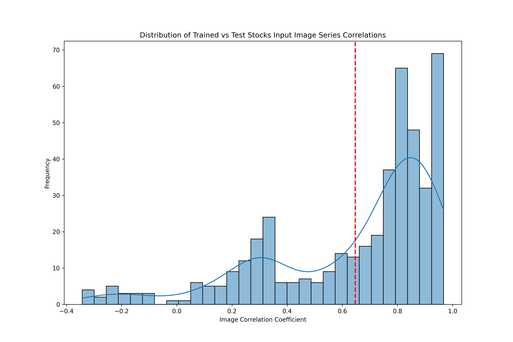<b>
==========Optimization Iteration==========
</b>

<b>transform_algo_type: 1 gaf_method: summation sample_range: (-0.5, 0.5) scaler: StandardScaler() dropout_probab: 0</b>
plot_price_comparison_stocks

quick_view_images

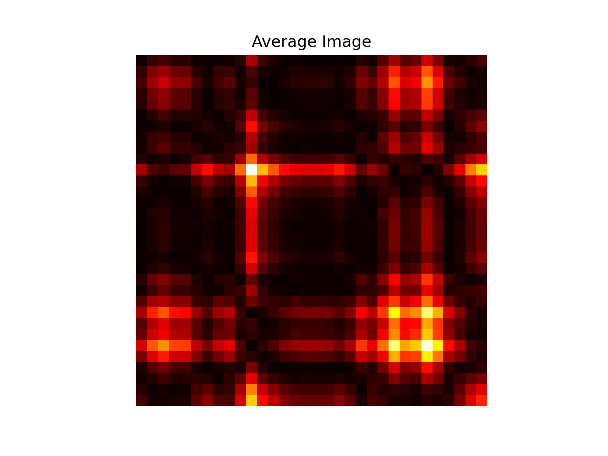Loss is less than 0.0001:9.976017463486642e-05 at 256. Stopping training.
error_pct_outside_iqr 0.0
Mean accuracy 2 decimal places: tensor([1.5625])% 
                Mean accuracy 1 decimal places: tensor([14.2857])% 
                 Percentage of predictions within 2 decimal places: tensor([[ 0.0000],
        [ 0.0000],
        [ 0.0000],
        [ 0.0000],
        [ 7.1429],
        [ 0.0000],
        [ 3.5714],
        [ 0.0000],
        [ 0.0000],
        [ 3.5714],
        [10.7143],
        [ 0.0000],
        [ 0.0000],
        [ 0.0000],
        [ 0.0000],
        [ 0.0000]])% 
                     1 decimal places: tensor([[21.4286],
        [ 3.5714],
        [ 3.5714],
        [14.2857],
        [10.7143],
        [ 7.1429],
        [ 3.5714],
        [25.0000],
        [17.8571],
        [21.4286],
        [14.2857],
        [17.8571],
        [17.8571],
        [25.0000],
        [17.8571],
        [ 7.1429]])%
scatter_diagram_onevar_plot_mean

Error Stats for SIVBQ
MAE: 0.4757740795612335
MSE: 0.35639289021492004
RMSE: 0.5969865322113037
MAPE: 373.6746520996094
R2: 0.6429157257080078
<u>
==========Run External Stock Tests:==========
</u>
plot_price_comparison_stocks

quick_view_images

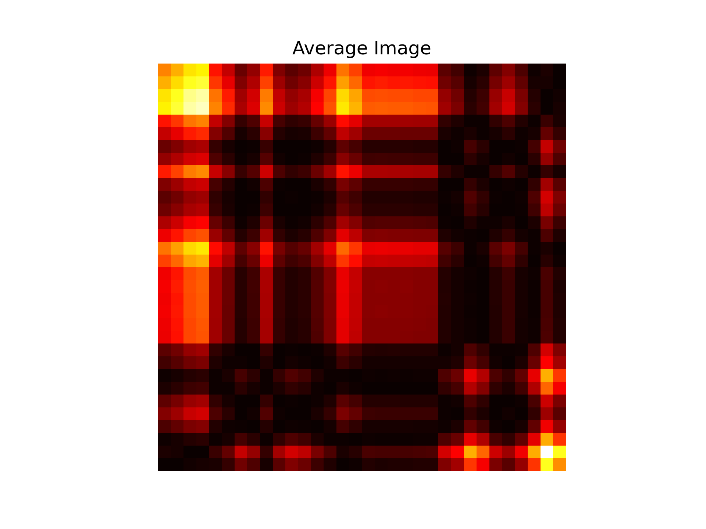error_pct_outside_iqr 0.0
Mean accuracy 2 decimal places: tensor([1.3393])% 
                Mean accuracy 1 decimal places: tensor([7.3661])% 
                 Percentage of predictions within 2 decimal places: tensor([[7.1429],
        [0.0000],
        [0.0000],
        [0.0000],
        [0.0000],
        [0.0000],
        [0.0000],
        [0.0000],
        [0.0000],
        [0.0000],
        [7.1429],
        [0.0000],
        [0.0000],
        [3.5714],
        [3.5714],
        [0.0000]])% 
                     1 decimal places: tensor([[ 7.1429],
        [ 7.1429],
        [ 0.0000],
        [ 7.1429],
        [ 7.1429],
        [ 0.0000],
        [ 3.5714],
        [ 3.5714],
        [10.7143],
        [ 7.1429],
        [21.4286],
        [ 3.5714],
        [ 7.1429],
        [10.7143],
        [14.2857],
        [ 7.1429]])%
scatter_diagram_onevar_plot_mean

Error Stats for SICP
MAE: 0.8163415193557739
MSE: 1.0675513744354248
RMSE: 1.0332237482070923
MAPE: 322.7098083496094
R2: -0.0675513744354248
scatter_diagram_twovar_plot_mean

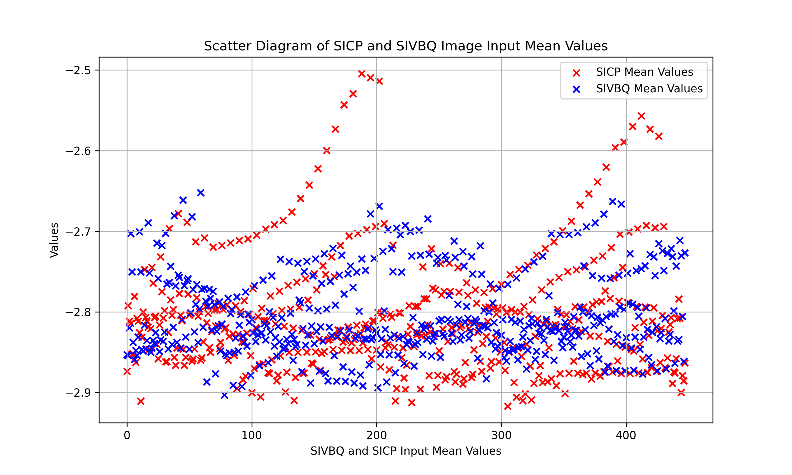plot_image_correlations

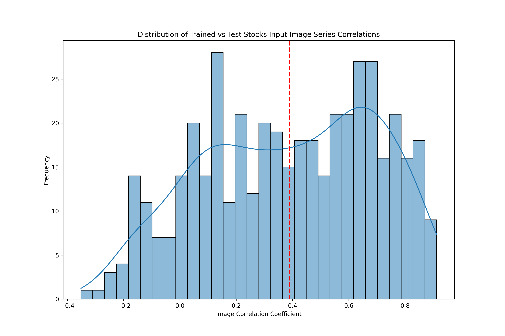<b>
==========Optimization Iteration==========
</b>

<b>transform_algo_type: 1 gaf_method: summation sample_range: (-0.5, 1) scaler: StandardScaler() dropout_probab: 0</b>
plot_price_comparison_stocks

quick_view_images

Loss is less than 0.0001:9.469185897614807e-05 at 250. Stopping training.
error_pct_outside_iqr 7.142857142857142
Mean accuracy 2 decimal places: tensor([1.1161])% 
                Mean accuracy 1 decimal places: tensor([13.3929])% 
                 Percentage of predictions within 2 decimal places: tensor([[0.0000],
        [0.0000],
        [0.0000],
        [0.0000],
        [3.5714],
        [0.0000],
        [3.5714],
        [0.0000],
        [0.0000],
        [0.0000],
        [7.1429],
        [0.0000],
        [0.0000],
        [0.0000],
        [3.5714],
        [0.0000]])% 
                     1 decimal places: tensor([[ 3.5714],
        [ 7.1429],
        [ 7.1429],
        [14.2857],
        [17.8571],
        [10.7143],
        [10.7143],
        [10.7143],
        [14.2857],
        [ 7.1429],
        [21.4286],
        [21.4286],
        [14.2857],
        [17.8571],
        [14.2857],
        [21.4286]])%
scatter_diagram_onevar_plot_mean

Error Stats for SIVBQ
MAE: 0.5507135987281799
MSE: 0.48518043756484985
RMSE: 0.6965489387512207
MAPE: 433.9670104980469
R2: 0.513878345489502
<u>
==========Run External Stock Tests:==========
</u>
plot_price_comparison_stocks

quick_view_images

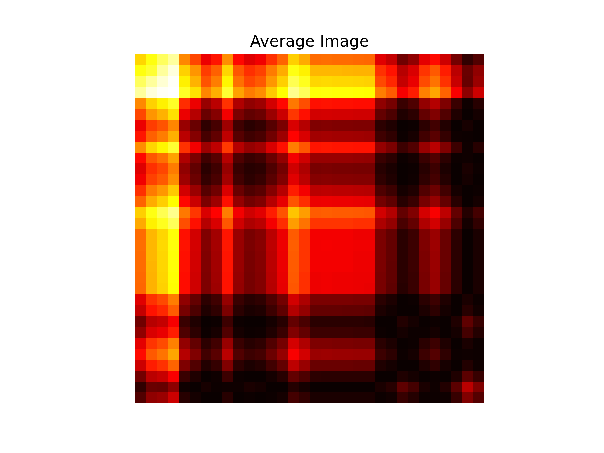error_pct_outside_iqr 7.142857142857142
Mean accuracy 2 decimal places: tensor([0.6696])% 
                Mean accuracy 1 decimal places: tensor([7.5893])% 
                 Percentage of predictions within 2 decimal places: tensor([[0.0000],
        [0.0000],
        [0.0000],
        [0.0000],
        [3.5714],
        [0.0000],
        [0.0000],
        [0.0000],
        [0.0000],
        [0.0000],
        [0.0000],
        [0.0000],
        [0.0000],
        [3.5714],
        [0.0000],
        [3.5714]])% 
                     1 decimal places: tensor([[ 7.1429],
        [ 3.5714],
        [ 7.1429],
        [ 0.0000],
        [14.2857],
        [ 7.1429],
        [ 7.1429],
        [ 7.1429],
        [ 7.1429],
        [ 3.5714],
        [ 3.5714],
        [14.2857],
        [ 3.5714],
        [14.2857],
        [10.7143],
        [10.7143]])%
scatter_diagram_onevar_plot_mean

Error Stats for SICP
MAE: 0.8698659539222717
MSE: 1.204187035560608
RMSE: 1.097354531288147
MAPE: 296.12432861328125
R2: -0.2041870355606079
scatter_diagram_twovar_plot_mean

plot_image_correlations

<b>
==========Optimization Iteration==========
</b>

<b>transform_algo_type: 1 gaf_method: summation sample_range: (0, 0.5) scaler: StandardScaler() dropout_probab: 0</b>
plot_price_comparison_stocks

quick_view_images

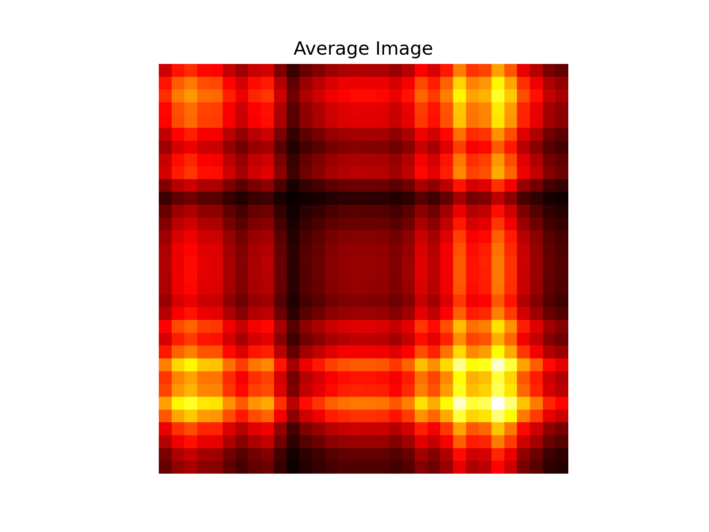Loss is less than 0.0001:9.962833428289741e-05 at 262. Stopping training.
error_pct_outside_iqr 0.0
Mean accuracy 2 decimal places: tensor([0.8929])% 
                Mean accuracy 1 decimal places: tensor([12.7232])% 
                 Percentage of predictions within 2 decimal places: tensor([[3.5714],
        [0.0000],
        [0.0000],
        [3.5714],
        [7.1429],
        [0.0000],
        [0.0000],
        [0.0000],
        [0.0000],
        [0.0000],
        [0.0000],
        [0.0000],
        [0.0000],
        [0.0000],
        [0.0000],
        [0.0000]])% 
                     1 decimal places: tensor([[25.0000],
        [14.2857],
        [14.2857],
        [14.2857],
        [14.2857],
        [14.2857],
        [ 0.0000],
        [10.7143],
        [ 3.5714],
        [17.8571],
        [ 7.1429],
        [14.2857],
        [14.2857],
        [17.8571],
        [10.7143],
        [10.7143]])%
scatter_diagram_onevar_plot_mean

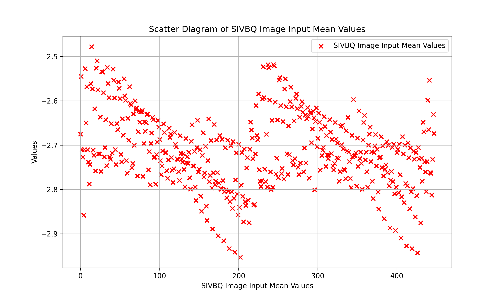Error Stats for SIVBQ
MAE: 0.5594761967658997
MSE: 0.47545725107192993
RMSE: 0.689534068107605
MAPE: 362.5408020019531
R2: 0.5236203670501709
<u>
==========Run External Stock Tests:==========
</u>
plot_price_comparison_stocks

quick_view_images

error_pct_outside_iqr 0.0
Mean accuracy 2 decimal places: tensor([2.0089])% 
                Mean accuracy 1 decimal places: tensor([10.0446])% 
                 Percentage of predictions within 2 decimal places: tensor([[0.0000],
        [7.1429],
        [3.5714],
        [0.0000],
        [3.5714],
        [0.0000],
        [0.0000],
        [3.5714],
        [0.0000],
        [7.1429],
        [0.0000],
        [0.0000],
        [0.0000],
        [3.5714],
        [3.5714],
        [0.0000]])% 
                     1 decimal places: tensor([[10.7143],
        [21.4286],
        [ 7.1429],
        [ 0.0000],
        [ 7.1429],
        [14.2857],
        [10.7143],
        [10.7143],
        [10.7143],
        [17.8571],
        [ 0.0000],
        [17.8571],
        [ 3.5714],
        [14.2857],
        [14.2857],
        [ 0.0000]])%
scatter_diagram_onevar_plot_mean

Error Stats for SICP
MAE: 0.8203948736190796
MSE: 1.136889934539795
RMSE: 1.0662504434585571
MAPE: 346.3636169433594
R2: -0.13688993453979492
scatter_diagram_twovar_plot_mean

plot_image_correlations

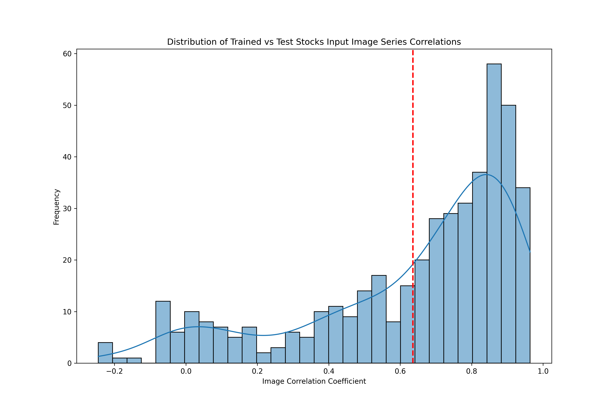<b>
==========Optimization Iteration==========
</b>

<b>transform_algo_type: 1 gaf_method: summation sample_range: (0, 1) scaler: StandardScaler() dropout_probab: 0</b>
plot_price_comparison_stocks

quick_view_images

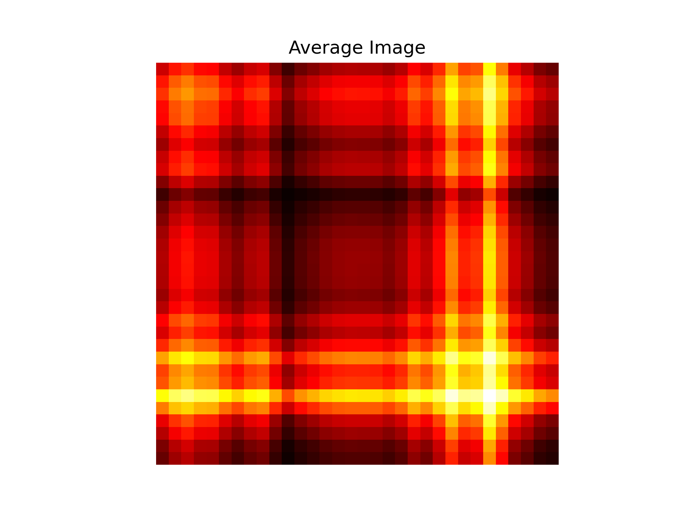Loss is less than 0.0001:9.709958976600319e-05 at 259. Stopping training.
error_pct_outside_iqr 0.0
Mean accuracy 2 decimal places: tensor([0.2232])% 
                Mean accuracy 1 decimal places: tensor([11.8304])% 
                 Percentage of predictions within 2 decimal places: tensor([[0.0000],
        [0.0000],
        [0.0000],
        [0.0000],
        [0.0000],
        [3.5714],
        [0.0000],
        [0.0000],
        [0.0000],
        [0.0000],
        [0.0000],
        [0.0000],
        [0.0000],
        [0.0000],
        [0.0000],
        [0.0000]])% 
                     1 decimal places: tensor([[14.2857],
        [17.8571],
        [10.7143],
        [ 7.1429],
        [10.7143],
        [21.4286],
        [10.7143],
        [ 3.5714],
        [ 7.1429],
        [14.2857],
        [10.7143],
        [17.8571],
        [14.2857],
        [17.8571],
        [ 7.1429],
        [ 3.5714]])%
scatter_diagram_onevar_plot_mean

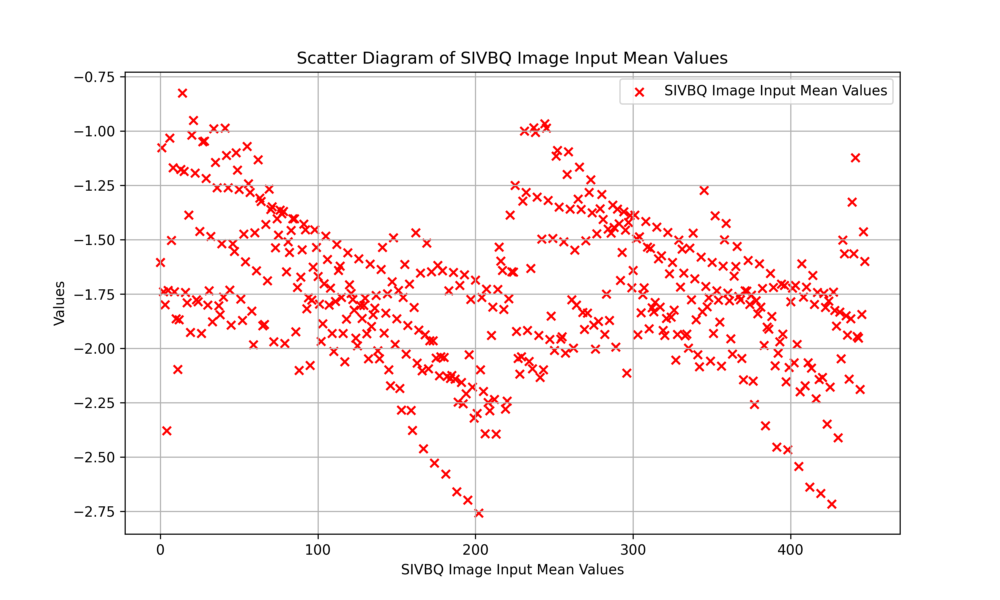Error Stats for SIVBQ
MAE: 0.510255753993988
MSE: 0.4128793776035309
RMSE: 0.64255690574646
MAPE: 431.8883972167969
R2: 0.5863196849822998
<u>
==========Run External Stock Tests:==========
</u>
plot_price_comparison_stocks

quick_view_images

error_pct_outside_iqr 0.0
Mean accuracy 2 decimal places: tensor([0.2232])% 
                Mean accuracy 1 decimal places: tensor([6.2500])% 
                 Percentage of predictions within 2 decimal places: tensor([[0.0000],
        [0.0000],
        [0.0000],
        [0.0000],
        [0.0000],
        [0.0000],
        [0.0000],
        [0.0000],
        [0.0000],
        [0.0000],
        [0.0000],
        [3.5714],
        [0.0000],
        [0.0000],
        [0.0000],
        [0.0000]])% 
                     1 decimal places: tensor([[ 0.0000],
        [ 3.5714],
        [10.7143],
        [ 3.5714],
        [ 7.1429],
        [ 7.1429],
        [ 7.1429],
        [ 3.5714],
        [14.2857],
        [ 3.5714],
        [ 3.5714],
        [14.2857],
        [ 0.0000],
        [ 3.5714],
        [10.7143],
        [ 7.1429]])%
scatter_diagram_onevar_plot_mean

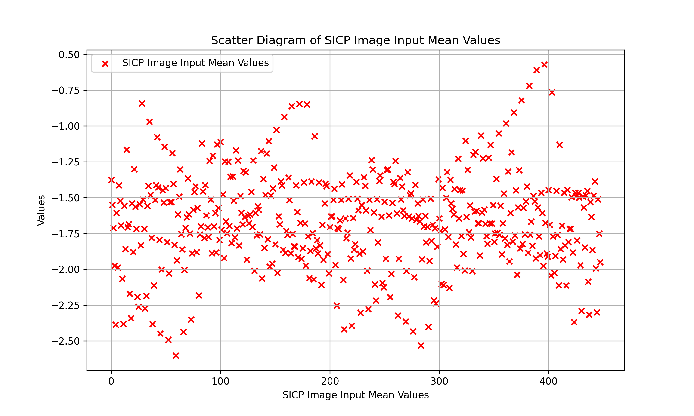Error Stats for SICP
MAE: 0.9210885763168335
MSE: 1.4045006036758423
RMSE: 1.1851162910461426
MAPE: 405.8591003417969
R2: -0.4045006036758423
scatter_diagram_twovar_plot_mean

plot_image_correlations

<b>
==========Optimization Iteration==========
</b>

<b>transform_algo_type: 1 gaf_method: summation sample_range: (-1, 0) scaler: MinMaxScaler() dropout_probab: 0</b>
plot_price_comparison_stocks

quick_view_images

Loss is less than 0.0001:9.510676318313926e-05 at 151. Stopping training.
error_pct_outside_iqr 0.0
Mean accuracy 2 decimal places: tensor([2.0089])% 
                Mean accuracy 1 decimal places: tensor([18.3036])% 
                 Percentage of predictions within 2 decimal places: tensor([[0.0000],
        [0.0000],
        [3.5714],
        [3.5714],
        [0.0000],
        [0.0000],
        [3.5714],
        [3.5714],
        [0.0000],
        [0.0000],
        [3.5714],
        [0.0000],
        [0.0000],
        [3.5714],
        [3.5714],
        [7.1429]])% 
                     1 decimal places: tensor([[21.4286],
        [17.8571],
        [ 7.1429],
        [10.7143],
        [17.8571],
        [21.4286],
        [14.2857],
        [21.4286],
        [17.8571],
        [14.2857],
        [10.7143],
        [35.7143],
        [14.2857],
        [25.0000],
        [28.5714],
        [14.2857]])%
scatter_diagram_onevar_plot_mean

Error Stats for SIVBQ
MAE: 0.34045034646987915
MSE: 0.18654872477054596
RMSE: 0.4319128692150116
MAPE: inf
R2: -1.776747703552246
<u>
==========Run External Stock Tests:==========
</u>
plot_price_comparison_stocks

quick_view_images

error_pct_outside_iqr 3.571428571428571
Mean accuracy 2 decimal places: tensor([2.6786])% 
                Mean accuracy 1 decimal places: tensor([15.1786])% 
                 Percentage of predictions within 2 decimal places: tensor([[0.0000],
        [0.0000],
        [7.1429],
        [0.0000],
        [3.5714],
        [0.0000],
        [3.5714],
        [0.0000],
        [3.5714],
        [0.0000],
        [0.0000],
        [0.0000],
        [7.1429],
        [3.5714],
        [7.1429],
        [7.1429]])% 
                     1 decimal places: tensor([[10.7143],
        [10.7143],
        [17.8571],
        [17.8571],
        [ 3.5714],
        [ 7.1429],
        [25.0000],
        [17.8571],
        [14.2857],
        [ 3.5714],
        [21.4286],
        [ 7.1429],
        [32.1429],
        [10.7143],
        [21.4286],
        [21.4286]])%
scatter_diagram_onevar_plot_mean

Error Stats for SICP
MAE: 0.4191385805606842
MSE: 0.29289698600769043
RMSE: 0.5411995649337769
MAPE: inf
R2: -4.101565837860107
scatter_diagram_twovar_plot_mean

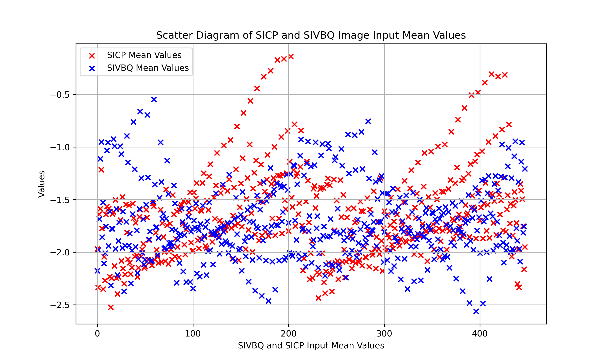plot_image_correlations

<b>
==========Optimization Iteration==========
</b>

<b>transform_algo_type: 1 gaf_method: summation sample_range: (-1, 0.5) scaler: MinMaxScaler() dropout_probab: 0</b>
plot_price_comparison_stocks

quick_view_images

Loss is less than 0.0001:9.738924563862383e-05 at 168. Stopping training.
error_pct_outside_iqr 0.0
Mean accuracy 2 decimal places: tensor([2.6786])% 
                Mean accuracy 1 decimal places: tensor([18.7500])% 
                 Percentage of predictions within 2 decimal places: tensor([[ 7.1429],
        [ 7.1429],
        [ 3.5714],
        [ 0.0000],
        [ 0.0000],
        [ 0.0000],
        [ 0.0000],
        [ 3.5714],
        [ 3.5714],
        [10.7143],
        [ 3.5714],
        [ 3.5714],
        [ 0.0000],
        [ 0.0000],
        [ 0.0000],
        [ 0.0000]])% 
                     1 decimal places: tensor([[17.8571],
        [21.4286],
        [25.0000],
        [39.2857],
        [17.8571],
        [10.7143],
        [25.0000],
        [17.8571],
        [32.1429],
        [17.8571],
        [14.2857],
        [17.8571],
        [14.2857],
        [10.7143],
        [10.7143],
        [ 7.1429]])%
scatter_diagram_onevar_plot_mean

Error Stats for SIVBQ
MAE: 0.35208502411842346
MSE: 0.19522754848003387
RMSE: 0.4418456256389618
MAPE: inf
R2: -1.905930519104004
<u>
==========Run External Stock Tests:==========
</u>
plot_price_comparison_stocks

quick_view_images

error_pct_outside_iqr 3.571428571428571
Mean accuracy 2 decimal places: tensor([1.7857])% 
                Mean accuracy 1 decimal places: tensor([12.5000])% 
                 Percentage of predictions within 2 decimal places: tensor([[0.0000],
        [0.0000],
        [0.0000],
        [3.5714],
        [0.0000],
        [0.0000],
        [0.0000],
        [7.1429],
        [3.5714],
        [3.5714],
        [3.5714],
        [0.0000],
        [0.0000],
        [3.5714],
        [0.0000],
        [3.5714]])% 
                     1 decimal places: tensor([[17.8571],
        [17.8571],
        [ 0.0000],
        [21.4286],
        [ 3.5714],
        [17.8571],
        [10.7143],
        [14.2857],
        [17.8571],
        [10.7143],
        [17.8571],
        [17.8571],
        [ 7.1429],
        [17.8571],
        [ 0.0000],
        [ 7.1429]])%
scatter_diagram_onevar_plot_mean

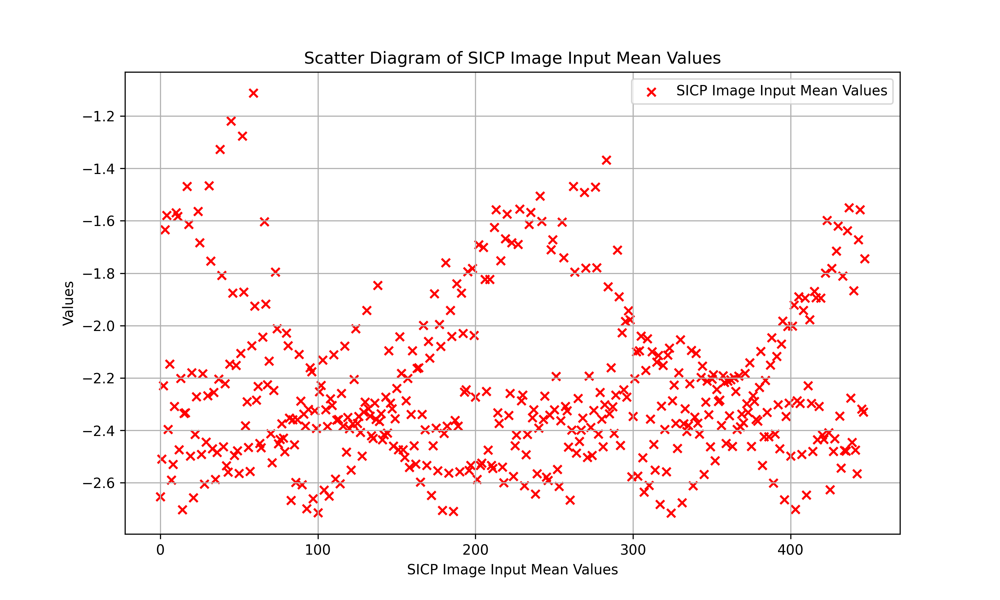Error Stats for SICP
MAE: 0.475585013628006
MSE: 0.3466387093067169
RMSE: 0.5887603163719177
MAPE: inf
R2: -5.037618637084961
scatter_diagram_twovar_plot_mean

plot_image_correlations

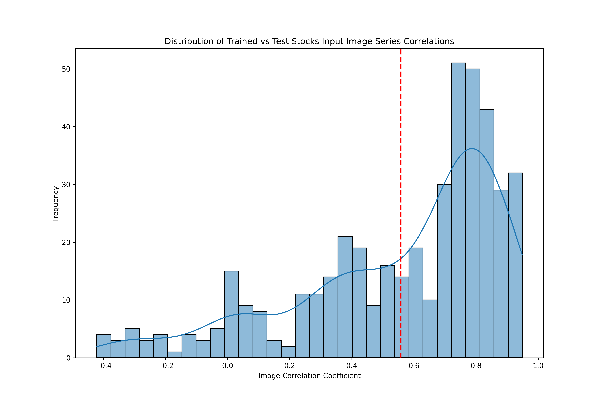<b>
==========Optimization Iteration==========
</b>

<b>transform_algo_type: 1 gaf_method: summation sample_range: (-1, 1) scaler: MinMaxScaler() dropout_probab: 0</b>
plot_price_comparison_stocks

quick_view_images

Loss is less than 0.0001:9.654652967583388e-05 at 159. Stopping training.
error_pct_outside_iqr 0.0
Mean accuracy 2 decimal places: tensor([2.4554])% 
                Mean accuracy 1 decimal places: tensor([24.1071])% 
                 Percentage of predictions within 2 decimal places: tensor([[ 0.0000],
        [ 0.0000],
        [ 0.0000],
        [ 7.1429],
        [10.7143],
        [ 0.0000],
        [ 3.5714],
        [ 3.5714],
        [ 0.0000],
        [ 3.5714],
        [ 0.0000],
        [ 3.5714],
        [ 0.0000],
        [ 7.1429],
        [ 0.0000],
        [ 0.0000]])% 
                     1 decimal places: tensor([[32.1429],
        [10.7143],
        [32.1429],
        [25.0000],
        [25.0000],
        [39.2857],
        [28.5714],
        [28.5714],
        [21.4286],
        [17.8571],
        [10.7143],
        [17.8571],
        [17.8571],
        [25.0000],
        [28.5714],
        [25.0000]])%
scatter_diagram_onevar_plot_mean

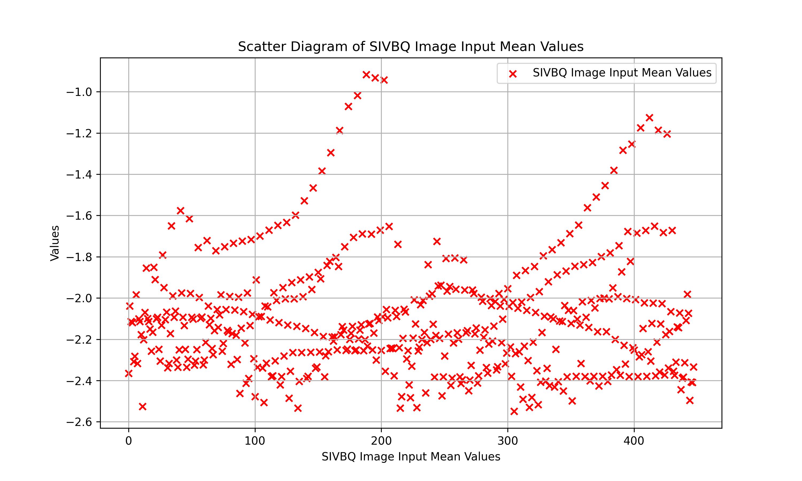Error Stats for SIVBQ
MAE: 0.323358952999115
MSE: 0.1717619150876999
RMSE: 0.41444170475006104
MAPE: inf
R2: -1.5566484928131104
<u>
==========Run External Stock Tests:==========
</u>
plot_price_comparison_stocks

quick_view_images

error_pct_outside_iqr 3.571428571428571
Mean accuracy 2 decimal places: tensor([0.6696])% 
                Mean accuracy 1 decimal places: tensor([11.6071])% 
                 Percentage of predictions within 2 decimal places: tensor([[0.0000],
        [0.0000],
        [0.0000],
        [0.0000],
        [0.0000],
        [0.0000],
        [0.0000],
        [0.0000],
        [3.5714],
        [0.0000],
        [0.0000],
        [3.5714],
        [3.5714],
        [0.0000],
        [0.0000],
        [0.0000]])% 
                     1 decimal places: tensor([[ 3.5714],
        [14.2857],
        [ 3.5714],
        [14.2857],
        [ 7.1429],
        [14.2857],
        [ 7.1429],
        [10.7143],
        [25.0000],
        [14.2857],
        [10.7143],
        [10.7143],
        [14.2857],
        [10.7143],
        [ 7.1429],
        [17.8571]])%
scatter_diagram_onevar_plot_mean

Error Stats for SICP
MAE: 0.4585616886615753
MSE: 0.32137590646743774
RMSE: 0.5669002532958984
MAPE: inf
R2: -4.597600936889648
scatter_diagram_twovar_plot_mean

plot_image_correlations

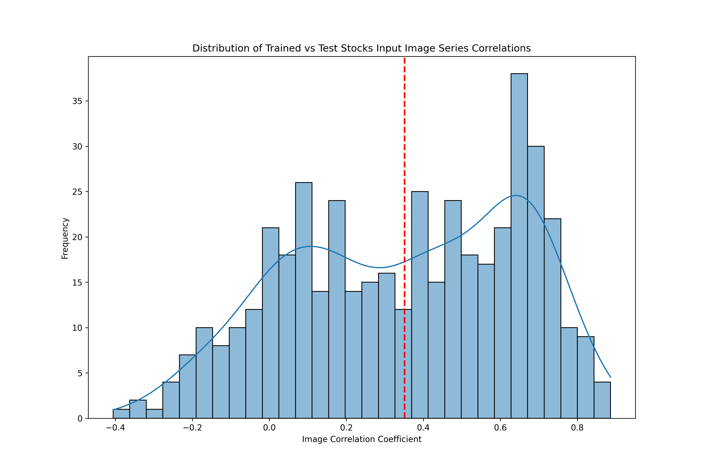<b>
==========Optimization Iteration==========
</b>

<b>transform_algo_type: 1 gaf_method: summation sample_range: (-0.5, 0) scaler: MinMaxScaler() dropout_probab: 0</b>
plot_price_comparison_stocks

quick_view_images

Loss is less than 0.0001:9.594488801667467e-05 at 182. Stopping training.
error_pct_outside_iqr 3.571428571428571
Mean accuracy 2 decimal places: tensor([0.8929])% 
                Mean accuracy 1 decimal places: tensor([20.0893])% 
                 Percentage of predictions within 2 decimal places: tensor([[0.0000],
        [0.0000],
        [0.0000],
        [0.0000],
        [3.5714],
        [3.5714],
        [0.0000],
        [0.0000],
        [0.0000],
        [0.0000],
        [0.0000],
        [0.0000],
        [0.0000],
        [0.0000],
        [7.1429],
        [0.0000]])% 
                     1 decimal places: tensor([[42.8571],
        [ 7.1429],
        [10.7143],
        [10.7143],
        [ 7.1429],
        [25.0000],
        [17.8571],
        [17.8571],
        [21.4286],
        [42.8571],
        [10.7143],
        [28.5714],
        [32.1429],
        [14.2857],
        [21.4286],
        [10.7143]])%
scatter_diagram_onevar_plot_mean

Error Stats for SIVBQ
MAE: 0.3763160705566406
MSE: 0.2476719319820404
RMSE: 0.49766647815704346
MAPE: inf
R2: -2.686556577682495
<u>
==========Run External Stock Tests:==========
</u>
plot_price_comparison_stocks

quick_view_images

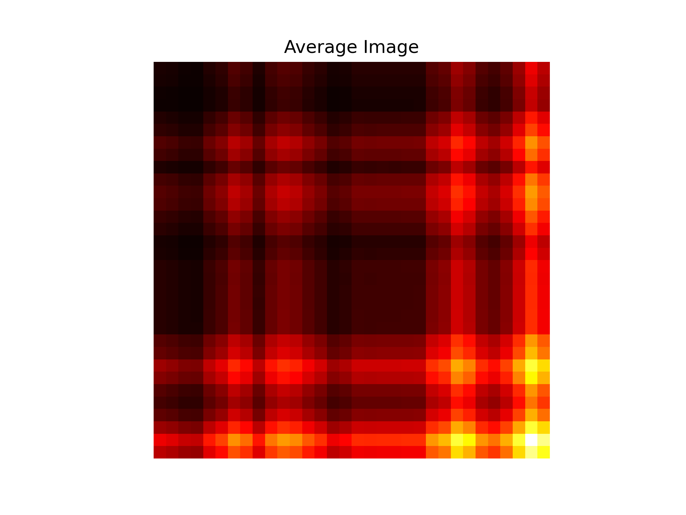error_pct_outside_iqr 0.0
Mean accuracy 2 decimal places: tensor([1.3393])% 
                Mean accuracy 1 decimal places: tensor([14.2857])% 
                 Percentage of predictions within 2 decimal places: tensor([[3.5714],
        [0.0000],
        [0.0000],
        [3.5714],
        [0.0000],
        [0.0000],
        [0.0000],
        [0.0000],
        [3.5714],
        [0.0000],
        [0.0000],
        [0.0000],
        [3.5714],
        [7.1429],
        [0.0000],
        [0.0000]])% 
                     1 decimal places: tensor([[14.2857],
        [21.4286],
        [ 3.5714],
        [14.2857],
        [10.7143],
        [ 0.0000],
        [14.2857],
        [14.2857],
        [25.0000],
        [10.7143],
        [17.8571],
        [14.2857],
        [21.4286],
        [25.0000],
        [ 7.1429],
        [14.2857]])%
scatter_diagram_onevar_plot_mean

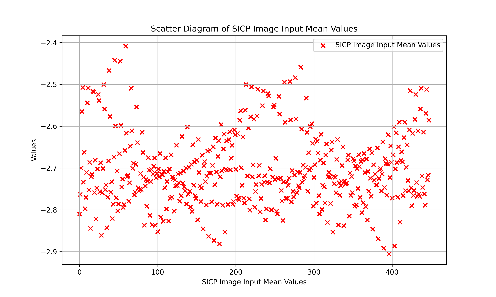Error Stats for SICP
MAE: 0.49068838357925415
MSE: 0.4064830243587494
RMSE: 0.6375601887702942
MAPE: inf
R2: -6.079963684082031
scatter_diagram_twovar_plot_mean

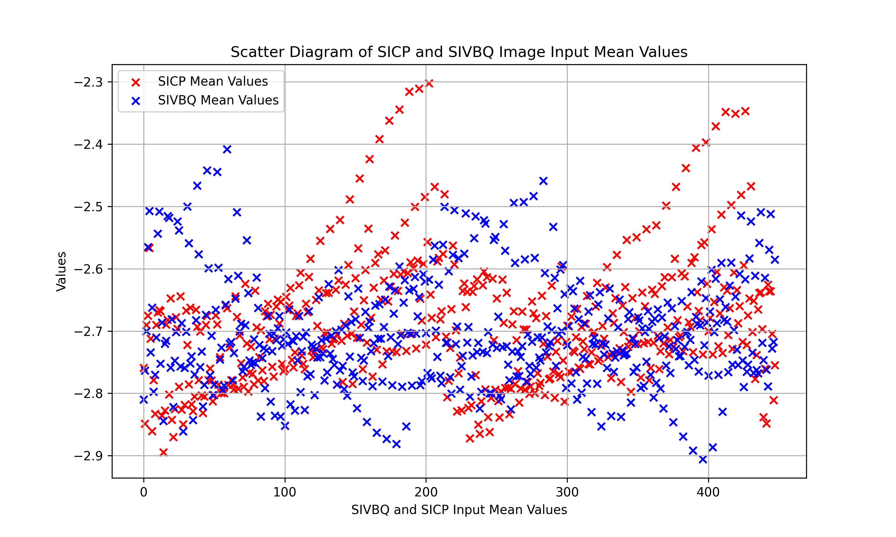plot_image_correlations

<b>
==========Optimization Iteration==========
</b>

<b>transform_algo_type: 1 gaf_method: summation sample_range: (-0.5, 0.5) scaler: MinMaxScaler() dropout_probab: 0</b>
plot_price_comparison_stocks

quick_view_images

Loss is less than 0.0001:9.655491157900542e-05 at 156. Stopping training.
error_pct_outside_iqr 7.142857142857142
Mean accuracy 2 decimal places: tensor([1.3393])% 
                Mean accuracy 1 decimal places: tensor([18.3036])% 
                 Percentage of predictions within 2 decimal places: tensor([[0.0000],
        [0.0000],
        [3.5714],
        [0.0000],
        [0.0000],
        [0.0000],
        [3.5714],
        [3.5714],
        [0.0000],
        [0.0000],
        [3.5714],
        [0.0000],
        [7.1429],
        [0.0000],
        [0.0000],
        [0.0000]])% 
                     1 decimal places: tensor([[14.2857],
        [28.5714],
        [17.8571],
        [10.7143],
        [10.7143],
        [ 7.1429],
        [17.8571],
        [28.5714],
        [ 7.1429],
        [28.5714],
        [17.8571],
        [25.0000],
        [21.4286],
        [28.5714],
        [14.2857],
        [14.2857]])%
scatter_diagram_onevar_plot_mean

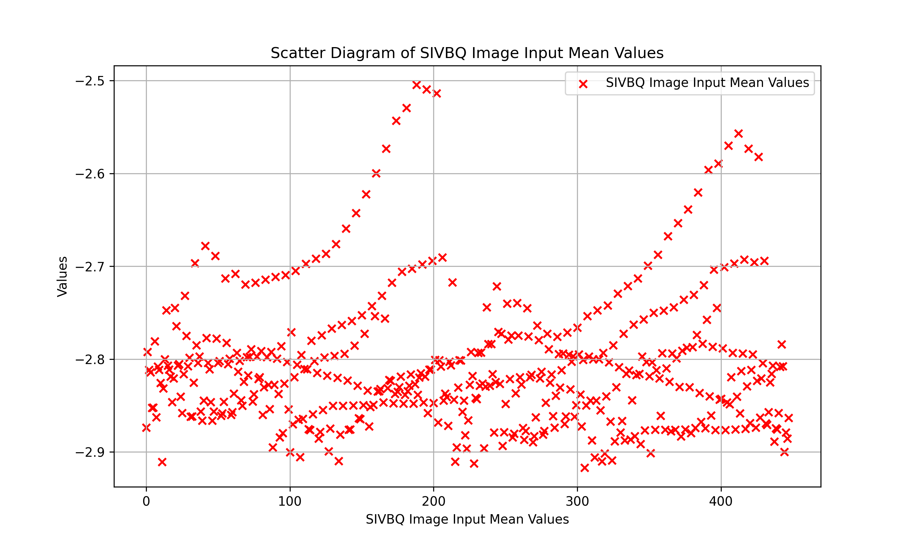Error Stats for SIVBQ
MAE: 0.35312169790267944
MSE: 0.19771616160869598
RMSE: 0.44465285539627075
MAPE: inf
R2: -1.9429731369018555
<u>
==========Run External Stock Tests:==========
</u>
plot_price_comparison_stocks

quick_view_images

error_pct_outside_iqr 0.0
Mean accuracy 2 decimal places: tensor([1.5625])% 
                Mean accuracy 1 decimal places: tensor([15.1786])% 
                 Percentage of predictions within 2 decimal places: tensor([[0.0000],
        [0.0000],
        [3.5714],
        [0.0000],
        [0.0000],
        [3.5714],
        [0.0000],
        [0.0000],
        [0.0000],
        [3.5714],
        [0.0000],
        [0.0000],
        [7.1429],
        [3.5714],
        [0.0000],
        [3.5714]])% 
                     1 decimal places: tensor([[21.4286],
        [10.7143],
        [17.8571],
        [17.8571],
        [21.4286],
        [17.8571],
        [ 7.1429],
        [21.4286],
        [10.7143],
        [14.2857],
        [14.2857],
        [ 3.5714],
        [10.7143],
        [35.7143],
        [ 3.5714],
        [14.2857]])%
scatter_diagram_onevar_plot_mean

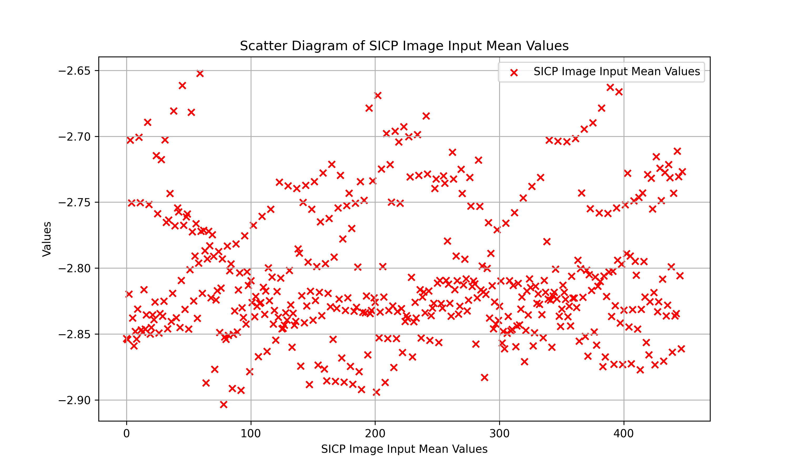Error Stats for SICP
MAE: 0.4354660212993622
MSE: 0.313252717256546
RMSE: 0.5596898198127747
MAPE: inf
R2: -4.456114292144775
scatter_diagram_twovar_plot_mean

plot_image_correlations

<b>
==========Optimization Iteration==========
</b>

<b>transform_algo_type: 1 gaf_method: summation sample_range: (-0.5, 1) scaler: MinMaxScaler() dropout_probab: 0</b>
plot_price_comparison_stocks

quick_view_images

Loss is less than 0.0001:9.989773388952017e-05 at 158. Stopping training.
error_pct_outside_iqr 3.571428571428571
Mean accuracy 2 decimal places: tensor([1.5625])% 
                Mean accuracy 1 decimal places: tensor([18.3036])% 
                 Percentage of predictions within 2 decimal places: tensor([[0.0000],
        [0.0000],
        [0.0000],
        [3.5714],
        [0.0000],
        [3.5714],
        [3.5714],
        [7.1429],
        [0.0000],
        [0.0000],
        [0.0000],
        [3.5714],
        [0.0000],
        [0.0000],
        [3.5714],
        [0.0000]])% 
                     1 decimal places: tensor([[25.0000],
        [ 7.1429],
        [14.2857],
        [14.2857],
        [ 7.1429],
        [35.7143],
        [21.4286],
        [21.4286],
        [10.7143],
        [28.5714],
        [10.7143],
        [ 7.1429],
        [39.2857],
        [ 7.1429],
        [25.0000],
        [17.8571]])%
scatter_diagram_onevar_plot_mean

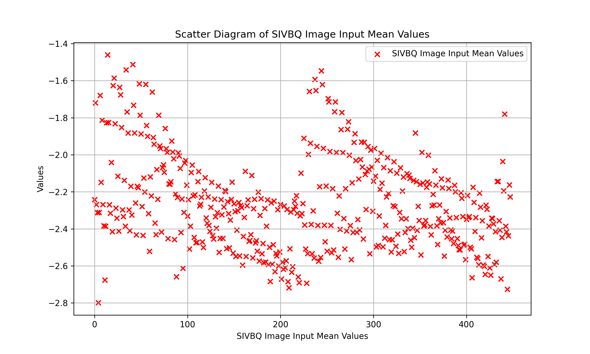Error Stats for SIVBQ
MAE: 0.32565250992774963
MSE: 0.17180287837982178
RMSE: 0.41449111700057983
MAPE: inf
R2: -1.557258129119873
<u>
==========Run External Stock Tests:==========
</u>
plot_price_comparison_stocks

quick_view_images

error_pct_outside_iqr 0.0
Mean accuracy 2 decimal places: tensor([1.3393])% 
                Mean accuracy 1 decimal places: tensor([13.1696])% 
                 Percentage of predictions within 2 decimal places: tensor([[0.0000],
        [0.0000],
        [0.0000],
        [3.5714],
        [0.0000],
        [0.0000],
        [3.5714],
        [3.5714],
        [3.5714],
        [0.0000],
        [0.0000],
        [0.0000],
        [0.0000],
        [0.0000],
        [3.5714],
        [3.5714]])% 
                     1 decimal places: tensor([[14.2857],
        [ 7.1429],
        [10.7143],
        [10.7143],
        [17.8571],
        [ 7.1429],
        [14.2857],
        [17.8571],
        [17.8571],
        [ 3.5714],
        [ 7.1429],
        [17.8571],
        [14.2857],
        [10.7143],
        [14.2857],
        [25.0000]])%
scatter_diagram_onevar_plot_mean

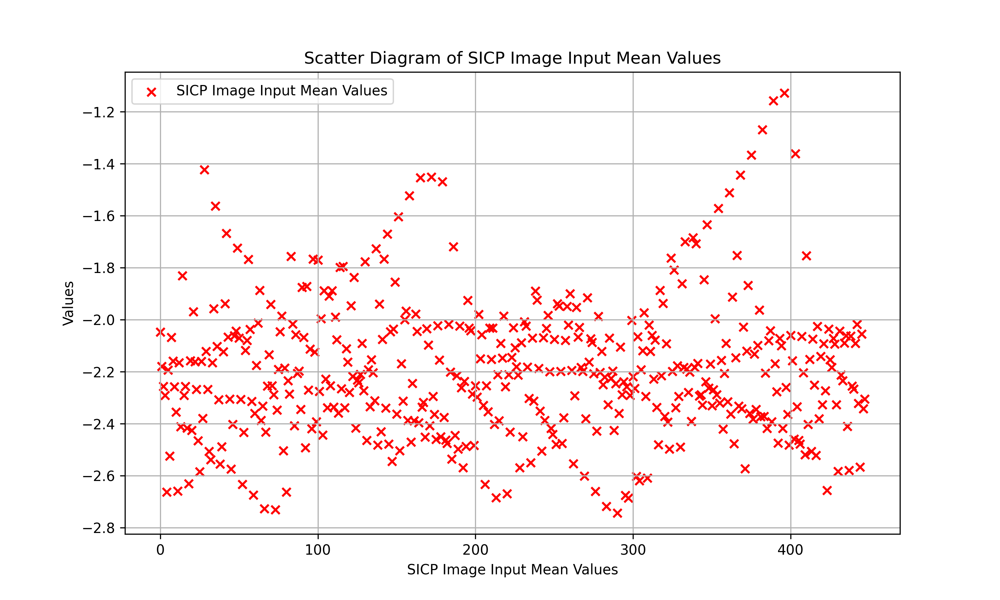Error Stats for SICP
MAE: 0.47937944531440735
MSE: 0.3575836718082428
RMSE: 0.5979830026626587
MAPE: inf
R2: -5.228253364562988
scatter_diagram_twovar_plot_mean

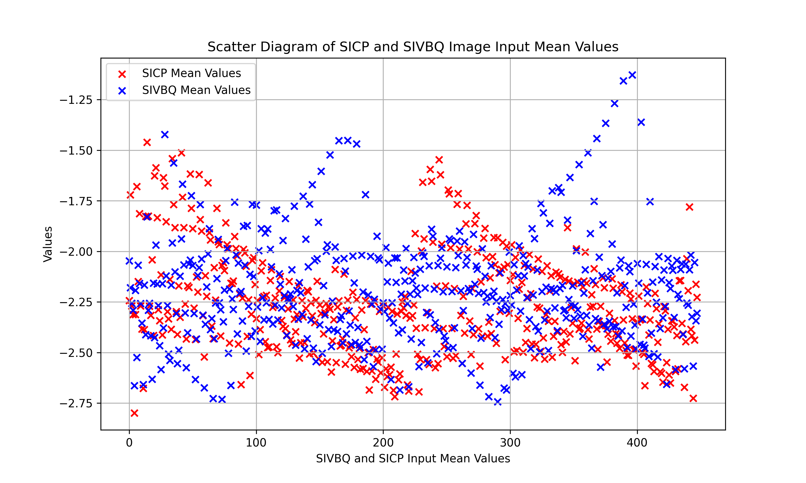plot_image_correlations

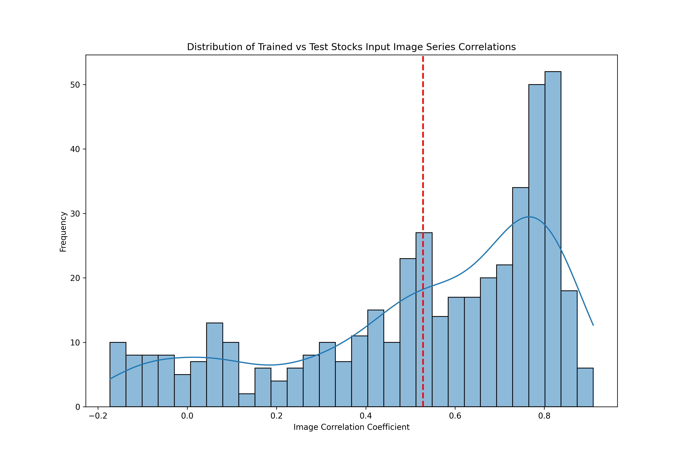<b>
==========Optimization Iteration==========
</b>

<b>transform_algo_type: 1 gaf_method: summation sample_range: (0, 0.5) scaler: MinMaxScaler() dropout_probab: 0</b>
plot_price_comparison_stocks

quick_view_images

Loss is less than 0.0001:9.435103129362687e-05 at 185. Stopping training.
error_pct_outside_iqr 7.142857142857142
Mean accuracy 2 decimal places: tensor([2.0089])% 
                Mean accuracy 1 decimal places: tensor([18.7500])% 
                 Percentage of predictions within 2 decimal places: tensor([[3.5714],
        [7.1429],
        [0.0000],
        [0.0000],
        [0.0000],
        [0.0000],
        [3.5714],
        [7.1429],
        [3.5714],
        [0.0000],
        [0.0000],
        [0.0000],
        [7.1429],
        [0.0000],
        [0.0000],
        [0.0000]])% 
                     1 decimal places: tensor([[25.0000],
        [21.4286],
        [ 7.1429],
        [14.2857],
        [17.8571],
        [14.2857],
        [ 7.1429],
        [35.7143],
        [10.7143],
        [14.2857],
        [28.5714],
        [28.5714],
        [17.8571],
        [28.5714],
        [17.8571],
        [10.7143]])%
scatter_diagram_onevar_plot_mean

Error Stats for SIVBQ
MAE: 0.3635525703430176
MSE: 0.22528615593910217
RMSE: 0.47464320063591003
MAPE: inf
R2: -2.3533480167388916
<u>
==========Run External Stock Tests:==========
</u>
plot_price_comparison_stocks

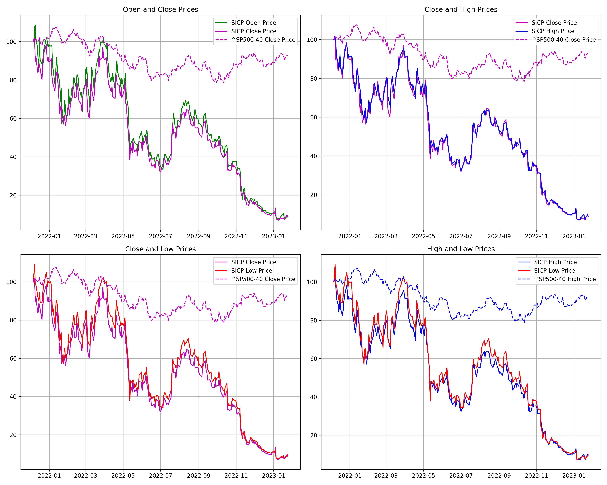quick_view_images

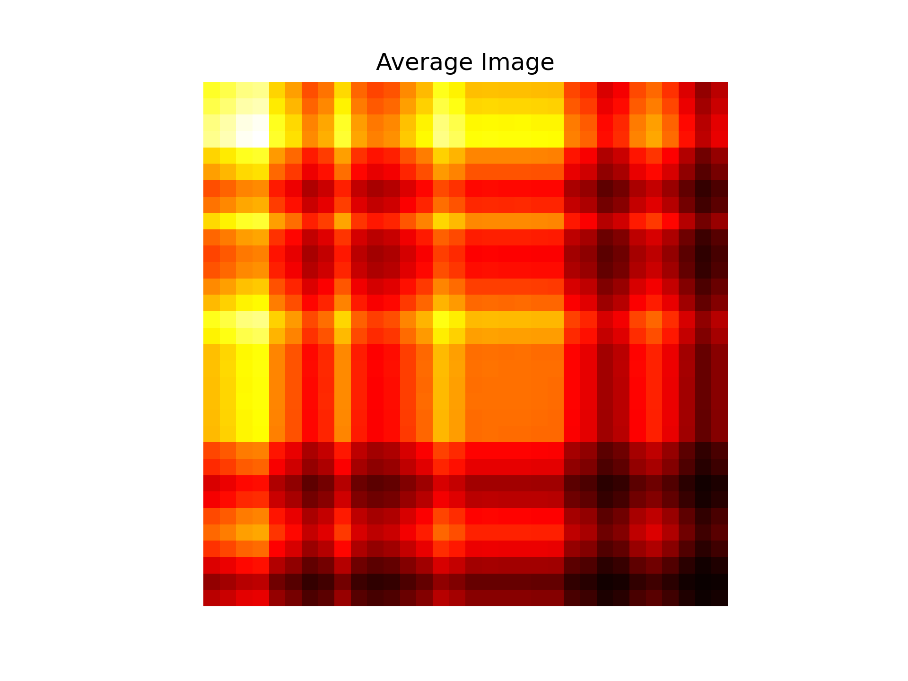error_pct_outside_iqr 0.0
Mean accuracy 2 decimal places: tensor([2.0089])% 
                Mean accuracy 1 decimal places: tensor([12.2768])% 
                 Percentage of predictions within 2 decimal places: tensor([[0.0000],
        [3.5714],
        [0.0000],
        [0.0000],
        [0.0000],
        [0.0000],
        [0.0000],
        [7.1429],
        [3.5714],
        [3.5714],
        [3.5714],
        [3.5714],
        [0.0000],
        [0.0000],
        [3.5714],
        [3.5714]])% 
                     1 decimal places: tensor([[10.7143],
        [ 3.5714],
        [ 7.1429],
        [10.7143],
        [14.2857],
        [17.8571],
        [10.7143],
        [17.8571],
        [17.8571],
        [ 7.1429],
        [14.2857],
        [14.2857],
        [14.2857],
        [ 7.1429],
        [21.4286],
        [ 7.1429]])%
scatter_diagram_onevar_plot_mean

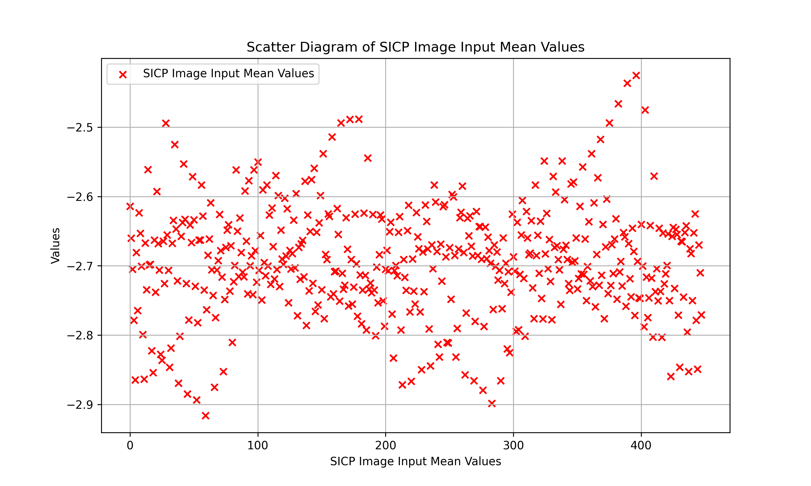Error Stats for SICP
MAE: 0.46381616592407227
MSE: 0.344150573015213
RMSE: 0.5866434574127197
MAPE: inf
R2: -4.99428129196167
scatter_diagram_twovar_plot_mean

plot_image_correlations

<b>
==========Optimization Iteration==========
</b>

<b>transform_algo_type: 1 gaf_method: summation sample_range: (0, 1) scaler: MinMaxScaler() dropout_probab: 0</b>
plot_price_comparison_stocks

quick_view_images

Loss is less than 0.0001:9.802448039408773e-05 at 165. Stopping training.
error_pct_outside_iqr 7.142857142857142
Mean accuracy 2 decimal places: tensor([2.0089])% 
                Mean accuracy 1 decimal places: tensor([22.5446])% 
                 Percentage of predictions within 2 decimal places: tensor([[3.5714],
        [0.0000],
        [0.0000],
        [7.1429],
        [0.0000],
        [7.1429],
        [0.0000],
        [3.5714],
        [3.5714],
        [0.0000],
        [0.0000],
        [0.0000],
        [0.0000],
        [3.5714],
        [3.5714],
        [0.0000]])% 
                     1 decimal places: tensor([[28.5714],
        [17.8571],
        [17.8571],
        [17.8571],
        [25.0000],
        [28.5714],
        [17.8571],
        [10.7143],
        [32.1429],
        [21.4286],
        [28.5714],
        [14.2857],
        [28.5714],
        [25.0000],
        [28.5714],
        [17.8571]])%
scatter_diagram_onevar_plot_mean

Error Stats for SIVBQ
MAE: 0.311521053314209
MSE: 0.15840135514736176
RMSE: 0.3979966640472412
MAPE: inf
R2: -1.357778549194336
<u>
==========Run External Stock Tests:==========
</u>
plot_price_comparison_stocks

quick_view_images

error_pct_outside_iqr 3.571428571428571
Mean accuracy 2 decimal places: tensor([3.1250])% 
                Mean accuracy 1 decimal places: tensor([21.6518])% 
                 Percentage of predictions within 2 decimal places: tensor([[ 0.0000],
        [ 0.0000],
        [ 3.5714],
        [ 3.5714],
        [10.7143],
        [ 3.5714],
        [ 0.0000],
        [ 3.5714],
        [ 3.5714],
        [ 0.0000],
        [ 3.5714],
        [ 0.0000],
        [ 3.5714],
        [ 3.5714],
        [ 7.1429],
        [ 3.5714]])% 
                     1 decimal places: tensor([[32.1429],
        [25.0000],
        [21.4286],
        [21.4286],
        [32.1429],
        [10.7143],
        [17.8571],
        [ 3.5714],
        [17.8571],
        [28.5714],
        [17.8571],
        [21.4286],
        [ 7.1429],
        [17.8571],
        [35.7143],
        [35.7143]])%
scatter_diagram_onevar_plot_mean

Error Stats for SICP
MAE: 0.37209534645080566
MSE: 0.23755423724651337
RMSE: 0.48739534616470337
MAPE: inf
R2: -3.137627601623535
scatter_diagram_twovar_plot_mean

plot_image_correlations

<b>
==========Optimization Iteration==========
</b>

<b>transform_algo_type: 1 gaf_method: summation sample_range: (-1, 0) scaler: StandardScaler() dropout_probab: 0.5</b>
plot_price_comparison_stocks

quick_view_images

[2500,     1] Cum loss: 0.000059785
[2500,     2] Cum loss: 0.000055180
[2500,     3] Cum loss: 0.000056248
[2500,     4] Cum loss: 0.000023627
[2500,     5] Cum loss: 0.000055899
[2500,     6] Cum loss: 0.000068680
[2500,     7] Cum loss: 0.000099088
[2500,     8] Cum loss: 0.000077608
[2500,     9] Cum loss: 0.000071721
[2500,    10] Cum loss: 0.000046158
[2500,    11] Cum loss: 0.000061959
[2500,    12] Cum loss: 0.000046109
[2500,    13] Cum loss: 0.000059090
[2500,    14] Cum loss: 0.000085995
[2500,    15] Cum loss: 0.000052313
[2500,    16] Cum loss: 0.000036624
[2500,    17] Cum loss: 0.000059949
[2500,    18] Cum loss: 0.000055699
[2500,    19] Cum loss: 0.000088520
[2500,    20] Cum loss: 0.000034206
[2500,    21] Cum loss: 0.000075716
[2500,    22] Cum loss: 0.000053713
[2500,    23] Cum loss: 0.000049475
[2500,    24] Cum loss: 0.000039308
[2500,    25] Cum loss: 0.000071891
[2500,    26] Cum loss: 0.000072605
[2500,    27] Cum loss: 0.000067501
[2500,    28] Cum loss: 0.000176357
plot_weights_gradients

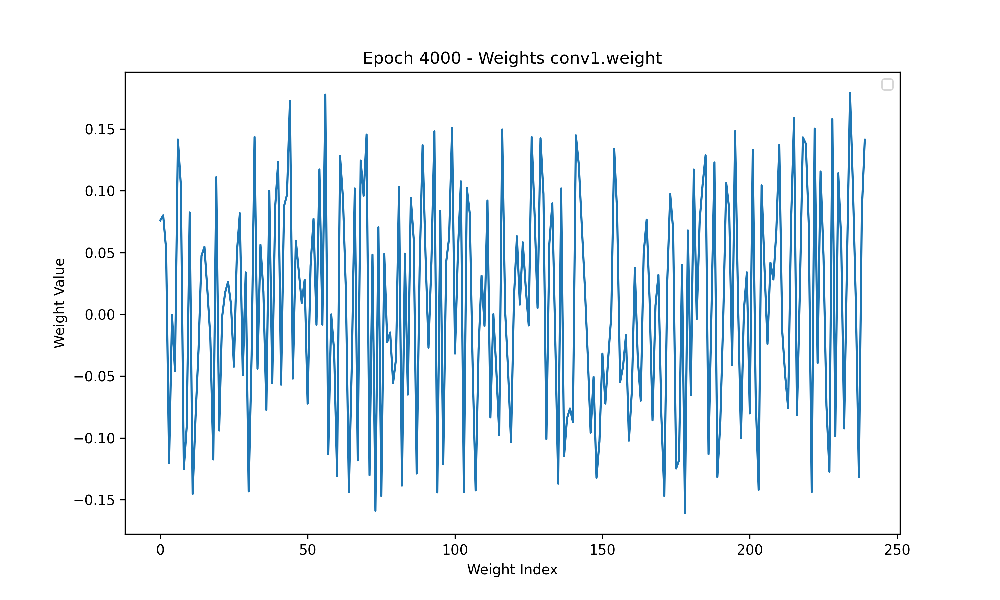plot_weights_gradients

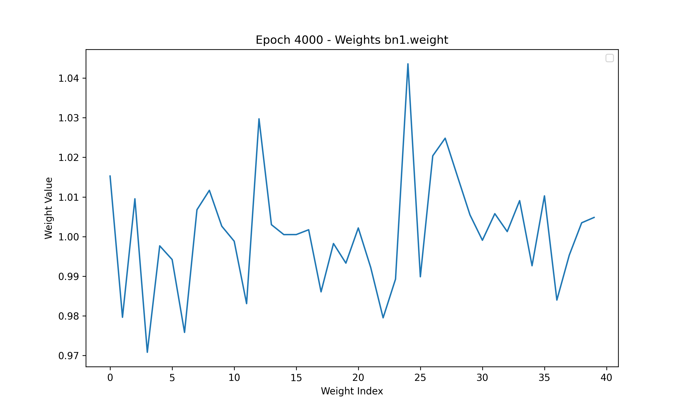plot_weights_gradients

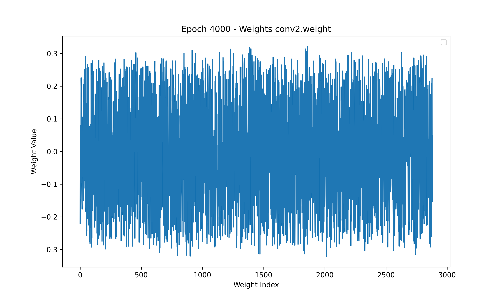plot_weights_gradients

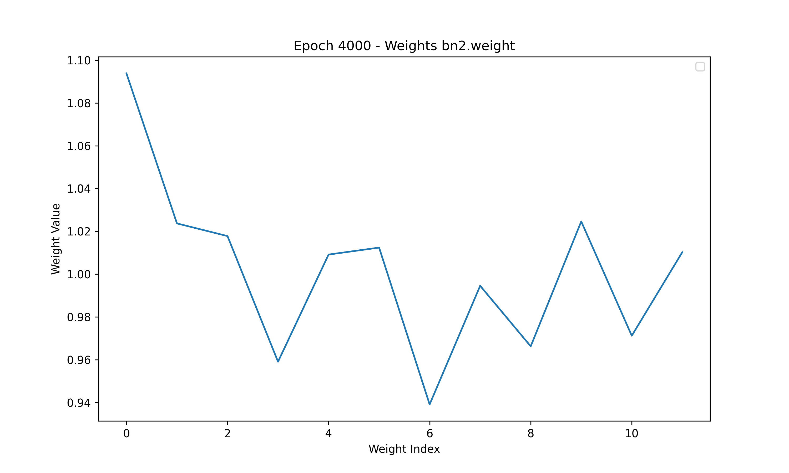plot_weights_gradients

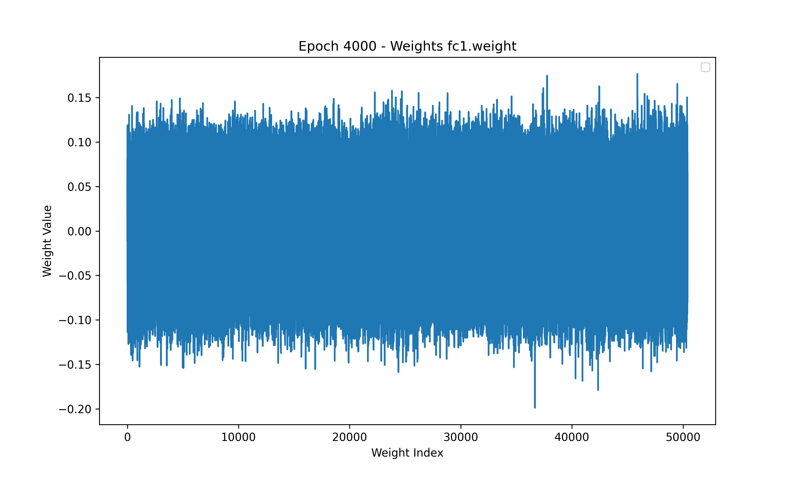plot_weights_gradients

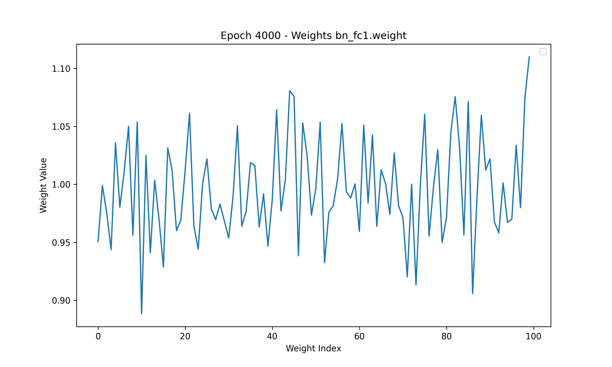plot_weights_gradients

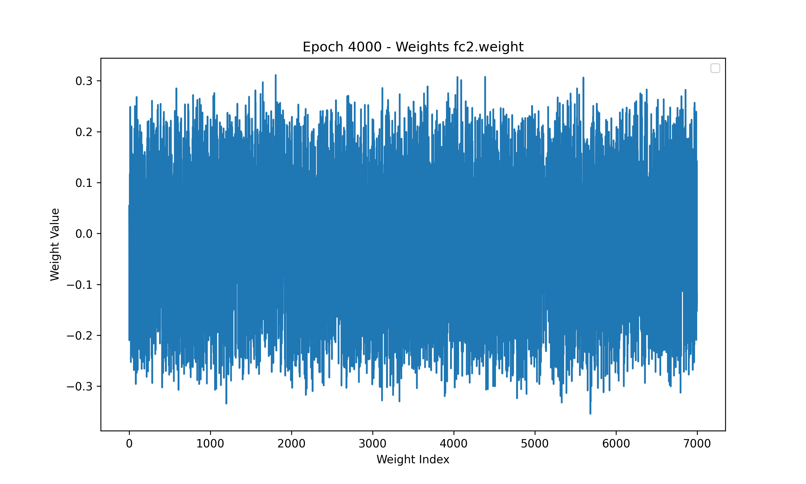plot_weights_gradients

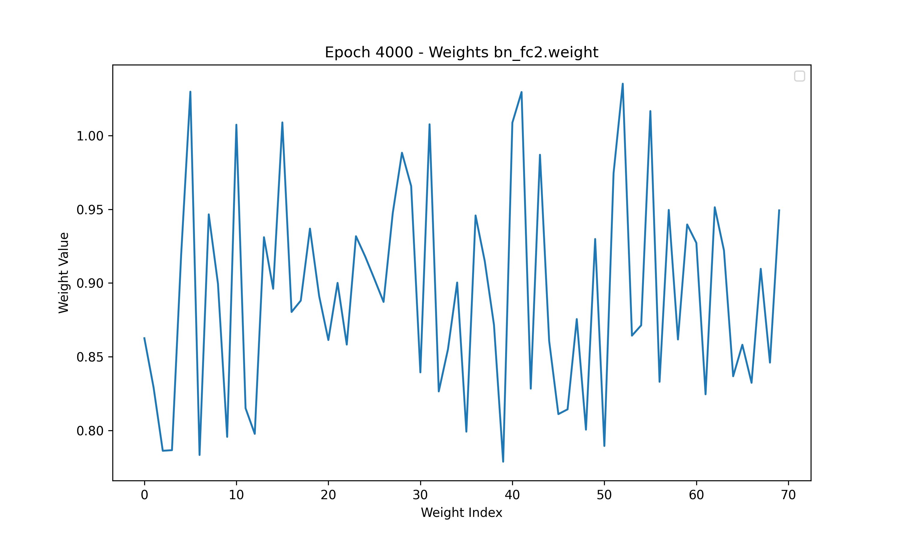plot_weights_gradients

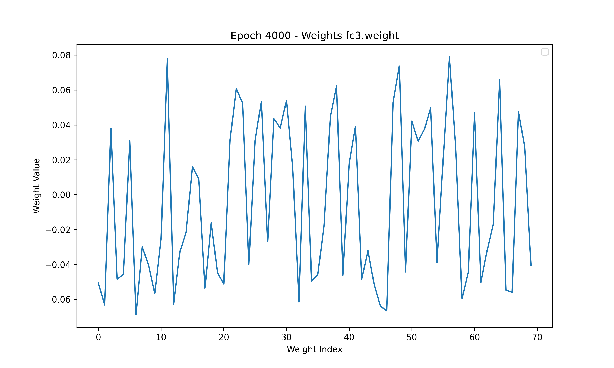plot_weights_gradients

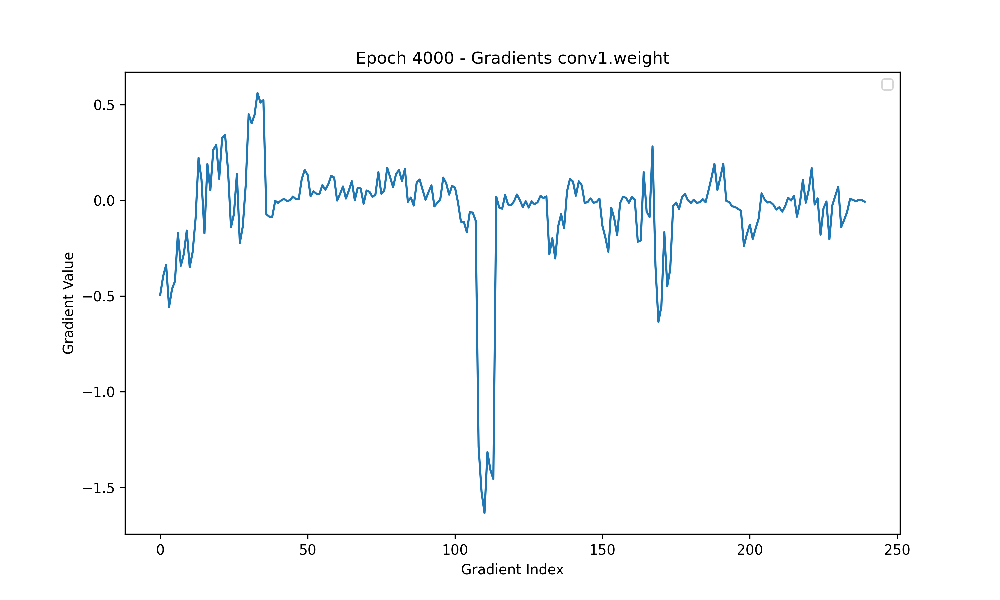plot_weights_gradients

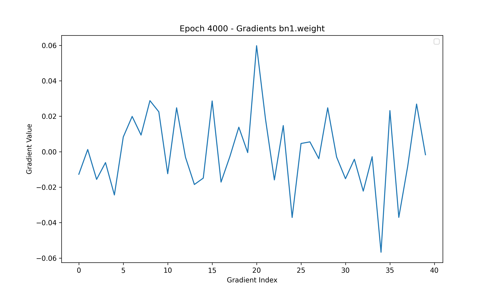plot_weights_gradients

plot_weights_gradients

plot_weights_gradients

plot_weights_gradients

plot_weights_gradients

plot_weights_gradients

plot_weights_gradients

[5000,     1] Cum loss: 0.000036840
[5000,     2] Cum loss: 0.000022590
[5000,     3] Cum loss: 0.000018276
[5000,     4] Cum loss: 0.000018312
[5000,     5] Cum loss: 0.000045814
[5000,     6] Cum loss: 0.000034556
[5000,     7] Cum loss: 0.000026286
[5000,     8] Cum loss: 0.000037383
[5000,     9] Cum loss: 0.000035031
[5000,    10] Cum loss: 0.000033770
[5000,    11] Cum loss: 0.000025193
[5000,    12] Cum loss: 0.000038379
[5000,    13] Cum loss: 0.000038509
[5000,    14] Cum loss: 0.000067568
[5000,    15] Cum loss: 0.000028178
[5000,    16] Cum loss: 0.000019707
[5000,    17] Cum loss: 0.000021925
[5000,    18] Cum loss: 0.000028347
[5000,    19] Cum loss: 0.000046238
[5000,    20] Cum loss: 0.000011428
[5000,    21] Cum loss: 0.000011591
[5000,    22] Cum loss: 0.000048294
[5000,    23] Cum loss: 0.000031562
[5000,    24] Cum loss: 0.000016634
[5000,    25] Cum loss: 0.000058377
[5000,    26] Cum loss: 0.000021203
[5000,    27] Cum loss: 0.000014563
[5000,    28] Cum loss: 0.000116558
[7500,     1] Cum loss: 0.000036787
[7500,     2] Cum loss: 0.000009568
[7500,     3] Cum loss: 0.000009535
[7500,     4] Cum loss: 0.000025640
[7500,     5] Cum loss: 0.000015005
[7500,     6] Cum loss: 0.000023898
[7500,     7] Cum loss: 0.000025612
[7500,     8] Cum loss: 0.000026959
[7500,     9] Cum loss: 0.000013298
[7500,    10] Cum loss: 0.000017517
[7500,    11] Cum loss: 0.000021166
[7500,    12] Cum loss: 0.000016832
[7500,    13] Cum loss: 0.000009942
[7500,    14] Cum loss: 0.000075492
[7500,    15] Cum loss: 0.000012149
[7500,    16] Cum loss: 0.000018168
[7500,    17] Cum loss: 0.000057008
[7500,    18] Cum loss: 0.000007462
[7500,    19] Cum loss: 0.000012294
[7500,    20] Cum loss: 0.000024951
[7500,    21] Cum loss: 0.000020374
[7500,    22] Cum loss: 0.000054534
[7500,    23] Cum loss: 0.000022762
[7500,    24] Cum loss: 0.000015716
[7500,    25] Cum loss: 0.000029162
[7500,    26] Cum loss: 0.000017869
[7500,    27] Cum loss: 0.000032587
[7500,    28] Cum loss: 0.000070844
plot_weights_gradients

plot_weights_gradients

plot_weights_gradients

plot_weights_gradients

plot_weights_gradients

plot_weights_gradients

plot_weights_gradients

plot_weights_gradients

plot_weights_gradients

plot_weights_gradients

plot_weights_gradients

plot_weights_gradients

plot_weights_gradients

plot_weights_gradients

plot_weights_gradients

plot_weights_gradients

plot_weights_gradients

plot_weights_gradients

[10000,     1] Cum loss: 0.000008639
[10000,     2] Cum loss: 0.000014188
[10000,     3] Cum loss: 0.000014721
[10000,     4] Cum loss: 0.000017923
[10000,     5] Cum loss: 0.000019635
[10000,     6] Cum loss: 0.000012599
[10000,     7] Cum loss: 0.000053514
[10000,     8] Cum loss: 0.000040519
[10000,     9] Cum loss: 0.000019867
[10000,    10] Cum loss: 0.000018588
[10000,    11] Cum loss: 0.000014687
[10000,    12] Cum loss: 0.000013122
[10000,    13] Cum loss: 0.000020556
[10000,    14] Cum loss: 0.000048752
[10000,    15] Cum loss: 0.000013115
[10000,    16] Cum loss: 0.000015504
[10000,    17] Cum loss: 0.000009887
[10000,    18] Cum loss: 0.000019342
[10000,    19] Cum loss: 0.000017444
[10000,    20] Cum loss: 0.000032482
[10000,    21] Cum loss: 0.000013808
[10000,    22] Cum loss: 0.000031778
[10000,    23] Cum loss: 0.000011019
[10000,    24] Cum loss: 0.000021521
[10000,    25] Cum loss: 0.000032504
[10000,    26] Cum loss: 0.000019866
[10000,    27] Cum loss: 0.000014522
[10000,    28] Cum loss: 0.000036951
plot_weights_gradients

plot_weights_gradients

plot_weights_gradients

plot_weights_gradients

plot_weights_gradients

plot_weights_gradients

plot_weights_gradients

plot_weights_gradients

plot_weights_gradients

plot_weights_gradients

plot_weights_gradients

plot_weights_gradients

plot_weights_gradients

plot_weights_gradients

plot_weights_gradients

plot_weights_gradients

plot_weights_gradients

plot_weights_gradients

[12500,     1] Cum loss: 0.000024154
[12500,     2] Cum loss: 0.000033609
[12500,     3] Cum loss: 0.000015283
[12500,     4] Cum loss: 0.000019594
[12500,     5] Cum loss: 0.000014511
[12500,     6] Cum loss: 0.000013012
[12500,     7] Cum loss: 0.000031019
[12500,     8] Cum loss: 0.000017945
[12500,     9] Cum loss: 0.000015411
[12500,    10] Cum loss: 0.000010530
[12500,    11] Cum loss: 0.000017418
[12500,    12] Cum loss: 0.000016710
[12500,    13] Cum loss: 0.000010289
[12500,    14] Cum loss: 0.000025466
[12500,    15] Cum loss: 0.000013266
[12500,    16] Cum loss: 0.000005921
[12500,    17] Cum loss: 0.000010771
[12500,    18] Cum loss: 0.000090919
[12500,    19] Cum loss: 0.000024041
[12500,    20] Cum loss: 0.000018377
[12500,    21] Cum loss: 0.000008305
[12500,    22] Cum loss: 0.000034209
[12500,    23] Cum loss: 0.000011685
[12500,    24] Cum loss: 0.000010480
[12500,    25] Cum loss: 0.000039420
[12500,    26] Cum loss: 0.000010725
[12500,    27] Cum loss: 0.000013785
[12500,    28] Cum loss: 0.000026268
[15000,     1] Cum loss: 0.000013820
[15000,     2] Cum loss: 0.000009585
[15000,     3] Cum loss: 0.000018442
[15000,     4] Cum loss: 0.000012598
[15000,     5] Cum loss: 0.000024951
[15000,     6] Cum loss: 0.000030469
[15000,     7] Cum loss: 0.000021026
[15000,     8] Cum loss: 0.000034146
[15000,     9] Cum loss: 0.000011330
[15000,    10] Cum loss: 0.000021473
[15000,    11] Cum loss: 0.000011620
[15000,    12] Cum loss: 0.000010792
[15000,    13] Cum loss: 0.000008711
[15000,    14] Cum loss: 0.000041964
[15000,    15] Cum loss: 0.000017859
[15000,    16] Cum loss: 0.000013178
[15000,    17] Cum loss: 0.000015318
[15000,    18] Cum loss: 0.000016473
[15000,    19] Cum loss: 0.000022050
[15000,    20] Cum loss: 0.000015921
[15000,    21] Cum loss: 0.000009004
[15000,    22] Cum loss: 0.000015993
[15000,    23] Cum loss: 0.000017974
[15000,    24] Cum loss: 0.000020343
[15000,    25] Cum loss: 0.000018371
[15000,    26] Cum loss: 0.000025832
[15000,    27] Cum loss: 0.000014878
[15000,    28] Cum loss: 0.000022402
error_pct_outside_iqr 14.285714285714285
Mean accuracy 2 decimal places: tensor([3.5714])% 
                Mean accuracy 1 decimal places: tensor([26.1161])% 
                 Percentage of predictions within 2 decimal places: tensor([[ 0.0000],
        [ 3.5714],
        [ 3.5714],
        [ 7.1429],
        [ 7.1429],
        [ 0.0000],
        [ 3.5714],
        [ 3.5714],
        [ 0.0000],
        [ 0.0000],
        [ 7.1429],
        [ 3.5714],
        [ 3.5714],
        [ 0.0000],
        [14.2857],
        [ 0.0000]])% 
                     1 decimal places: tensor([[14.2857],
        [25.0000],
        [35.7143],
        [42.8571],
        [32.1429],
        [17.8571],
        [25.0000],
        [28.5714],
        [17.8571],
        [42.8571],
        [35.7143],
        [25.0000],
        [14.2857],
        [ 7.1429],
        [32.1429],
        [21.4286]])%
scatter_diagram_onevar_plot_mean

Error Stats for SIVBQ
MAE: 0.31259775161743164
MSE: 0.1998288333415985
RMSE: 0.4470221698284149
MAPE: 120.12926483154297
R2: 0.7997835278511047
<u>
==========Run External Stock Tests:==========
</u>
plot_price_comparison_stocks

quick_view_images

error_pct_outside_iqr 3.571428571428571
Mean accuracy 2 decimal places: tensor([0.4464])% 
                Mean accuracy 1 decimal places: tensor([9.3750])% 
                 Percentage of predictions within 2 decimal places: tensor([[0.0000],
        [0.0000],
        [0.0000],
        [0.0000],
        [0.0000],
        [0.0000],
        [0.0000],
        [3.5714],
        [0.0000],
        [0.0000],
        [0.0000],
        [0.0000],
        [3.5714],
        [0.0000],
        [0.0000],
        [0.0000]])% 
                     1 decimal places: tensor([[17.8571],
        [ 0.0000],
        [ 7.1429],
        [ 0.0000],
        [ 7.1429],
        [25.0000],
        [10.7143],
        [14.2857],
        [ 3.5714],
        [ 3.5714],
        [ 0.0000],
        [14.2857],
        [ 3.5714],
        [17.8571],
        [14.2857],
        [10.7143]])%
scatter_diagram_onevar_plot_mean

Error Stats for SICP
MAE: 0.6522678136825562
MSE: 0.6959806680679321
RMSE: 0.8342545628547668
MAPE: 185.98501586914062
R2: 0.30401933193206787
scatter_diagram_twovar_plot_mean

plot_image_correlations

<b>
==========Optimization Iteration==========
</b>

<b>transform_algo_type: 1 gaf_method: summation sample_range: (-1, 0.5) scaler: StandardScaler() dropout_probab: 0.5</b>
plot_price_comparison_stocks

quick_view_images

[2500,     1] Cum loss: 0.000123103
[2500,     2] Cum loss: 0.000062149
[2500,     3] Cum loss: 0.000038707
[2500,     4] Cum loss: 0.000038714
[2500,     5] Cum loss: 0.000055817
[2500,     6] Cum loss: 0.000050129
[2500,     7] Cum loss: 0.000050371
[2500,     8] Cum loss: 0.000099970
[2500,     9] Cum loss: 0.000060252
[2500,    10] Cum loss: 0.000068496
[2500,    11] Cum loss: 0.000158576
[2500,    12] Cum loss: 0.000037481
[2500,    13] Cum loss: 0.000110005
[2500,    14] Cum loss: 0.000163102
[2500,    15] Cum loss: 0.000028230
[2500,    16] Cum loss: 0.000046869
[2500,    17] Cum loss: 0.000067083
[2500,    18] Cum loss: 0.000096672
[2500,    19] Cum loss: 0.000065660
[2500,    20] Cum loss: 0.000097322
[2500,    21] Cum loss: 0.000022303
[2500,    22] Cum loss: 0.000115848
[2500,    23] Cum loss: 0.000073351
[2500,    24] Cum loss: 0.000035050
[2500,    25] Cum loss: 0.000043190
[2500,    26] Cum loss: 0.000034510
[2500,    27] Cum loss: 0.000051042
[2500,    28] Cum loss: 0.000141208
plot_weights_gradients

plot_weights_gradients

plot_weights_gradients

plot_weights_gradients

plot_weights_gradients

plot_weights_gradients

plot_weights_gradients

plot_weights_gradients

plot_weights_gradients

plot_weights_gradients

plot_weights_gradients

plot_weights_gradients

plot_weights_gradients

plot_weights_gradients

plot_weights_gradients

plot_weights_gradients

plot_weights_gradients

plot_weights_gradients

[5000,     1] Cum loss: 0.000041238
[5000,     2] Cum loss: 0.000025070
[5000,     3] Cum loss: 0.000068815
[5000,     4] Cum loss: 0.000037774
[5000,     5] Cum loss: 0.000036612
[5000,     6] Cum loss: 0.000024319
[5000,     7] Cum loss: 0.000041045
[5000,     8] Cum loss: 0.000075946
[5000,     9] Cum loss: 0.000042389
[5000,    10] Cum loss: 0.000026131
[5000,    11] Cum loss: 0.000020085
[5000,    12] Cum loss: 0.000029544
[5000,    13] Cum loss: 0.000024066
[5000,    14] Cum loss: 0.000098789
[5000,    15] Cum loss: 0.000035115
[5000,    16] Cum loss: 0.000018206
[5000,    17] Cum loss: 0.000048569
[5000,    18] Cum loss: 0.000034245
[5000,    19] Cum loss: 0.000013737
[5000,    20] Cum loss: 0.000063731
[5000,    21] Cum loss: 0.000026327
[5000,    22] Cum loss: 0.000085719
[5000,    23] Cum loss: 0.000013889
[5000,    24] Cum loss: 0.000030238
[5000,    25] Cum loss: 0.000036299
[5000,    26] Cum loss: 0.000057700
[5000,    27] Cum loss: 0.000019345
[5000,    28] Cum loss: 0.000074446
[7500,     1] Cum loss: 0.000024103
[7500,     2] Cum loss: 0.000014321
[7500,     3] Cum loss: 0.000027949
[7500,     4] Cum loss: 0.000016015
[7500,     5] Cum loss: 0.000032049
[7500,     6] Cum loss: 0.000019746
[7500,     7] Cum loss: 0.000034332
[7500,     8] Cum loss: 0.000033573
[7500,     9] Cum loss: 0.000013995
[7500,    10] Cum loss: 0.000017777
[7500,    11] Cum loss: 0.000012693
[7500,    12] Cum loss: 0.000009815
[7500,    13] Cum loss: 0.000009561
[7500,    14] Cum loss: 0.000059726
[7500,    15] Cum loss: 0.000028632
[7500,    16] Cum loss: 0.000013171
[7500,    17] Cum loss: 0.000028401
[7500,    18] Cum loss: 0.000040213
[7500,    19] Cum loss: 0.000037887
[7500,    20] Cum loss: 0.000015202
[7500,    21] Cum loss: 0.000023374
[7500,    22] Cum loss: 0.000045649
[7500,    23] Cum loss: 0.000014469
[7500,    24] Cum loss: 0.000013970
[7500,    25] Cum loss: 0.000045342
[7500,    26] Cum loss: 0.000015937
[7500,    27] Cum loss: 0.000027792
[7500,    28] Cum loss: 0.000059607
plot_weights_gradients

plot_weights_gradients

plot_weights_gradients

plot_weights_gradients

plot_weights_gradients

plot_weights_gradients

plot_weights_gradients

plot_weights_gradients

plot_weights_gradients

plot_weights_gradients

plot_weights_gradients

plot_weights_gradients

plot_weights_gradients

plot_weights_gradients

plot_weights_gradients

plot_weights_gradients

plot_weights_gradients

plot_weights_gradients

[10000,     1] Cum loss: 0.000039186
[10000,     2] Cum loss: 0.000018627
[10000,     3] Cum loss: 0.000026995
[10000,     4] Cum loss: 0.000029191
[10000,     5] Cum loss: 0.000030888
[10000,     6] Cum loss: 0.000014688
[10000,     7] Cum loss: 0.000015440
[10000,     8] Cum loss: 0.000030321
[10000,     9] Cum loss: 0.000020932
[10000,    10] Cum loss: 0.000008760
[10000,    11] Cum loss: 0.000014182
[10000,    12] Cum loss: 0.000021876
[10000,    13] Cum loss: 0.000020419
[10000,    14] Cum loss: 0.000039195
[10000,    15] Cum loss: 0.000017427
[10000,    16] Cum loss: 0.000008970
[10000,    17] Cum loss: 0.000015482
[10000,    18] Cum loss: 0.000025208
[10000,    19] Cum loss: 0.000020879
[10000,    20] Cum loss: 0.000030749
[10000,    21] Cum loss: 0.000033408
[10000,    22] Cum loss: 0.000032212
[10000,    23] Cum loss: 0.000023794
[10000,    24] Cum loss: 0.000014964
[10000,    25] Cum loss: 0.000023197
[10000,    26] Cum loss: 0.000012741
[10000,    27] Cum loss: 0.000008499
[10000,    28] Cum loss: 0.000043541
plot_weights_gradients

plot_weights_gradients

plot_weights_gradients

plot_weights_gradients

plot_weights_gradients

plot_weights_gradients

plot_weights_gradients

plot_weights_gradients

plot_weights_gradients

plot_weights_gradients

plot_weights_gradients

plot_weights_gradients

plot_weights_gradients

plot_weights_gradients

plot_weights_gradients

plot_weights_gradients

plot_weights_gradients

plot_weights_gradients

[12500,     1] Cum loss: 0.000020598
[12500,     2] Cum loss: 0.000020714
[12500,     3] Cum loss: 0.000022163
[12500,     4] Cum loss: 0.000033338
[12500,     5] Cum loss: 0.000024890
[12500,     6] Cum loss: 0.000017660
[12500,     7] Cum loss: 0.000028311
[12500,     8] Cum loss: 0.000021607
[12500,     9] Cum loss: 0.000017143
[12500,    10] Cum loss: 0.000016573
[12500,    11] Cum loss: 0.000011152
[12500,    12] Cum loss: 0.000008099
[12500,    13] Cum loss: 0.000022160
[12500,    14] Cum loss: 0.000039354
[12500,    15] Cum loss: 0.000014851
[12500,    16] Cum loss: 0.000012854
[12500,    17] Cum loss: 0.000016689
[12500,    18] Cum loss: 0.000019502
[12500,    19] Cum loss: 0.000009812
[12500,    20] Cum loss: 0.000010145
[12500,    21] Cum loss: 0.000027960
[12500,    22] Cum loss: 0.000023242
[12500,    23] Cum loss: 0.000007383
[12500,    24] Cum loss: 0.000012457
[12500,    25] Cum loss: 0.000054108
[12500,    26] Cum loss: 0.000016413
[12500,    27] Cum loss: 0.000012937
[12500,    28] Cum loss: 0.000050229
[15000,     1] Cum loss: 0.000036598
[15000,     2] Cum loss: 0.000010016
[15000,     3] Cum loss: 0.000017077
[15000,     4] Cum loss: 0.000027126
[15000,     5] Cum loss: 0.000010280
[15000,     6] Cum loss: 0.000018831
[15000,     7] Cum loss: 0.000020710
[15000,     8] Cum loss: 0.000020390
[15000,     9] Cum loss: 0.000014886
[15000,    10] Cum loss: 0.000011630
[15000,    11] Cum loss: 0.000013396
[15000,    12] Cum loss: 0.000015718
[15000,    13] Cum loss: 0.000007752
[15000,    14] Cum loss: 0.000028614
[15000,    15] Cum loss: 0.000025655
[15000,    16] Cum loss: 0.000027508
[15000,    17] Cum loss: 0.000004583
[15000,    18] Cum loss: 0.000015942
[15000,    19] Cum loss: 0.000014768
[15000,    20] Cum loss: 0.000022736
[15000,    21] Cum loss: 0.000011991
[15000,    22] Cum loss: 0.000023357
[15000,    23] Cum loss: 0.000012029
[15000,    24] Cum loss: 0.000006669
[15000,    25] Cum loss: 0.000021809
[15000,    26] Cum loss: 0.000009733
[15000,    27] Cum loss: 0.000018545
[15000,    28] Cum loss: 0.000018468
error_pct_outside_iqr 7.142857142857142
Mean accuracy 2 decimal places: tensor([2.0089])% 
                Mean accuracy 1 decimal places: tensor([23.8839])% 
                 Percentage of predictions within 2 decimal places: tensor([[0.0000],
        [3.5714],
        [0.0000],
        [0.0000],
        [0.0000],
        [3.5714],
        [3.5714],
        [3.5714],
        [3.5714],
        [0.0000],
        [0.0000],
        [0.0000],
        [7.1429],
        [3.5714],
        [0.0000],
        [3.5714]])% 
                     1 decimal places: tensor([[25.0000],
        [21.4286],
        [28.5714],
        [10.7143],
        [25.0000],
        [17.8571],
        [25.0000],
        [28.5714],
        [21.4286],
        [21.4286],
        [14.2857],
        [28.5714],
        [17.8571],
        [42.8571],
        [21.4286],
        [32.1429]])%
scatter_diagram_onevar_plot_mean

Error Stats for SIVBQ
MAE: 0.3009594976902008
MSE: 0.16565589606761932
RMSE: 0.40700846910476685
MAPE: 153.41136169433594
R2: 0.8340227603912354
<u>
==========Run External Stock Tests:==========
</u>
plot_price_comparison_stocks

quick_view_images

error_pct_outside_iqr 3.571428571428571
Mean accuracy 2 decimal places: tensor([0.6696])% 
                Mean accuracy 1 decimal places: tensor([10.9375])% 
                 Percentage of predictions within 2 decimal places: tensor([[0.0000],
        [0.0000],
        [0.0000],
        [0.0000],
        [0.0000],
        [0.0000],
        [0.0000],
        [0.0000],
        [3.5714],
        [0.0000],
        [3.5714],
        [3.5714],
        [0.0000],
        [0.0000],
        [0.0000],
        [0.0000]])% 
                     1 decimal places: tensor([[10.7143],
        [25.0000],
        [ 7.1429],
        [ 0.0000],
        [10.7143],
        [ 7.1429],
        [10.7143],
        [ 3.5714],
        [25.0000],
        [21.4286],
        [10.7143],
        [17.8571],
        [ 3.5714],
        [10.7143],
        [ 7.1429],
        [ 3.5714]])%
scatter_diagram_onevar_plot_mean

Error Stats for SICP
MAE: 0.5998898148536682
MSE: 0.5823763608932495
RMSE: 0.7631358504295349
MAPE: 142.5
R2: 0.4176236391067505
scatter_diagram_twovar_plot_mean

plot_image_correlations

<b>
==========Optimization Iteration==========
</b>

<b>transform_algo_type: 1 gaf_method: summation sample_range: (-1, 1) scaler: StandardScaler() dropout_probab: 0.5</b>
plot_price_comparison_stocks

quick_view_images

[2500,     1] Cum loss: 0.000164745
[2500,     2] Cum loss: 0.000048335
[2500,     3] Cum loss: 0.000025945
[2500,     4] Cum loss: 0.000057051
[2500,     5] Cum loss: 0.000036507
[2500,     6] Cum loss: 0.000035069
[2500,     7] Cum loss: 0.000071116
[2500,     8] Cum loss: 0.000089090
[2500,     9] Cum loss: 0.000043163
[2500,    10] Cum loss: 0.000016945
[2500,    11] Cum loss: 0.000051520
[2500,    12] Cum loss: 0.000067342
[2500,    13] Cum loss: 0.000017020
[2500,    14] Cum loss: 0.000115723
[2500,    15] Cum loss: 0.000073359
[2500,    16] Cum loss: 0.000049820
[2500,    17] Cum loss: 0.000036072
[2500,    18] Cum loss: 0.000059326
[2500,    19] Cum loss: 0.000064563
[2500,    20] Cum loss: 0.000048029
[2500,    21] Cum loss: 0.000038373
[2500,    22] Cum loss: 0.000054142
[2500,    23] Cum loss: 0.000060834
[2500,    24] Cum loss: 0.000039873
[2500,    25] Cum loss: 0.000040965
[2500,    26] Cum loss: 0.000066440
[2500,    27] Cum loss: 0.000102607
[2500,    28] Cum loss: 0.000110273
plot_weights_gradients

plot_weights_gradients

plot_weights_gradients

plot_weights_gradients

plot_weights_gradients

plot_weights_gradients

plot_weights_gradients

plot_weights_gradients

plot_weights_gradients

plot_weights_gradients

plot_weights_gradients

plot_weights_gradients

plot_weights_gradients

plot_weights_gradients

plot_weights_gradients

plot_weights_gradients

plot_weights_gradients

plot_weights_gradients

[5000,     1] Cum loss: 0.000050141
[5000,     2] Cum loss: 0.000012672
[5000,     3] Cum loss: 0.000026722
[5000,     4] Cum loss: 0.000063851
[5000,     5] Cum loss: 0.000040474
[5000,     6] Cum loss: 0.000049076
[5000,     7] Cum loss: 0.000032643
[5000,     8] Cum loss: 0.000073088
[5000,     9] Cum loss: 0.000012110
[5000,    10] Cum loss: 0.000011275
[5000,    11] Cum loss: 0.000029485
[5000,    12] Cum loss: 0.000022741
[5000,    13] Cum loss: 0.000027987
[5000,    14] Cum loss: 0.000088542
[5000,    15] Cum loss: 0.000040118
[5000,    16] Cum loss: 0.000039287
[5000,    17] Cum loss: 0.000020287
[5000,    18] Cum loss: 0.000029094
[5000,    19] Cum loss: 0.000019244
[5000,    20] Cum loss: 0.000024783
[5000,    21] Cum loss: 0.000015874
[5000,    22] Cum loss: 0.000040262
[5000,    23] Cum loss: 0.000023663
[5000,    24] Cum loss: 0.000021072
[5000,    25] Cum loss: 0.000018539
[5000,    26] Cum loss: 0.000055981
[5000,    27] Cum loss: 0.000021434
[5000,    28] Cum loss: 0.000095309
[7500,     1] Cum loss: 0.000018307
[7500,     2] Cum loss: 0.000016192
[7500,     3] Cum loss: 0.000038561
[7500,     4] Cum loss: 0.000018484
[7500,     5] Cum loss: 0.000025976
[7500,     6] Cum loss: 0.000023164
[7500,     7] Cum loss: 0.000015428
[7500,     8] Cum loss: 0.000029365
[7500,     9] Cum loss: 0.000013429
[7500,    10] Cum loss: 0.000016019
[7500,    11] Cum loss: 0.000023439
[7500,    12] Cum loss: 0.000020426
[7500,    13] Cum loss: 0.000016089
[7500,    14] Cum loss: 0.000040787
[7500,    15] Cum loss: 0.000034128
[7500,    16] Cum loss: 0.000027643
[7500,    17] Cum loss: 0.000007804
[7500,    18] Cum loss: 0.000029871
[7500,    19] Cum loss: 0.000033696
[7500,    20] Cum loss: 0.000013237
[7500,    21] Cum loss: 0.000019610
[7500,    22] Cum loss: 0.000047752
[7500,    23] Cum loss: 0.000019920
[7500,    24] Cum loss: 0.000014972
[7500,    25] Cum loss: 0.000016616
[7500,    26] Cum loss: 0.000038042
[7500,    27] Cum loss: 0.000017040
[7500,    28] Cum loss: 0.000097120
plot_weights_gradients

plot_weights_gradients

plot_weights_gradients

plot_weights_gradients

plot_weights_gradients

plot_weights_gradients

plot_weights_gradients

plot_weights_gradients

plot_weights_gradients

plot_weights_gradients

plot_weights_gradients

plot_weights_gradients

plot_weights_gradients

plot_weights_gradients

plot_weights_gradients

plot_weights_gradients

plot_weights_gradients

plot_weights_gradients

[10000,     1] Cum loss: 0.000034149
[10000,     2] Cum loss: 0.000021126
[10000,     3] Cum loss: 0.000009630
[10000,     4] Cum loss: 0.000018464
[10000,     5] Cum loss: 0.000023442
[10000,     6] Cum loss: 0.000018495
[10000,     7] Cum loss: 0.000030648
[10000,     8] Cum loss: 0.000033659
[10000,     9] Cum loss: 0.000044125
[10000,    10] Cum loss: 0.000005396
[10000,    11] Cum loss: 0.000014937
[10000,    12] Cum loss: 0.000017499
[10000,    13] Cum loss: 0.000020776
[10000,    14] Cum loss: 0.000033562
[10000,    15] Cum loss: 0.000021048
[10000,    16] Cum loss: 0.000010796
[10000,    17] Cum loss: 0.000026431
[10000,    18] Cum loss: 0.000011471
[10000,    19] Cum loss: 0.000025067
[10000,    20] Cum loss: 0.000023353
[10000,    21] Cum loss: 0.000016458
[10000,    22] Cum loss: 0.000036751
[10000,    23] Cum loss: 0.000015373
[10000,    24] Cum loss: 0.000022079
[10000,    25] Cum loss: 0.000025805
[10000,    26] Cum loss: 0.000021555
[10000,    27] Cum loss: 0.000010770
[10000,    28] Cum loss: 0.000034463
plot_weights_gradients

plot_weights_gradients

plot_weights_gradients

plot_weights_gradients

plot_weights_gradients

plot_weights_gradients

plot_weights_gradients

plot_weights_gradients

plot_weights_gradients

plot_weights_gradients

plot_weights_gradients

plot_weights_gradients

plot_weights_gradients

plot_weights_gradients

plot_weights_gradients

plot_weights_gradients

plot_weights_gradients

plot_weights_gradients

[12500,     1] Cum loss: 0.000027881
[12500,     2] Cum loss: 0.000018607
[12500,     3] Cum loss: 0.000007553
[12500,     4] Cum loss: 0.000022774
[12500,     5] Cum loss: 0.000029228
[12500,     6] Cum loss: 0.000012443
[12500,     7] Cum loss: 0.000022418
[12500,     8] Cum loss: 0.000026902
[12500,     9] Cum loss: 0.000032248
[12500,    10] Cum loss: 0.000049098
[12500,    11] Cum loss: 0.000017488
[12500,    12] Cum loss: 0.000005402
[12500,    13] Cum loss: 0.000040761
[12500,    14] Cum loss: 0.000022486
[12500,    15] Cum loss: 0.000031021
[12500,    16] Cum loss: 0.000013635
[12500,    17] Cum loss: 0.000025420
[12500,    18] Cum loss: 0.000038055
[12500,    19] Cum loss: 0.000049870
[12500,    20] Cum loss: 0.000014842
[12500,    21] Cum loss: 0.000011086
[12500,    22] Cum loss: 0.000017063
[12500,    23] Cum loss: 0.000013973
[12500,    24] Cum loss: 0.000022261
[12500,    25] Cum loss: 0.000017886
[12500,    26] Cum loss: 0.000040963
[12500,    27] Cum loss: 0.000007350
[12500,    28] Cum loss: 0.000049996
[15000,     1] Cum loss: 0.000009972
[15000,     2] Cum loss: 0.000020415
[15000,     3] Cum loss: 0.000017433
[15000,     4] Cum loss: 0.000023108
[15000,     5] Cum loss: 0.000009229
[15000,     6] Cum loss: 0.000012937
[15000,     7] Cum loss: 0.000017553
[15000,     8] Cum loss: 0.000012616
[15000,     9] Cum loss: 0.000023409
[15000,    10] Cum loss: 0.000037427
[15000,    11] Cum loss: 0.000008441
[15000,    12] Cum loss: 0.000019922
[15000,    13] Cum loss: 0.000021977
[15000,    14] Cum loss: 0.000021886
[15000,    15] Cum loss: 0.000020819
[15000,    16] Cum loss: 0.000012131
[15000,    17] Cum loss: 0.000013628
[15000,    18] Cum loss: 0.000022944
[15000,    19] Cum loss: 0.000021588
[15000,    20] Cum loss: 0.000008587
[15000,    21] Cum loss: 0.000034940
[15000,    22] Cum loss: 0.000030261
[15000,    23] Cum loss: 0.000013835
[15000,    24] Cum loss: 0.000019679
[15000,    25] Cum loss: 0.000016277
[15000,    26] Cum loss: 0.000009871
[15000,    27] Cum loss: 0.000009941
[15000,    28] Cum loss: 0.000015937
error_pct_outside_iqr 0.0
Mean accuracy 2 decimal places: tensor([2.6786])% 
                Mean accuracy 1 decimal places: tensor([22.7679])% 
                 Percentage of predictions within 2 decimal places: tensor([[7.1429],
        [0.0000],
        [0.0000],
        [3.5714],
        [7.1429],
        [0.0000],
        [0.0000],
        [3.5714],
        [3.5714],
        [3.5714],
        [3.5714],
        [3.5714],
        [0.0000],
        [3.5714],
        [0.0000],
        [3.5714]])% 
                     1 decimal places: tensor([[42.8571],
        [14.2857],
        [28.5714],
        [28.5714],
        [25.0000],
        [21.4286],
        [21.4286],
        [14.2857],
        [17.8571],
        [39.2857],
        [17.8571],
        [25.0000],
        [21.4286],
        [14.2857],
        [14.2857],
        [17.8571]])%
scatter_diagram_onevar_plot_mean

Error Stats for SIVBQ
MAE: 0.3119654059410095
MSE: 0.1888509839773178
RMSE: 0.4345698952674866
MAPE: 177.2789306640625
R2: 0.8107826709747314
<u>
==========Run External Stock Tests:==========
</u>
plot_price_comparison_stocks

quick_view_images

error_pct_outside_iqr 0.0
Mean accuracy 2 decimal places: tensor([0.2232])% 
                Mean accuracy 1 decimal places: tensor([6.4732])% 
                 Percentage of predictions within 2 decimal places: tensor([[0.0000],
        [0.0000],
        [0.0000],
        [0.0000],
        [0.0000],
        [0.0000],
        [0.0000],
        [0.0000],
        [0.0000],
        [0.0000],
        [0.0000],
        [0.0000],
        [0.0000],
        [0.0000],
        [3.5714],
        [0.0000]])% 
                     1 decimal places: tensor([[14.2857],
        [ 3.5714],
        [ 7.1429],
        [ 3.5714],
        [ 7.1429],
        [ 7.1429],
        [ 3.5714],
        [ 3.5714],
        [14.2857],
        [ 3.5714],
        [10.7143],
        [ 3.5714],
        [ 3.5714],
        [ 0.0000],
        [ 3.5714],
        [14.2857]])%
scatter_diagram_onevar_plot_mean

Error Stats for SICP
MAE: 0.7999638915061951
MSE: 0.9523246884346008
RMSE: 0.9758712649345398
MAPE: 234.6988983154297
R2: 0.04767531156539917
scatter_diagram_twovar_plot_mean

plot_image_correlations

<b>
==========Optimization Iteration==========
</b>

<b>transform_algo_type: 1 gaf_method: summation sample_range: (-0.5, 0) scaler: StandardScaler() dropout_probab: 0.5</b>
plot_price_comparison_stocks

quick_view_images

[2500,     1] Cum loss: 0.000119807
[2500,     2] Cum loss: 0.000024526
[2500,     3] Cum loss: 0.000037745
[2500,     4] Cum loss: 0.000061962
[2500,     5] Cum loss: 0.000057094
[2500,     6] Cum loss: 0.000083453
[2500,     7] Cum loss: 0.000040807
[2500,     8] Cum loss: 0.000039185
[2500,     9] Cum loss: 0.000039529
[2500,    10] Cum loss: 0.000046500
[2500,    11] Cum loss: 0.000068816
[2500,    12] Cum loss: 0.000051876
[2500,    13] Cum loss: 0.000039267
[2500,    14] Cum loss: 0.000151538
[2500,    15] Cum loss: 0.000111431
[2500,    16] Cum loss: 0.000082594
[2500,    17] Cum loss: 0.000035503
[2500,    18] Cum loss: 0.000098425
[2500,    19] Cum loss: 0.000122812
[2500,    20] Cum loss: 0.000064646
[2500,    21] Cum loss: 0.000064061
[2500,    22] Cum loss: 0.000102830
[2500,    23] Cum loss: 0.000031045
[2500,    24] Cum loss: 0.000044813
[2500,    25] Cum loss: 0.000042444
[2500,    26] Cum loss: 0.000034952
[2500,    27] Cum loss: 0.000055783
[2500,    28] Cum loss: 0.000159591
plot_weights_gradients

plot_weights_gradients

plot_weights_gradients

plot_weights_gradients

plot_weights_gradients

plot_weights_gradients

plot_weights_gradients

plot_weights_gradients

plot_weights_gradients

plot_weights_gradients

plot_weights_gradients

plot_weights_gradients

plot_weights_gradients

plot_weights_gradients

plot_weights_gradients

plot_weights_gradients

plot_weights_gradients

plot_weights_gradients

[5000,     1] Cum loss: 0.000047844
[5000,     2] Cum loss: 0.000017368
[5000,     3] Cum loss: 0.000019328
[5000,     4] Cum loss: 0.000030864
[5000,     5] Cum loss: 0.000053376
[5000,     6] Cum loss: 0.000049949
[5000,     7] Cum loss: 0.000043072
[5000,     8] Cum loss: 0.000027138
[5000,     9] Cum loss: 0.000051224
[5000,    10] Cum loss: 0.000014991
[5000,    11] Cum loss: 0.000019557
[5000,    12] Cum loss: 0.000020125
[5000,    13] Cum loss: 0.000018341
[5000,    14] Cum loss: 0.000082103
[5000,    15] Cum loss: 0.000031999
[5000,    16] Cum loss: 0.000040544
[5000,    17] Cum loss: 0.000025711
[5000,    18] Cum loss: 0.000017948
[5000,    19] Cum loss: 0.000023165
[5000,    20] Cum loss: 0.000050026
[5000,    21] Cum loss: 0.000035444
[5000,    22] Cum loss: 0.000044398
[5000,    23] Cum loss: 0.000023687
[5000,    24] Cum loss: 0.000013811
[5000,    25] Cum loss: 0.000027469
[5000,    26] Cum loss: 0.000025250
[5000,    27] Cum loss: 0.000045064
[5000,    28] Cum loss: 0.000113123
[7500,     1] Cum loss: 0.000052339
[7500,     2] Cum loss: 0.000020824
[7500,     3] Cum loss: 0.000031177
[7500,     4] Cum loss: 0.000033519
[7500,     5] Cum loss: 0.000056217
[7500,     6] Cum loss: 0.000015097
[7500,     7] Cum loss: 0.000024535
[7500,     8] Cum loss: 0.000021697
[7500,     9] Cum loss: 0.000013164
[7500,    10] Cum loss: 0.000022606
[7500,    11] Cum loss: 0.000019031
[7500,    12] Cum loss: 0.000017202
[7500,    13] Cum loss: 0.000014939
[7500,    14] Cum loss: 0.000049775
[7500,    15] Cum loss: 0.000021037
[7500,    16] Cum loss: 0.000040321
[7500,    17] Cum loss: 0.000028756
[7500,    18] Cum loss: 0.000028265
[7500,    19] Cum loss: 0.000017821
[7500,    20] Cum loss: 0.000055421
[7500,    21] Cum loss: 0.000011794
[7500,    22] Cum loss: 0.000054243
[7500,    23] Cum loss: 0.000010139
[7500,    24] Cum loss: 0.000019919
[7500,    25] Cum loss: 0.000013420
[7500,    26] Cum loss: 0.000033002
[7500,    27] Cum loss: 0.000020407
[7500,    28] Cum loss: 0.000060922
plot_weights_gradients

plot_weights_gradients

plot_weights_gradients

plot_weights_gradients

plot_weights_gradients

plot_weights_gradients

plot_weights_gradients

plot_weights_gradients

plot_weights_gradients

plot_weights_gradients

plot_weights_gradients

plot_weights_gradients

plot_weights_gradients

plot_weights_gradients

plot_weights_gradients

plot_weights_gradients

plot_weights_gradients

plot_weights_gradients

[10000,     1] Cum loss: 0.000033321
[10000,     2] Cum loss: 0.000013572
[10000,     3] Cum loss: 0.000016336
[10000,     4] Cum loss: 0.000023946
[10000,     5] Cum loss: 0.000017651
[10000,     6] Cum loss: 0.000015274
[10000,     7] Cum loss: 0.000018707
[10000,     8] Cum loss: 0.000047149
[10000,     9] Cum loss: 0.000021898
[10000,    10] Cum loss: 0.000004948
[10000,    11] Cum loss: 0.000016307
[10000,    12] Cum loss: 0.000008982
[10000,    13] Cum loss: 0.000016802
[10000,    14] Cum loss: 0.000051297
[10000,    15] Cum loss: 0.000031572
[10000,    16] Cum loss: 0.000015023
[10000,    17] Cum loss: 0.000027436
[10000,    18] Cum loss: 0.000014376
[10000,    19] Cum loss: 0.000009224
[10000,    20] Cum loss: 0.000014649
[10000,    21] Cum loss: 0.000028677
[10000,    22] Cum loss: 0.000018193
[10000,    23] Cum loss: 0.000006518
[10000,    24] Cum loss: 0.000013328
[10000,    25] Cum loss: 0.000010604
[10000,    26] Cum loss: 0.000013255
[10000,    27] Cum loss: 0.000011278
[10000,    28] Cum loss: 0.000041867
plot_weights_gradients

plot_weights_gradients

plot_weights_gradients

plot_weights_gradients

plot_weights_gradients

plot_weights_gradients

plot_weights_gradients

plot_weights_gradients

plot_weights_gradients

plot_weights_gradients

plot_weights_gradients

plot_weights_gradients

plot_weights_gradients

plot_weights_gradients

plot_weights_gradients

plot_weights_gradients

plot_weights_gradients

plot_weights_gradients

[12500,     1] Cum loss: 0.000015347
[12500,     2] Cum loss: 0.000012723
[12500,     3] Cum loss: 0.000014034
[12500,     4] Cum loss: 0.000016511
[12500,     5] Cum loss: 0.000005691
[12500,     6] Cum loss: 0.000030608
[12500,     7] Cum loss: 0.000024036
[12500,     8] Cum loss: 0.000017880
[12500,     9] Cum loss: 0.000046582
[12500,    10] Cum loss: 0.000007188
[12500,    11] Cum loss: 0.000012104
[12500,    12] Cum loss: 0.000009863
[12500,    13] Cum loss: 0.000018605
[12500,    14] Cum loss: 0.000045440
[12500,    15] Cum loss: 0.000008148
[12500,    16] Cum loss: 0.000014337
[12500,    17] Cum loss: 0.000017135
[12500,    18] Cum loss: 0.000031667
[12500,    19] Cum loss: 0.000039513
[12500,    20] Cum loss: 0.000017471
[12500,    21] Cum loss: 0.000012587
[12500,    22] Cum loss: 0.000053012
[12500,    23] Cum loss: 0.000020364
[12500,    24] Cum loss: 0.000021138
[12500,    25] Cum loss: 0.000021302
[12500,    26] Cum loss: 0.000014582
[12500,    27] Cum loss: 0.000018733
[12500,    28] Cum loss: 0.000031654
[15000,     1] Cum loss: 0.000019589
[15000,     2] Cum loss: 0.000015114
[15000,     3] Cum loss: 0.000017090
[15000,     4] Cum loss: 0.000024357
[15000,     5] Cum loss: 0.000021799
[15000,     6] Cum loss: 0.000016435
[15000,     7] Cum loss: 0.000018264
[15000,     8] Cum loss: 0.000044307
[15000,     9] Cum loss: 0.000021612
[15000,    10] Cum loss: 0.000032343
[15000,    11] Cum loss: 0.000017371
[15000,    12] Cum loss: 0.000012991
[15000,    13] Cum loss: 0.000022997
[15000,    14] Cum loss: 0.000028460
[15000,    15] Cum loss: 0.000012951
[15000,    16] Cum loss: 0.000015829
[15000,    17] Cum loss: 0.000020226
[15000,    18] Cum loss: 0.000028068
[15000,    19] Cum loss: 0.000009458
[15000,    20] Cum loss: 0.000004029
[15000,    21] Cum loss: 0.000044243
[15000,    22] Cum loss: 0.000012113
[15000,    23] Cum loss: 0.000014246
[15000,    24] Cum loss: 0.000030418
[15000,    25] Cum loss: 0.000030042
[15000,    26] Cum loss: 0.000010187
[15000,    27] Cum loss: 0.000013745
[15000,    28] Cum loss: 0.000025971
error_pct_outside_iqr 17.857142857142858
Mean accuracy 2 decimal places: tensor([2.2321])% 
                Mean accuracy 1 decimal places: tensor([28.5714])% 
                 Percentage of predictions within 2 decimal places: tensor([[ 0.0000],
        [ 0.0000],
        [ 7.1429],
        [ 0.0000],
        [ 0.0000],
        [ 3.5714],
        [ 3.5714],
        [ 0.0000],
        [ 3.5714],
        [ 0.0000],
        [10.7143],
        [ 0.0000],
        [ 0.0000],
        [ 0.0000],
        [ 3.5714],
        [ 3.5714]])% 
                     1 decimal places: tensor([[28.5714],
        [28.5714],
        [25.0000],
        [39.2857],
        [32.1429],
        [17.8571],
        [28.5714],
        [32.1429],
        [21.4286],
        [25.0000],
        [28.5714],
        [28.5714],
        [28.5714],
        [32.1429],
        [28.5714],
        [32.1429]])%
scatter_diagram_onevar_plot_mean

Error Stats for SIVBQ
MAE: 0.3022850453853607
MSE: 0.1852649301290512
RMSE: 0.43042412400245667
MAPE: 148.9661102294922
R2: 0.814375638961792
<u>
==========Run External Stock Tests:==========
</u>
plot_price_comparison_stocks

quick_view_images

error_pct_outside_iqr 0.0
Mean accuracy 2 decimal places: tensor([1.3393])% 
                Mean accuracy 1 decimal places: tensor([11.3839])% 
                 Percentage of predictions within 2 decimal places: tensor([[7.1429],
        [0.0000],
        [0.0000],
        [0.0000],
        [0.0000],
        [0.0000],
        [0.0000],
        [0.0000],
        [0.0000],
        [3.5714],
        [0.0000],
        [0.0000],
        [3.5714],
        [0.0000],
        [3.5714],
        [3.5714]])% 
                     1 decimal places: tensor([[21.4286],
        [ 7.1429],
        [ 7.1429],
        [ 7.1429],
        [17.8571],
        [10.7143],
        [ 7.1429],
        [10.7143],
        [ 7.1429],
        [17.8571],
        [17.8571],
        [25.0000],
        [ 7.1429],
        [ 0.0000],
        [10.7143],
        [ 7.1429]])%
scatter_diagram_onevar_plot_mean

Error Stats for SICP
MAE: 0.6126316785812378
MSE: 0.6237367987632751
RMSE: 0.7897700667381287
MAPE: 165.81837463378906
R2: 0.37626320123672485
scatter_diagram_twovar_plot_mean

plot_image_correlations

<b>
==========Optimization Iteration==========
</b>

<b>transform_algo_type: 1 gaf_method: summation sample_range: (-0.5, 0.5) scaler: StandardScaler() dropout_probab: 0.5</b>
plot_price_comparison_stocks

quick_view_images

[2500,     1] Cum loss: 0.000072165
[2500,     2] Cum loss: 0.000076862
[2500,     3] Cum loss: 0.000043929
[2500,     4] Cum loss: 0.000055105
[2500,     5] Cum loss: 0.000044592
[2500,     6] Cum loss: 0.000040488
[2500,     7] Cum loss: 0.000042747
[2500,     8] Cum loss: 0.000088211
[2500,     9] Cum loss: 0.000086874
[2500,    10] Cum loss: 0.000017271
[2500,    11] Cum loss: 0.000031625
[2500,    12] Cum loss: 0.000029778
[2500,    13] Cum loss: 0.000046127
[2500,    14] Cum loss: 0.000132416
[2500,    15] Cum loss: 0.000122216
[2500,    16] Cum loss: 0.000070779
[2500,    17] Cum loss: 0.000029293
[2500,    18] Cum loss: 0.000072287
[2500,    19] Cum loss: 0.000111878
[2500,    20] Cum loss: 0.000049187
[2500,    21] Cum loss: 0.000037993
[2500,    22] Cum loss: 0.000102665
[2500,    23] Cum loss: 0.000063435
[2500,    24] Cum loss: 0.000024358
[2500,    25] Cum loss: 0.000062903
[2500,    26] Cum loss: 0.000072454
[2500,    27] Cum loss: 0.000068963
[2500,    28] Cum loss: 0.000091191
plot_weights_gradients

plot_weights_gradients

plot_weights_gradients

plot_weights_gradients

plot_weights_gradients

plot_weights_gradients

plot_weights_gradients

plot_weights_gradients

plot_weights_gradients

plot_weights_gradients

plot_weights_gradients

plot_weights_gradients

plot_weights_gradients

plot_weights_gradients

plot_weights_gradients

plot_weights_gradients

plot_weights_gradients

plot_weights_gradients

[5000,     1] Cum loss: 0.000051430
[5000,     2] Cum loss: 0.000015922
[5000,     3] Cum loss: 0.000032030
[5000,     4] Cum loss: 0.000045659
[5000,     5] Cum loss: 0.000046554
[5000,     6] Cum loss: 0.000034437
[5000,     7] Cum loss: 0.000046591
[5000,     8] Cum loss: 0.000052184
[5000,     9] Cum loss: 0.000029802
[5000,    10] Cum loss: 0.000016921
[5000,    11] Cum loss: 0.000025743
[5000,    12] Cum loss: 0.000036822
[5000,    13] Cum loss: 0.000038952
[5000,    14] Cum loss: 0.000103575
[5000,    15] Cum loss: 0.000036384
[5000,    16] Cum loss: 0.000034385
[5000,    17] Cum loss: 0.000017942
[5000,    18] Cum loss: 0.000030797
[5000,    19] Cum loss: 0.000040591
[5000,    20] Cum loss: 0.000021109
[5000,    21] Cum loss: 0.000012036
[5000,    22] Cum loss: 0.000047251
[5000,    23] Cum loss: 0.000026445
[5000,    24] Cum loss: 0.000021348
[5000,    25] Cum loss: 0.000030576
[5000,    26] Cum loss: 0.000017296
[5000,    27] Cum loss: 0.000035635
[5000,    28] Cum loss: 0.000099844
[7500,     1] Cum loss: 0.000026352
[7500,     2] Cum loss: 0.000013335
[7500,     3] Cum loss: 0.000031860
[7500,     4] Cum loss: 0.000042775
[7500,     5] Cum loss: 0.000012148
[7500,     6] Cum loss: 0.000023362
[7500,     7] Cum loss: 0.000026741
[7500,     8] Cum loss: 0.000027985
[7500,     9] Cum loss: 0.000014794
[7500,    10] Cum loss: 0.000012768
[7500,    11] Cum loss: 0.000016486
[7500,    12] Cum loss: 0.000014422
[7500,    13] Cum loss: 0.000008969
[7500,    14] Cum loss: 0.000088001
[7500,    15] Cum loss: 0.000021961
[7500,    16] Cum loss: 0.000013544
[7500,    17] Cum loss: 0.000008464
[7500,    18] Cum loss: 0.000023515
[7500,    19] Cum loss: 0.000026465
[7500,    20] Cum loss: 0.000023054
[7500,    21] Cum loss: 0.000026243
[7500,    22] Cum loss: 0.000023889
[7500,    23] Cum loss: 0.000028188
[7500,    24] Cum loss: 0.000011173
[7500,    25] Cum loss: 0.000044610
[7500,    26] Cum loss: 0.000025387
[7500,    27] Cum loss: 0.000024973
[7500,    28] Cum loss: 0.000052344
plot_weights_gradients

plot_weights_gradients

plot_weights_gradients

plot_weights_gradients

plot_weights_gradients

plot_weights_gradients

plot_weights_gradients

plot_weights_gradients

plot_weights_gradients

plot_weights_gradients

plot_weights_gradients

plot_weights_gradients

plot_weights_gradients

plot_weights_gradients

plot_weights_gradients

plot_weights_gradients

plot_weights_gradients

plot_weights_gradients

[10000,     1] Cum loss: 0.000024809
[10000,     2] Cum loss: 0.000007487
[10000,     3] Cum loss: 0.000032222
[10000,     4] Cum loss: 0.000034971
[10000,     5] Cum loss: 0.000040154
[10000,     6] Cum loss: 0.000009955
[10000,     7] Cum loss: 0.000017967
[10000,     8] Cum loss: 0.000017002
[10000,     9] Cum loss: 0.000034250
[10000,    10] Cum loss: 0.000009203
[10000,    11] Cum loss: 0.000038261
[10000,    12] Cum loss: 0.000016243
[10000,    13] Cum loss: 0.000010425
[10000,    14] Cum loss: 0.000043155
[10000,    15] Cum loss: 0.000014767
[10000,    16] Cum loss: 0.000008706
[10000,    17] Cum loss: 0.000034945
[10000,    18] Cum loss: 0.000016324
[10000,    19] Cum loss: 0.000043116
[10000,    20] Cum loss: 0.000008211
[10000,    21] Cum loss: 0.000020200
[10000,    22] Cum loss: 0.000032473
[10000,    23] Cum loss: 0.000010587
[10000,    24] Cum loss: 0.000039927
[10000,    25] Cum loss: 0.000016870
[10000,    26] Cum loss: 0.000012247
[10000,    27] Cum loss: 0.000016446
[10000,    28] Cum loss: 0.000047375
plot_weights_gradients

plot_weights_gradients

plot_weights_gradients

plot_weights_gradients

plot_weights_gradients

plot_weights_gradients

plot_weights_gradients

plot_weights_gradients

plot_weights_gradients

plot_weights_gradients

plot_weights_gradients

plot_weights_gradients

plot_weights_gradients

plot_weights_gradients

plot_weights_gradients

plot_weights_gradients

plot_weights_gradients

plot_weights_gradients

[12500,     1] Cum loss: 0.000008550
[12500,     2] Cum loss: 0.000017702
[12500,     3] Cum loss: 0.000015880
[12500,     4] Cum loss: 0.000009925
[12500,     5] Cum loss: 0.000015261
[12500,     6] Cum loss: 0.000005774
[12500,     7] Cum loss: 0.000015451
[12500,     8] Cum loss: 0.000020244
[12500,     9] Cum loss: 0.000012982
[12500,    10] Cum loss: 0.000015399
[12500,    11] Cum loss: 0.000008801
[12500,    12] Cum loss: 0.000010968
[12500,    13] Cum loss: 0.000021972
[12500,    14] Cum loss: 0.000030618
[12500,    15] Cum loss: 0.000019425
[12500,    16] Cum loss: 0.000017151
[12500,    17] Cum loss: 0.000011156
[12500,    18] Cum loss: 0.000017224
[12500,    19] Cum loss: 0.000041639
[12500,    20] Cum loss: 0.000030488
[12500,    21] Cum loss: 0.000006813
[12500,    22] Cum loss: 0.000018302
[12500,    23] Cum loss: 0.000028552
[12500,    24] Cum loss: 0.000020652
[12500,    25] Cum loss: 0.000016424
[12500,    26] Cum loss: 0.000012050
[12500,    27] Cum loss: 0.000026613
[12500,    28] Cum loss: 0.000051238
[15000,     1] Cum loss: 0.000028971
[15000,     2] Cum loss: 0.000004100
[15000,     3] Cum loss: 0.000009372
[15000,     4] Cum loss: 0.000014258
[15000,     5] Cum loss: 0.000013456
[15000,     6] Cum loss: 0.000029595
[15000,     7] Cum loss: 0.000017680
[15000,     8] Cum loss: 0.000027698
[15000,     9] Cum loss: 0.000033160
[15000,    10] Cum loss: 0.000023717
[15000,    11] Cum loss: 0.000020685
[15000,    12] Cum loss: 0.000012265
[15000,    13] Cum loss: 0.000008365
[15000,    14] Cum loss: 0.000031947
[15000,    15] Cum loss: 0.000013233
[15000,    16] Cum loss: 0.000006457
[15000,    17] Cum loss: 0.000008611
[15000,    18] Cum loss: 0.000035721
[15000,    19] Cum loss: 0.000021487
[15000,    20] Cum loss: 0.000010871
[15000,    21] Cum loss: 0.000008868
[15000,    22] Cum loss: 0.000017532
[15000,    23] Cum loss: 0.000008008
[15000,    24] Cum loss: 0.000008869
[15000,    25] Cum loss: 0.000030759
[15000,    26] Cum loss: 0.000012023
[15000,    27] Cum loss: 0.000025922
[15000,    28] Cum loss: 0.000035707
error_pct_outside_iqr 3.571428571428571
Mean accuracy 2 decimal places: tensor([3.3482])% 
                Mean accuracy 1 decimal places: tensor([30.8036])% 
                 Percentage of predictions within 2 decimal places: tensor([[3.5714],
        [7.1429],
        [3.5714],
        [0.0000],
        [0.0000],
        [0.0000],
        [7.1429],
        [7.1429],
        [3.5714],
        [3.5714],
        [3.5714],
        [3.5714],
        [7.1429],
        [3.5714],
        [0.0000],
        [0.0000]])% 
                     1 decimal places: tensor([[35.7143],
        [17.8571],
        [32.1429],
        [42.8571],
        [28.5714],
        [35.7143],
        [25.0000],
        [28.5714],
        [21.4286],
        [35.7143],
        [28.5714],
        [35.7143],
        [46.4286],
        [17.8571],
        [35.7143],
        [25.0000]])%
scatter_diagram_onevar_plot_mean

Error Stats for SIVBQ
MAE: 0.28453096747398376
MSE: 0.1622500717639923
RMSE: 0.4028027653694153
MAPE: 134.94146728515625
R2: 0.8374351859092712
<u>
==========Run External Stock Tests:==========
</u>
plot_price_comparison_stocks

quick_view_images

error_pct_outside_iqr 0.0
Mean accuracy 2 decimal places: tensor([0.4464])% 
                Mean accuracy 1 decimal places: tensor([9.8214])% 
                 Percentage of predictions within 2 decimal places: tensor([[0.0000],
        [0.0000],
        [0.0000],
        [0.0000],
        [0.0000],
        [0.0000],
        [0.0000],
        [3.5714],
        [0.0000],
        [0.0000],
        [0.0000],
        [0.0000],
        [0.0000],
        [0.0000],
        [3.5714],
        [0.0000]])% 
                     1 decimal places: tensor([[ 3.5714],
        [ 7.1429],
        [ 7.1429],
        [17.8571],
        [10.7143],
        [ 7.1429],
        [10.7143],
        [10.7143],
        [21.4286],
        [10.7143],
        [ 0.0000],
        [ 3.5714],
        [ 7.1429],
        [ 7.1429],
        [14.2857],
        [17.8571]])%
scatter_diagram_onevar_plot_mean

Error Stats for SICP
MAE: 0.7556620240211487
MSE: 0.8678253889083862
RMSE: 0.9315714836120605
MAPE: 236.62554931640625
R2: 0.13217461109161377
scatter_diagram_twovar_plot_mean

plot_image_correlations

<b>
==========Optimization Iteration==========
</b>

<b>transform_algo_type: 1 gaf_method: summation sample_range: (-0.5, 1) scaler: StandardScaler() dropout_probab: 0.5</b>
plot_price_comparison_stocks

quick_view_images

[2500,     1] Cum loss: 0.000060552
[2500,     2] Cum loss: 0.000035386
[2500,     3] Cum loss: 0.000020337
[2500,     4] Cum loss: 0.000075218
[2500,     5] Cum loss: 0.000053264
[2500,     6] Cum loss: 0.000040928
[2500,     7] Cum loss: 0.000070150
[2500,     8] Cum loss: 0.000062147
[2500,     9] Cum loss: 0.000057640
[2500,    10] Cum loss: 0.000047523
[2500,    11] Cum loss: 0.000037854
[2500,    12] Cum loss: 0.000036486
[2500,    13] Cum loss: 0.000060536
[2500,    14] Cum loss: 0.000148492
[2500,    15] Cum loss: 0.000049159
[2500,    16] Cum loss: 0.000045665
[2500,    17] Cum loss: 0.000043444
[2500,    18] Cum loss: 0.000057764
[2500,    19] Cum loss: 0.000039406
[2500,    20] Cum loss: 0.000072992
[2500,    21] Cum loss: 0.000046715
[2500,    22] Cum loss: 0.000058853
[2500,    23] Cum loss: 0.000040678
[2500,    24] Cum loss: 0.000067101
[2500,    25] Cum loss: 0.000043658
[2500,    26] Cum loss: 0.000052434
[2500,    27] Cum loss: 0.000030462
[2500,    28] Cum loss: 0.000177656
plot_weights_gradients

plot_weights_gradients

plot_weights_gradients

plot_weights_gradients

plot_weights_gradients

plot_weights_gradients

plot_weights_gradients

plot_weights_gradients

plot_weights_gradients

plot_weights_gradients

plot_weights_gradients

plot_weights_gradients

plot_weights_gradients

plot_weights_gradients

plot_weights_gradients

plot_weights_gradients

plot_weights_gradients

plot_weights_gradients

[5000,     1] Cum loss: 0.000038517
[5000,     2] Cum loss: 0.000041244
[5000,     3] Cum loss: 0.000020945
[5000,     4] Cum loss: 0.000030639
[5000,     5] Cum loss: 0.000036007
[5000,     6] Cum loss: 0.000031407
[5000,     7] Cum loss: 0.000026657
[5000,     8] Cum loss: 0.000057121
[5000,     9] Cum loss: 0.000017983
[5000,    10] Cum loss: 0.000022138
[5000,    11] Cum loss: 0.000037096
[5000,    12] Cum loss: 0.000017858
[5000,    13] Cum loss: 0.000024609
[5000,    14] Cum loss: 0.000095545
[5000,    15] Cum loss: 0.000022937
[5000,    16] Cum loss: 0.000027615
[5000,    17] Cum loss: 0.000019002
[5000,    18] Cum loss: 0.000029392
[5000,    19] Cum loss: 0.000018204
[5000,    20] Cum loss: 0.000015750
[5000,    21] Cum loss: 0.000010424
[5000,    22] Cum loss: 0.000094668
[5000,    23] Cum loss: 0.000016920
[5000,    24] Cum loss: 0.000006893
[5000,    25] Cum loss: 0.000045299
[5000,    26] Cum loss: 0.000016578
[5000,    27] Cum loss: 0.000029174
[5000,    28] Cum loss: 0.000071473
[7500,     1] Cum loss: 0.000039671
[7500,     2] Cum loss: 0.000007563
[7500,     3] Cum loss: 0.000009103
[7500,     4] Cum loss: 0.000046055
[7500,     5] Cum loss: 0.000030756
[7500,     6] Cum loss: 0.000017402
[7500,     7] Cum loss: 0.000015316
[7500,     8] Cum loss: 0.000026464
[7500,     9] Cum loss: 0.000017755
[7500,    10] Cum loss: 0.000012799
[7500,    11] Cum loss: 0.000010327
[7500,    12] Cum loss: 0.000022584
[7500,    13] Cum loss: 0.000034283
[7500,    14] Cum loss: 0.000042539
[7500,    15] Cum loss: 0.000019139
[7500,    16] Cum loss: 0.000011138
[7500,    17] Cum loss: 0.000016041
[7500,    18] Cum loss: 0.000019784
[7500,    19] Cum loss: 0.000029513
[7500,    20] Cum loss: 0.000015248
[7500,    21] Cum loss: 0.000033960
[7500,    22] Cum loss: 0.000031613
[7500,    23] Cum loss: 0.000012481
[7500,    24] Cum loss: 0.000015284
[7500,    25] Cum loss: 0.000015065
[7500,    26] Cum loss: 0.000016005
[7500,    27] Cum loss: 0.000034664
[7500,    28] Cum loss: 0.000062612
plot_weights_gradients

plot_weights_gradients

plot_weights_gradients

plot_weights_gradients

plot_weights_gradients

plot_weights_gradients

plot_weights_gradients

plot_weights_gradients

plot_weights_gradients

plot_weights_gradients

plot_weights_gradients

plot_weights_gradients

plot_weights_gradients

plot_weights_gradients

plot_weights_gradients

plot_weights_gradients

plot_weights_gradients

plot_weights_gradients

[10000,     1] Cum loss: 0.000020715
[10000,     2] Cum loss: 0.000016074
[10000,     3] Cum loss: 0.000013208
[10000,     4] Cum loss: 0.000023811
[10000,     5] Cum loss: 0.000020032
[10000,     6] Cum loss: 0.000034295
[10000,     7] Cum loss: 0.000011814
[10000,     8] Cum loss: 0.000016783
[10000,     9] Cum loss: 0.000007511
[10000,    10] Cum loss: 0.000021430
[10000,    11] Cum loss: 0.000016625
[10000,    12] Cum loss: 0.000012300
[10000,    13] Cum loss: 0.000031819
[10000,    14] Cum loss: 0.000056971
[10000,    15] Cum loss: 0.000024828
[10000,    16] Cum loss: 0.000010974
[10000,    17] Cum loss: 0.000014998
[10000,    18] Cum loss: 0.000028684
[10000,    19] Cum loss: 0.000011299
[10000,    20] Cum loss: 0.000023013
[10000,    21] Cum loss: 0.000041550
[10000,    22] Cum loss: 0.000016651
[10000,    23] Cum loss: 0.000019846
[10000,    24] Cum loss: 0.000029293
[10000,    25] Cum loss: 0.000029998
[10000,    26] Cum loss: 0.000018849
[10000,    27] Cum loss: 0.000041348
[10000,    28] Cum loss: 0.000048478
plot_weights_gradients

plot_weights_gradients

plot_weights_gradients

plot_weights_gradients

plot_weights_gradients

plot_weights_gradients

plot_weights_gradients

plot_weights_gradients

plot_weights_gradients

plot_weights_gradients

plot_weights_gradients

plot_weights_gradients

plot_weights_gradients

plot_weights_gradients

plot_weights_gradients

plot_weights_gradients

plot_weights_gradients

plot_weights_gradients

[12500,     1] Cum loss: 0.000039348
[12500,     2] Cum loss: 0.000013513
[12500,     3] Cum loss: 0.000023898
[12500,     4] Cum loss: 0.000017049
[12500,     5] Cum loss: 0.000021474
[12500,     6] Cum loss: 0.000017701
[12500,     7] Cum loss: 0.000016971
[12500,     8] Cum loss: 0.000018683
[12500,     9] Cum loss: 0.000012180
[12500,    10] Cum loss: 0.000009915
[12500,    11] Cum loss: 0.000023179
[12500,    12] Cum loss: 0.000016142
[12500,    13] Cum loss: 0.000019590
[12500,    14] Cum loss: 0.000036535
[12500,    15] Cum loss: 0.000012427
[12500,    16] Cum loss: 0.000018203
[12500,    17] Cum loss: 0.000005027
[12500,    18] Cum loss: 0.000020641
[12500,    19] Cum loss: 0.000021588
[12500,    20] Cum loss: 0.000028375
[12500,    21] Cum loss: 0.000025400
[12500,    22] Cum loss: 0.000017652
[12500,    23] Cum loss: 0.000013932
[12500,    24] Cum loss: 0.000008161
[12500,    25] Cum loss: 0.000015593
[12500,    26] Cum loss: 0.000013051
[12500,    27] Cum loss: 0.000011869
[12500,    28] Cum loss: 0.000029685
[15000,     1] Cum loss: 0.000034991
[15000,     2] Cum loss: 0.000014224
[15000,     3] Cum loss: 0.000017237
[15000,     4] Cum loss: 0.000020541
[15000,     5] Cum loss: 0.000030649
[15000,     6] Cum loss: 0.000018216
[15000,     7] Cum loss: 0.000010851
[15000,     8] Cum loss: 0.000014709
[15000,     9] Cum loss: 0.000025811
[15000,    10] Cum loss: 0.000004836
[15000,    11] Cum loss: 0.000008028
[15000,    12] Cum loss: 0.000016768
[15000,    13] Cum loss: 0.000020605
[15000,    14] Cum loss: 0.000065989
[15000,    15] Cum loss: 0.000012948
[15000,    16] Cum loss: 0.000013645
[15000,    17] Cum loss: 0.000019276
[15000,    18] Cum loss: 0.000016384
[15000,    19] Cum loss: 0.000011510
[15000,    20] Cum loss: 0.000012846
[15000,    21] Cum loss: 0.000017915
[15000,    22] Cum loss: 0.000012594
[15000,    23] Cum loss: 0.000012385
[15000,    24] Cum loss: 0.000005972
[15000,    25] Cum loss: 0.000015695
[15000,    26] Cum loss: 0.000008422
[15000,    27] Cum loss: 0.000017399
[15000,    28] Cum loss: 0.000023893
error_pct_outside_iqr 14.285714285714285
Mean accuracy 2 decimal places: tensor([3.1250])% 
                Mean accuracy 1 decimal places: tensor([30.5804])% 
                 Percentage of predictions within 2 decimal places: tensor([[ 3.5714],
        [ 0.0000],
        [ 3.5714],
        [ 0.0000],
        [ 3.5714],
        [ 0.0000],
        [ 3.5714],
        [10.7143],
        [ 0.0000],
        [ 0.0000],
        [ 7.1429],
        [ 0.0000],
        [ 3.5714],
        [ 7.1429],
        [ 0.0000],
        [ 7.1429]])% 
                     1 decimal places: tensor([[35.7143],
        [32.1429],
        [35.7143],
        [32.1429],
        [39.2857],
        [21.4286],
        [28.5714],
        [25.0000],
        [32.1429],
        [39.2857],
        [35.7143],
        [28.5714],
        [28.5714],
        [28.5714],
        [21.4286],
        [25.0000]])%
scatter_diagram_onevar_plot_mean

Error Stats for SIVBQ
MAE: 0.29102230072021484
MSE: 0.17932118475437164
RMSE: 0.4234633147716522
MAPE: 90.59911346435547
R2: 0.8203309774398804
<u>
==========Run External Stock Tests:==========
</u>
plot_price_comparison_stocks

quick_view_images

error_pct_outside_iqr 0.0
Mean accuracy 2 decimal places: tensor([0.6696])% 
                Mean accuracy 1 decimal places: tensor([7.5893])% 
                 Percentage of predictions within 2 decimal places: tensor([[0.0000],
        [3.5714],
        [0.0000],
        [0.0000],
        [3.5714],
        [0.0000],
        [0.0000],
        [3.5714],
        [0.0000],
        [0.0000],
        [0.0000],
        [0.0000],
        [0.0000],
        [0.0000],
        [0.0000],
        [0.0000]])% 
                     1 decimal places: tensor([[ 7.1429],
        [17.8571],
        [ 7.1429],
        [ 7.1429],
        [10.7143],
        [ 3.5714],
        [ 3.5714],
        [ 3.5714],
        [ 7.1429],
        [ 0.0000],
        [10.7143],
        [ 7.1429],
        [10.7143],
        [10.7143],
        [ 7.1429],
        [ 7.1429]])%
scatter_diagram_onevar_plot_mean

Error Stats for SICP
MAE: 0.7518506646156311
MSE: 0.8481412529945374
RMSE: 0.9209458231925964
MAPE: 181.6248321533203
R2: 0.15185874700546265
scatter_diagram_twovar_plot_mean

plot_image_correlations

<b>
==========Optimization Iteration==========
</b>

<b>transform_algo_type: 1 gaf_method: summation sample_range: (0, 0.5) scaler: StandardScaler() dropout_probab: 0.5</b>
plot_price_comparison_stocks

quick_view_images

[2500,     1] Cum loss: 0.000127160
[2500,     2] Cum loss: 0.000049865
[2500,     3] Cum loss: 0.000034906
[2500,     4] Cum loss: 0.000094767
[2500,     5] Cum loss: 0.000037610
[2500,     6] Cum loss: 0.000036329
[2500,     7] Cum loss: 0.000071046
[2500,     8] Cum loss: 0.000088910
[2500,     9] Cum loss: 0.000082246
[2500,    10] Cum loss: 0.000041807
[2500,    11] Cum loss: 0.000049561
[2500,    12] Cum loss: 0.000105543
[2500,    13] Cum loss: 0.000051304
[2500,    14] Cum loss: 0.000117842
[2500,    15] Cum loss: 0.000087640
[2500,    16] Cum loss: 0.000017152
[2500,    17] Cum loss: 0.000077549
[2500,    18] Cum loss: 0.000059322
[2500,    19] Cum loss: 0.000050768
[2500,    20] Cum loss: 0.000051291
[2500,    21] Cum loss: 0.000071128
[2500,    22] Cum loss: 0.000052735
[2500,    23] Cum loss: 0.000051382
[2500,    24] Cum loss: 0.000022474
[2500,    25] Cum loss: 0.000033064
[2500,    26] Cum loss: 0.000033633
[2500,    27] Cum loss: 0.000060067
[2500,    28] Cum loss: 0.000145432
plot_weights_gradients

plot_weights_gradients

plot_weights_gradients

plot_weights_gradients

plot_weights_gradients

plot_weights_gradients

plot_weights_gradients

plot_weights_gradients

plot_weights_gradients

plot_weights_gradients

plot_weights_gradients

plot_weights_gradients

plot_weights_gradients

plot_weights_gradients

plot_weights_gradients

plot_weights_gradients

plot_weights_gradients

plot_weights_gradients

[5000,     1] Cum loss: 0.000052677
[5000,     2] Cum loss: 0.000020032
[5000,     3] Cum loss: 0.000024744
[5000,     4] Cum loss: 0.000038314
[5000,     5] Cum loss: 0.000037997
[5000,     6] Cum loss: 0.000024107
[5000,     7] Cum loss: 0.000038766
[5000,     8] Cum loss: 0.000053048
[5000,     9] Cum loss: 0.000012919
[5000,    10] Cum loss: 0.000019267
[5000,    11] Cum loss: 0.000018908
[5000,    12] Cum loss: 0.000028588
[5000,    13] Cum loss: 0.000026005
[5000,    14] Cum loss: 0.000086187
[5000,    15] Cum loss: 0.000061969
[5000,    16] Cum loss: 0.000070170
[5000,    17] Cum loss: 0.000031990
[5000,    18] Cum loss: 0.000021501
[5000,    19] Cum loss: 0.000050708
[5000,    20] Cum loss: 0.000078501
[5000,    21] Cum loss: 0.000035725
[5000,    22] Cum loss: 0.000036636
[5000,    23] Cum loss: 0.000021666
[5000,    24] Cum loss: 0.000039940
[5000,    25] Cum loss: 0.000046604
[5000,    26] Cum loss: 0.000046749
[5000,    27] Cum loss: 0.000023287
[5000,    28] Cum loss: 0.000079487
[7500,     1] Cum loss: 0.000028159
[7500,     2] Cum loss: 0.000029410
[7500,     3] Cum loss: 0.000025282
[7500,     4] Cum loss: 0.000017574
[7500,     5] Cum loss: 0.000010055
[7500,     6] Cum loss: 0.000017493
[7500,     7] Cum loss: 0.000037627
[7500,     8] Cum loss: 0.000047140
[7500,     9] Cum loss: 0.000025043
[7500,    10] Cum loss: 0.000012303
[7500,    11] Cum loss: 0.000012718
[7500,    12] Cum loss: 0.000021458
[7500,    13] Cum loss: 0.000020709
[7500,    14] Cum loss: 0.000060817
[7500,    15] Cum loss: 0.000022057
[7500,    16] Cum loss: 0.000006180
[7500,    17] Cum loss: 0.000032296
[7500,    18] Cum loss: 0.000025222
[7500,    19] Cum loss: 0.000040121
[7500,    20] Cum loss: 0.000023094
[7500,    21] Cum loss: 0.000027596
[7500,    22] Cum loss: 0.000027110
[7500,    23] Cum loss: 0.000043676
[7500,    24] Cum loss: 0.000021701
[7500,    25] Cum loss: 0.000029795
[7500,    26] Cum loss: 0.000017298
[7500,    27] Cum loss: 0.000029869
[7500,    28] Cum loss: 0.000069679
plot_weights_gradients

plot_weights_gradients

plot_weights_gradients

plot_weights_gradients

plot_weights_gradients

plot_weights_gradients

plot_weights_gradients

plot_weights_gradients

plot_weights_gradients

plot_weights_gradients

plot_weights_gradients

plot_weights_gradients

plot_weights_gradients

plot_weights_gradients

plot_weights_gradients

plot_weights_gradients

plot_weights_gradients

plot_weights_gradients

[10000,     1] Cum loss: 0.000014259
[10000,     2] Cum loss: 0.000014577
[10000,     3] Cum loss: 0.000011687
[10000,     4] Cum loss: 0.000008382
[10000,     5] Cum loss: 0.000041076
[10000,     6] Cum loss: 0.000034615
[10000,     7] Cum loss: 0.000009201
[10000,     8] Cum loss: 0.000035378
[10000,     9] Cum loss: 0.000020048
[10000,    10] Cum loss: 0.000017815
[10000,    11] Cum loss: 0.000011480
[10000,    12] Cum loss: 0.000013493
[10000,    13] Cum loss: 0.000026875
[10000,    14] Cum loss: 0.000028112
[10000,    15] Cum loss: 0.000019720
[10000,    16] Cum loss: 0.000009542
[10000,    17] Cum loss: 0.000010215
[10000,    18] Cum loss: 0.000021619
[10000,    19] Cum loss: 0.000029409
[10000,    20] Cum loss: 0.000024661
[10000,    21] Cum loss: 0.000046456
[10000,    22] Cum loss: 0.000039137
[10000,    23] Cum loss: 0.000028700
[10000,    24] Cum loss: 0.000025996
[10000,    25] Cum loss: 0.000019899
[10000,    26] Cum loss: 0.000018415
[10000,    27] Cum loss: 0.000010166
[10000,    28] Cum loss: 0.000029113
plot_weights_gradients

plot_weights_gradients

plot_weights_gradients

plot_weights_gradients

plot_weights_gradients

plot_weights_gradients

plot_weights_gradients

plot_weights_gradients

plot_weights_gradients

plot_weights_gradients

plot_weights_gradients

plot_weights_gradients

plot_weights_gradients

plot_weights_gradients

plot_weights_gradients

plot_weights_gradients

plot_weights_gradients

plot_weights_gradients

[12500,     1] Cum loss: 0.000013367
[12500,     2] Cum loss: 0.000024247
[12500,     3] Cum loss: 0.000023547
[12500,     4] Cum loss: 0.000014825
[12500,     5] Cum loss: 0.000012622
[12500,     6] Cum loss: 0.000019889
[12500,     7] Cum loss: 0.000020951
[12500,     8] Cum loss: 0.000027078
[12500,     9] Cum loss: 0.000042482
[12500,    10] Cum loss: 0.000006930
[12500,    11] Cum loss: 0.000019444
[12500,    12] Cum loss: 0.000025841
[12500,    13] Cum loss: 0.000012073
[12500,    14] Cum loss: 0.000036695
[12500,    15] Cum loss: 0.000009368
[12500,    16] Cum loss: 0.000032887
[12500,    17] Cum loss: 0.000009957
[12500,    18] Cum loss: 0.000015596
[12500,    19] Cum loss: 0.000037309
[12500,    20] Cum loss: 0.000026582
[12500,    21] Cum loss: 0.000027207
[12500,    22] Cum loss: 0.000021695
[12500,    23] Cum loss: 0.000016504
[12500,    24] Cum loss: 0.000018382
[12500,    25] Cum loss: 0.000017592
[12500,    26] Cum loss: 0.000006330
[12500,    27] Cum loss: 0.000014540
[12500,    28] Cum loss: 0.000028772
[15000,     1] Cum loss: 0.000010444
[15000,     2] Cum loss: 0.000019166
[15000,     3] Cum loss: 0.000014276
[15000,     4] Cum loss: 0.000044715
[15000,     5] Cum loss: 0.000013713
[15000,     6] Cum loss: 0.000018257
[15000,     7] Cum loss: 0.000026724
[15000,     8] Cum loss: 0.000022010
[15000,     9] Cum loss: 0.000006159
[15000,    10] Cum loss: 0.000012010
[15000,    11] Cum loss: 0.000012778
[15000,    12] Cum loss: 0.000018965
[15000,    13] Cum loss: 0.000017549
[15000,    14] Cum loss: 0.000023807
[15000,    15] Cum loss: 0.000027701
[15000,    16] Cum loss: 0.000009280
[15000,    17] Cum loss: 0.000013367
[15000,    18] Cum loss: 0.000022518
[15000,    19] Cum loss: 0.000023388
[15000,    20] Cum loss: 0.000016688
[15000,    21] Cum loss: 0.000009408
[15000,    22] Cum loss: 0.000024816
[15000,    23] Cum loss: 0.000006879
[15000,    24] Cum loss: 0.000034905
[15000,    25] Cum loss: 0.000015301
[15000,    26] Cum loss: 0.000020803
[15000,    27] Cum loss: 0.000022930
[15000,    28] Cum loss: 0.000030467
error_pct_outside_iqr 3.571428571428571
Mean accuracy 2 decimal places: tensor([2.0089])% 
                Mean accuracy 1 decimal places: tensor([23.4375])% 
                 Percentage of predictions within 2 decimal places: tensor([[ 0.0000],
        [ 0.0000],
        [ 0.0000],
        [ 7.1429],
        [10.7143],
        [ 0.0000],
        [ 0.0000],
        [ 3.5714],
        [ 0.0000],
        [ 0.0000],
        [ 3.5714],
        [ 0.0000],
        [ 0.0000],
        [ 3.5714],
        [ 0.0000],
        [ 3.5714]])% 
                     1 decimal places: tensor([[32.1429],
        [28.5714],
        [25.0000],
        [28.5714],
        [25.0000],
        [25.0000],
        [10.7143],
        [28.5714],
        [14.2857],
        [21.4286],
        [28.5714],
        [21.4286],
        [17.8571],
        [21.4286],
        [25.0000],
        [21.4286]])%
scatter_diagram_onevar_plot_mean

Error Stats for SIVBQ
MAE: 0.3366950452327728
MSE: 0.21560989320278168
RMSE: 0.46433812379837036
MAPE: 127.60102844238281
R2: 0.7839718461036682
<u>
==========Run External Stock Tests:==========
</u>
plot_price_comparison_stocks

quick_view_images

error_pct_outside_iqr 0.0
Mean accuracy 2 decimal places: tensor([0.8929])% 
                Mean accuracy 1 decimal places: tensor([9.1518])% 
                 Percentage of predictions within 2 decimal places: tensor([[3.5714],
        [3.5714],
        [0.0000],
        [0.0000],
        [0.0000],
        [0.0000],
        [0.0000],
        [0.0000],
        [0.0000],
        [3.5714],
        [0.0000],
        [3.5714],
        [0.0000],
        [0.0000],
        [0.0000],
        [0.0000]])% 
                     1 decimal places: tensor([[10.7143],
        [ 7.1429],
        [ 3.5714],
        [ 3.5714],
        [14.2857],
        [ 7.1429],
        [ 7.1429],
        [10.7143],
        [14.2857],
        [ 7.1429],
        [ 7.1429],
        [10.7143],
        [10.7143],
        [10.7143],
        [10.7143],
        [10.7143]])%
scatter_diagram_onevar_plot_mean

Error Stats for SICP
MAE: 0.7016598582267761
MSE: 0.7935566902160645
RMSE: 0.8908179998397827
MAPE: 188.07736206054688
R2: 0.20644330978393555
scatter_diagram_twovar_plot_mean

plot_image_correlations

<b>
==========Optimization Iteration==========
</b>

<b>transform_algo_type: 1 gaf_method: summation sample_range: (0, 1) scaler: StandardScaler() dropout_probab: 0.5</b>
plot_price_comparison_stocks

quick_view_images

[2500,     1] Cum loss: 0.000064790
[2500,     2] Cum loss: 0.000042652
[2500,     3] Cum loss: 0.000043898
[2500,     4] Cum loss: 0.000023220
[2500,     5] Cum loss: 0.000046634
[2500,     6] Cum loss: 0.000076715
[2500,     7] Cum loss: 0.000044900
[2500,     8] Cum loss: 0.000093686
[2500,     9] Cum loss: 0.000052652
[2500,    10] Cum loss: 0.000041732
[2500,    11] Cum loss: 0.000045947
[2500,    12] Cum loss: 0.000042139
[2500,    13] Cum loss: 0.000048913
[2500,    14] Cum loss: 0.000170672
[2500,    15] Cum loss: 0.000066930
[2500,    16] Cum loss: 0.000047157
[2500,    17] Cum loss: 0.000082985
[2500,    18] Cum loss: 0.000053530
[2500,    19] Cum loss: 0.000025767
[2500,    20] Cum loss: 0.000066363
[2500,    21] Cum loss: 0.000066399
[2500,    22] Cum loss: 0.000048684
[2500,    23] Cum loss: 0.000068455
[2500,    24] Cum loss: 0.000020373
[2500,    25] Cum loss: 0.000046110
[2500,    26] Cum loss: 0.000051562
[2500,    27] Cum loss: 0.000061008
[2500,    28] Cum loss: 0.000184972
plot_weights_gradients

plot_weights_gradients

plot_weights_gradients

plot_weights_gradients

plot_weights_gradients

plot_weights_gradients

plot_weights_gradients

plot_weights_gradients

plot_weights_gradients

plot_weights_gradients

plot_weights_gradients

plot_weights_gradients

plot_weights_gradients

plot_weights_gradients

plot_weights_gradients

plot_weights_gradients

plot_weights_gradients

plot_weights_gradients

[5000,     1] Cum loss: 0.000046336
[5000,     2] Cum loss: 0.000030487
[5000,     3] Cum loss: 0.000005978
[5000,     4] Cum loss: 0.000050207
[5000,     5] Cum loss: 0.000020742
[5000,     6] Cum loss: 0.000033630
[5000,     7] Cum loss: 0.000026933
[5000,     8] Cum loss: 0.000065299
[5000,     9] Cum loss: 0.000027843
[5000,    10] Cum loss: 0.000009338
[5000,    11] Cum loss: 0.000054890
[5000,    12] Cum loss: 0.000021384
[5000,    13] Cum loss: 0.000033033
[5000,    14] Cum loss: 0.000081900
[5000,    15] Cum loss: 0.000050920
[5000,    16] Cum loss: 0.000032004
[5000,    17] Cum loss: 0.000023132
[5000,    18] Cum loss: 0.000040879
[5000,    19] Cum loss: 0.000039295
[5000,    20] Cum loss: 0.000014581
[5000,    21] Cum loss: 0.000051857
[5000,    22] Cum loss: 0.000041238
[5000,    23] Cum loss: 0.000025804
[5000,    24] Cum loss: 0.000015004
[5000,    25] Cum loss: 0.000018410
[5000,    26] Cum loss: 0.000022543
[5000,    27] Cum loss: 0.000022698
[5000,    28] Cum loss: 0.000111453
[7500,     1] Cum loss: 0.000024150
[7500,     2] Cum loss: 0.000014953
[7500,     3] Cum loss: 0.000021676
[7500,     4] Cum loss: 0.000026602
[7500,     5] Cum loss: 0.000020564
[7500,     6] Cum loss: 0.000017305
[7500,     7] Cum loss: 0.000036072
[7500,     8] Cum loss: 0.000023705
[7500,     9] Cum loss: 0.000023772
[7500,    10] Cum loss: 0.000004841
[7500,    11] Cum loss: 0.000029604
[7500,    12] Cum loss: 0.000018148
[7500,    13] Cum loss: 0.000019310
[7500,    14] Cum loss: 0.000051005
[7500,    15] Cum loss: 0.000036799
[7500,    16] Cum loss: 0.000022586
[7500,    17] Cum loss: 0.000037984
[7500,    18] Cum loss: 0.000020584
[7500,    19] Cum loss: 0.000024529
[7500,    20] Cum loss: 0.000035972
[7500,    21] Cum loss: 0.000028323
[7500,    22] Cum loss: 0.000043538
[7500,    23] Cum loss: 0.000006154
[7500,    24] Cum loss: 0.000024700
[7500,    25] Cum loss: 0.000041726
[7500,    26] Cum loss: 0.000010645
[7500,    27] Cum loss: 0.000024493
[7500,    28] Cum loss: 0.000076698
plot_weights_gradients

plot_weights_gradients

plot_weights_gradients

plot_weights_gradients

plot_weights_gradients

plot_weights_gradients

plot_weights_gradients

plot_weights_gradients

plot_weights_gradients

plot_weights_gradients

plot_weights_gradients

plot_weights_gradients

plot_weights_gradients

plot_weights_gradients

plot_weights_gradients

plot_weights_gradients

plot_weights_gradients

plot_weights_gradients

[10000,     1] Cum loss: 0.000013083
[10000,     2] Cum loss: 0.000013166
[10000,     3] Cum loss: 0.000023996
[10000,     4] Cum loss: 0.000015835
[10000,     5] Cum loss: 0.000013176
[10000,     6] Cum loss: 0.000043214
[10000,     7] Cum loss: 0.000023371
[10000,     8] Cum loss: 0.000026623
[10000,     9] Cum loss: 0.000029195
[10000,    10] Cum loss: 0.000020859
[10000,    11] Cum loss: 0.000014737
[10000,    12] Cum loss: 0.000018892
[10000,    13] Cum loss: 0.000026352
[10000,    14] Cum loss: 0.000064482
[10000,    15] Cum loss: 0.000017385
[10000,    16] Cum loss: 0.000012575
[10000,    17] Cum loss: 0.000012589
[10000,    18] Cum loss: 0.000034413
[10000,    19] Cum loss: 0.000011361
[10000,    20] Cum loss: 0.000011948
[10000,    21] Cum loss: 0.000023058
[10000,    22] Cum loss: 0.000019053
[10000,    23] Cum loss: 0.000024712
[10000,    24] Cum loss: 0.000010350
[10000,    25] Cum loss: 0.000011688
[10000,    26] Cum loss: 0.000012484
[10000,    27] Cum loss: 0.000020073
[10000,    28] Cum loss: 0.000053243
plot_weights_gradients

plot_weights_gradients

plot_weights_gradients

plot_weights_gradients

plot_weights_gradients

plot_weights_gradients

plot_weights_gradients

plot_weights_gradients

plot_weights_gradients

plot_weights_gradients

plot_weights_gradients

plot_weights_gradients

plot_weights_gradients

plot_weights_gradients

plot_weights_gradients

plot_weights_gradients

plot_weights_gradients

plot_weights_gradients

[12500,     1] Cum loss: 0.000029148
[12500,     2] Cum loss: 0.000008392
[12500,     3] Cum loss: 0.000017606
[12500,     4] Cum loss: 0.000029408
[12500,     5] Cum loss: 0.000021875
[12500,     6] Cum loss: 0.000010722
[12500,     7] Cum loss: 0.000020958
[12500,     8] Cum loss: 0.000047182
[12500,     9] Cum loss: 0.000018036
[12500,    10] Cum loss: 0.000016603
[12500,    11] Cum loss: 0.000031556
[12500,    12] Cum loss: 0.000016452
[12500,    13] Cum loss: 0.000014396
[12500,    14] Cum loss: 0.000043366
[12500,    15] Cum loss: 0.000012415
[12500,    16] Cum loss: 0.000037379
[12500,    17] Cum loss: 0.000008720
[12500,    18] Cum loss: 0.000026314
[12500,    19] Cum loss: 0.000025873
[12500,    20] Cum loss: 0.000006382
[12500,    21] Cum loss: 0.000021543
[12500,    22] Cum loss: 0.000031462
[12500,    23] Cum loss: 0.000019131
[12500,    24] Cum loss: 0.000022213
[12500,    25] Cum loss: 0.000018092
[12500,    26] Cum loss: 0.000015070
[12500,    27] Cum loss: 0.000011103
[12500,    28] Cum loss: 0.000047131
[15000,     1] Cum loss: 0.000036015
[15000,     2] Cum loss: 0.000012233
[15000,     3] Cum loss: 0.000018018
[15000,     4] Cum loss: 0.000018025
[15000,     5] Cum loss: 0.000007538
[15000,     6] Cum loss: 0.000021146
[15000,     7] Cum loss: 0.000014122
[15000,     8] Cum loss: 0.000018519
[15000,     9] Cum loss: 0.000013825
[15000,    10] Cum loss: 0.000026109
[15000,    11] Cum loss: 0.000019424
[15000,    12] Cum loss: 0.000012478
[15000,    13] Cum loss: 0.000013056
[15000,    14] Cum loss: 0.000034857
[15000,    15] Cum loss: 0.000030536
[15000,    16] Cum loss: 0.000023166
[15000,    17] Cum loss: 0.000031154
[15000,    18] Cum loss: 0.000029187
[15000,    19] Cum loss: 0.000018295
[15000,    20] Cum loss: 0.000013605
[15000,    21] Cum loss: 0.000027086
[15000,    22] Cum loss: 0.000029710
[15000,    23] Cum loss: 0.000023505
[15000,    24] Cum loss: 0.000025643
[15000,    25] Cum loss: 0.000022389
[15000,    26] Cum loss: 0.000008128
[15000,    27] Cum loss: 0.000025060
[15000,    28] Cum loss: 0.000039526
error_pct_outside_iqr 17.857142857142858
Mean accuracy 2 decimal places: tensor([2.0089])% 
                Mean accuracy 1 decimal places: tensor([29.0179])% 
                 Percentage of predictions within 2 decimal places: tensor([[ 3.5714],
        [ 0.0000],
        [ 3.5714],
        [ 0.0000],
        [ 7.1429],
        [ 0.0000],
        [ 3.5714],
        [ 0.0000],
        [10.7143],
        [ 3.5714],
        [ 0.0000],
        [ 0.0000],
        [ 0.0000],
        [ 0.0000],
        [ 0.0000],
        [ 0.0000]])% 
                     1 decimal places: tensor([[25.0000],
        [28.5714],
        [17.8571],
        [35.7143],
        [39.2857],
        [17.8571],
        [32.1429],
        [32.1429],
        [25.0000],
        [21.4286],
        [25.0000],
        [42.8571],
        [28.5714],
        [42.8571],
        [25.0000],
        [25.0000]])%
scatter_diagram_onevar_plot_mean

Error Stats for SIVBQ
MAE: 0.2737172245979309
MSE: 0.1348671168088913
RMSE: 0.36724257469177246
MAPE: 113.18138885498047
R2: 0.8648712635040283
<u>
==========Run External Stock Tests:==========
</u>
plot_price_comparison_stocks

quick_view_images

error_pct_outside_iqr 0.0
Mean accuracy 2 decimal places: tensor([0.2232])% 
                Mean accuracy 1 decimal places: tensor([7.5893])% 
                 Percentage of predictions within 2 decimal places: tensor([[0.0000],
        [0.0000],
        [0.0000],
        [0.0000],
        [0.0000],
        [3.5714],
        [0.0000],
        [0.0000],
        [0.0000],
        [0.0000],
        [0.0000],
        [0.0000],
        [0.0000],
        [0.0000],
        [0.0000],
        [0.0000]])% 
                     1 decimal places: tensor([[14.2857],
        [ 0.0000],
        [ 3.5714],
        [ 0.0000],
        [10.7143],
        [10.7143],
        [ 7.1429],
        [14.2857],
        [14.2857],
        [ 3.5714],
        [ 3.5714],
        [10.7143],
        [ 3.5714],
        [10.7143],
        [10.7143],
        [ 3.5714]])%
scatter_diagram_onevar_plot_mean

Error Stats for SICP
MAE: 0.7240777015686035
MSE: 0.8161145448684692
RMSE: 0.9033905863761902
MAPE: 185.08090209960938
R2: 0.18388545513153076
scatter_diagram_twovar_plot_mean

plot_image_correlations

<b>
==========Optimization Iteration==========
</b>

<b>transform_algo_type: 1 gaf_method: summation sample_range: (-1, 0) scaler: MinMaxScaler() dropout_probab: 0.5</b>
plot_price_comparison_stocks

quick_view_images

[2500,     1] Cum loss: 0.000018096
[2500,     2] Cum loss: 0.000005720
[2500,     3] Cum loss: 0.000013273
[2500,     4] Cum loss: 0.000013527
[2500,     5] Cum loss: 0.000011982
[2500,     6] Cum loss: 0.000008107
[2500,     7] Cum loss: 0.000005004
[2500,     8] Cum loss: 0.000015423
[2500,     9] Cum loss: 0.000006148
[2500,    10] Cum loss: 0.000008603
[2500,    11] Cum loss: 0.000005667
[2500,    12] Cum loss: 0.000005739
[2500,    13] Cum loss: 0.000010984
[2500,    14] Cum loss: 0.000015264
[2500,    15] Cum loss: 0.000008012
[2500,    16] Cum loss: 0.000007762
[2500,    17] Cum loss: 0.000011644
[2500,    18] Cum loss: 0.000012326
[2500,    19] Cum loss: 0.000013364
[2500,    20] Cum loss: 0.000005227
[2500,    21] Cum loss: 0.000006937
[2500,    22] Cum loss: 0.000008913
[2500,    23] Cum loss: 0.000013771
[2500,    24] Cum loss: 0.000008366
[2500,    25] Cum loss: 0.000008935
[2500,    26] Cum loss: 0.000010393
[2500,    27] Cum loss: 0.000007283
[2500,    28] Cum loss: 0.000014291
plot_weights_gradients

plot_weights_gradients

plot_weights_gradients

plot_weights_gradients

plot_weights_gradients

plot_weights_gradients

plot_weights_gradients

plot_weights_gradients

plot_weights_gradients

plot_weights_gradients

plot_weights_gradients

plot_weights_gradients

plot_weights_gradients

plot_weights_gradients

plot_weights_gradients

plot_weights_gradients

plot_weights_gradients

plot_weights_gradients

[5000,     1] Cum loss: 0.000003563
[5000,     2] Cum loss: 0.000002657
[5000,     3] Cum loss: 0.000004324
[5000,     4] Cum loss: 0.000002995
[5000,     5] Cum loss: 0.000003250
[5000,     6] Cum loss: 0.000005577
[5000,     7] Cum loss: 0.000004054
[5000,     8] Cum loss: 0.000003841
[5000,     9] Cum loss: 0.000002805
[5000,    10] Cum loss: 0.000002500
[5000,    11] Cum loss: 0.000002875
[5000,    12] Cum loss: 0.000001920
[5000,    13] Cum loss: 0.000002303
[5000,    14] Cum loss: 0.000005111
[5000,    15] Cum loss: 0.000003485
[5000,    16] Cum loss: 0.000003052
[5000,    17] Cum loss: 0.000004193
[5000,    18] Cum loss: 0.000004084
[5000,    19] Cum loss: 0.000003263
[5000,    20] Cum loss: 0.000002710
[5000,    21] Cum loss: 0.000001967
[5000,    22] Cum loss: 0.000002607
[5000,    23] Cum loss: 0.000001362
[5000,    24] Cum loss: 0.000003164
[5000,    25] Cum loss: 0.000004036
[5000,    26] Cum loss: 0.000002310
[5000,    27] Cum loss: 0.000002413
[5000,    28] Cum loss: 0.000007446
[7500,     1] Cum loss: 0.000004564
[7500,     2] Cum loss: 0.000003385
[7500,     3] Cum loss: 0.000001513
[7500,     4] Cum loss: 0.000001502
[7500,     5] Cum loss: 0.000001886
[7500,     6] Cum loss: 0.000000801
[7500,     7] Cum loss: 0.000001668
[7500,     8] Cum loss: 0.000002086
[7500,     9] Cum loss: 0.000002937
[7500,    10] Cum loss: 0.000001826
[7500,    11] Cum loss: 0.000002459
[7500,    12] Cum loss: 0.000002021
[7500,    13] Cum loss: 0.000001114
[7500,    14] Cum loss: 0.000004477
[7500,    15] Cum loss: 0.000002790
[7500,    16] Cum loss: 0.000000597
[7500,    17] Cum loss: 0.000001689
[7500,    18] Cum loss: 0.000001748
[7500,    19] Cum loss: 0.000001593
[7500,    20] Cum loss: 0.000002789
[7500,    21] Cum loss: 0.000001221
[7500,    22] Cum loss: 0.000002030
[7500,    23] Cum loss: 0.000000939
[7500,    24] Cum loss: 0.000001646
[7500,    25] Cum loss: 0.000001952
[7500,    26] Cum loss: 0.000002117
[7500,    27] Cum loss: 0.000001448
[7500,    28] Cum loss: 0.000008500
plot_weights_gradients

plot_weights_gradients

plot_weights_gradients

plot_weights_gradients

plot_weights_gradients

plot_weights_gradients

plot_weights_gradients

plot_weights_gradients

plot_weights_gradients

plot_weights_gradients

plot_weights_gradients

plot_weights_gradients

plot_weights_gradients

plot_weights_gradients

plot_weights_gradients

plot_weights_gradients

plot_weights_gradients

plot_weights_gradients

[10000,     1] Cum loss: 0.000002189
[10000,     2] Cum loss: 0.000002157
[10000,     3] Cum loss: 0.000000506
[10000,     4] Cum loss: 0.000002503
[10000,     5] Cum loss: 0.000002580
[10000,     6] Cum loss: 0.000002485
[10000,     7] Cum loss: 0.000001996
[10000,     8] Cum loss: 0.000000858
[10000,     9] Cum loss: 0.000000928
[10000,    10] Cum loss: 0.000000650
[10000,    11] Cum loss: 0.000001431
[10000,    12] Cum loss: 0.000001992
[10000,    13] Cum loss: 0.000000666
[10000,    14] Cum loss: 0.000003999
[10000,    15] Cum loss: 0.000002076
[10000,    16] Cum loss: 0.000001588
[10000,    17] Cum loss: 0.000001292
[10000,    18] Cum loss: 0.000003146
[10000,    19] Cum loss: 0.000004388
[10000,    20] Cum loss: 0.000001242
[10000,    21] Cum loss: 0.000001910
[10000,    22] Cum loss: 0.000001898
[10000,    23] Cum loss: 0.000000719
[10000,    24] Cum loss: 0.000003064
[10000,    25] Cum loss: 0.000002003
[10000,    26] Cum loss: 0.000003468
[10000,    27] Cum loss: 0.000002557
[10000,    28] Cum loss: 0.000008028
plot_weights_gradients

plot_weights_gradients

plot_weights_gradients

plot_weights_gradients

plot_weights_gradients

plot_weights_gradients

plot_weights_gradients

plot_weights_gradients

plot_weights_gradients

plot_weights_gradients

plot_weights_gradients

plot_weights_gradients

plot_weights_gradients

plot_weights_gradients

plot_weights_gradients

plot_weights_gradients

plot_weights_gradients

plot_weights_gradients

[12500,     1] Cum loss: 0.000002879
[12500,     2] Cum loss: 0.000001095
[12500,     3] Cum loss: 0.000000983
[12500,     4] Cum loss: 0.000000992
[12500,     5] Cum loss: 0.000001249
[12500,     6] Cum loss: 0.000001280
[12500,     7] Cum loss: 0.000001519
[12500,     8] Cum loss: 0.000002113
[12500,     9] Cum loss: 0.000001293
[12500,    10] Cum loss: 0.000001196
[12500,    11] Cum loss: 0.000001834
[12500,    12] Cum loss: 0.000001386
[12500,    13] Cum loss: 0.000002209
[12500,    14] Cum loss: 0.000004619
[12500,    15] Cum loss: 0.000001093
[12500,    16] Cum loss: 0.000001477
[12500,    17] Cum loss: 0.000000871
[12500,    18] Cum loss: 0.000002157
[12500,    19] Cum loss: 0.000001722
[12500,    20] Cum loss: 0.000001416
[12500,    21] Cum loss: 0.000000889
[12500,    22] Cum loss: 0.000002095
[12500,    23] Cum loss: 0.000001449
[12500,    24] Cum loss: 0.000000728
[12500,    25] Cum loss: 0.000001021
[12500,    26] Cum loss: 0.000000317
[12500,    27] Cum loss: 0.000001915
[12500,    28] Cum loss: 0.000005738
[15000,     1] Cum loss: 0.000001141
[15000,     2] Cum loss: 0.000001835
[15000,     3] Cum loss: 0.000000951
[15000,     4] Cum loss: 0.000001566
[15000,     5] Cum loss: 0.000002611
[15000,     6] Cum loss: 0.000003533
[15000,     7] Cum loss: 0.000001132
[15000,     8] Cum loss: 0.000002158
[15000,     9] Cum loss: 0.000001380
[15000,    10] Cum loss: 0.000001088
[15000,    11] Cum loss: 0.000001888
[15000,    12] Cum loss: 0.000004191
[15000,    13] Cum loss: 0.000002925
[15000,    14] Cum loss: 0.000003837
[15000,    15] Cum loss: 0.000002327
[15000,    16] Cum loss: 0.000001722
[15000,    17] Cum loss: 0.000000997
[15000,    18] Cum loss: 0.000000735
[15000,    19] Cum loss: 0.000001539
[15000,    20] Cum loss: 0.000002209
[15000,    21] Cum loss: 0.000001325
[15000,    22] Cum loss: 0.000001666
[15000,    23] Cum loss: 0.000000906
[15000,    24] Cum loss: 0.000002798
[15000,    25] Cum loss: 0.000000787
[15000,    26] Cum loss: 0.000001499
[15000,    27] Cum loss: 0.000001465
[15000,    28] Cum loss: 0.000002697
error_pct_outside_iqr 21.428571428571427
Mean accuracy 2 decimal places: tensor([9.8214])% 
                Mean accuracy 1 decimal places: tensor([67.1875])% 
                 Percentage of predictions within 2 decimal places: tensor([[ 0.0000],
        [ 7.1429],
        [17.8571],
        [ 7.1429],
        [ 7.1429],
        [ 3.5714],
        [14.2857],
        [ 3.5714],
        [ 7.1429],
        [14.2857],
        [ 0.0000],
        [21.4286],
        [21.4286],
        [14.2857],
        [ 7.1429],
        [10.7143]])% 
                     1 decimal places: tensor([[57.1429],
        [60.7143],
        [67.8571],
        [75.0000],
        [67.8571],
        [67.8571],
        [71.4286],
        [57.1429],
        [57.1429],
        [57.1429],
        [67.8571],
        [75.0000],
        [78.5714],
        [75.0000],
        [71.4286],
        [67.8571]])%
scatter_diagram_onevar_plot_mean

Error Stats for SIVBQ
MAE: 0.08482586592435837
MSE: 0.013110356405377388
RMSE: 0.11450046300888062
MAPE: inf
R2: 0.8048544526100159
<u>
==========Run External Stock Tests:==========
</u>
plot_price_comparison_stocks

quick_view_images

error_pct_outside_iqr 0.0
Mean accuracy 2 decimal places: tensor([5.3571])% 
                Mean accuracy 1 decimal places: tensor([40.1786])% 
                 Percentage of predictions within 2 decimal places: tensor([[10.7143],
        [ 3.5714],
        [ 7.1429],
        [ 3.5714],
        [ 3.5714],
        [ 7.1429],
        [ 7.1429],
        [ 7.1429],
        [ 3.5714],
        [ 0.0000],
        [ 0.0000],
        [10.7143],
        [ 3.5714],
        [ 7.1429],
        [ 7.1429],
        [ 3.5714]])% 
                     1 decimal places: tensor([[46.4286],
        [32.1429],
        [46.4286],
        [17.8571],
        [42.8571],
        [53.5714],
        [39.2857],
        [50.0000],
        [32.1429],
        [39.2857],
        [32.1429],
        [42.8571],
        [32.1429],
        [42.8571],
        [53.5714],
        [39.2857]])%
scatter_diagram_onevar_plot_mean

Error Stats for SICP
MAE: 0.152568981051445
MSE: 0.037353549152612686
RMSE: 0.19327066838741302
MAPE: inf
R2: 0.3493903875350952
scatter_diagram_twovar_plot_mean

plot_image_correlations

<b>
==========Optimization Iteration==========
</b>

<b>transform_algo_type: 1 gaf_method: summation sample_range: (-1, 0.5) scaler: MinMaxScaler() dropout_probab: 0.5</b>
plot_price_comparison_stocks

quick_view_images

[2500,     1] Cum loss: 0.000012440
[2500,     2] Cum loss: 0.000008522
[2500,     3] Cum loss: 0.000005401
[2500,     4] Cum loss: 0.000007447
[2500,     5] Cum loss: 0.000017367
[2500,     6] Cum loss: 0.000006720
[2500,     7] Cum loss: 0.000011271
[2500,     8] Cum loss: 0.000007170
[2500,     9] Cum loss: 0.000003660
[2500,    10] Cum loss: 0.000006736
[2500,    11] Cum loss: 0.000004434
[2500,    12] Cum loss: 0.000005083
[2500,    13] Cum loss: 0.000009498
[2500,    14] Cum loss: 0.000018418
[2500,    15] Cum loss: 0.000006994
[2500,    16] Cum loss: 0.000007250
[2500,    17] Cum loss: 0.000005107
[2500,    18] Cum loss: 0.000006726
[2500,    19] Cum loss: 0.000015878
[2500,    20] Cum loss: 0.000003576
[2500,    21] Cum loss: 0.000019384
[2500,    22] Cum loss: 0.000006567
[2500,    23] Cum loss: 0.000004012
[2500,    24] Cum loss: 0.000002271
[2500,    25] Cum loss: 0.000009013
[2500,    26] Cum loss: 0.000005204
[2500,    27] Cum loss: 0.000009857
[2500,    28] Cum loss: 0.000011580
plot_weights_gradients

plot_weights_gradients

plot_weights_gradients

plot_weights_gradients

plot_weights_gradients

plot_weights_gradients

plot_weights_gradients

plot_weights_gradients

plot_weights_gradients

plot_weights_gradients

plot_weights_gradients

plot_weights_gradients

plot_weights_gradients

plot_weights_gradients

plot_weights_gradients

plot_weights_gradients

plot_weights_gradients

plot_weights_gradients

[5000,     1] Cum loss: 0.000005128
[5000,     2] Cum loss: 0.000001352
[5000,     3] Cum loss: 0.000002170
[5000,     4] Cum loss: 0.000003921
[5000,     5] Cum loss: 0.000002232
[5000,     6] Cum loss: 0.000002128
[5000,     7] Cum loss: 0.000002151
[5000,     8] Cum loss: 0.000004553
[5000,     9] Cum loss: 0.000002355
[5000,    10] Cum loss: 0.000001229
[5000,    11] Cum loss: 0.000002650
[5000,    12] Cum loss: 0.000003563
[5000,    13] Cum loss: 0.000003927
[5000,    14] Cum loss: 0.000005410
[5000,    15] Cum loss: 0.000003980
[5000,    16] Cum loss: 0.000002369
[5000,    17] Cum loss: 0.000003222
[5000,    18] Cum loss: 0.000002083
[5000,    19] Cum loss: 0.000002888
[5000,    20] Cum loss: 0.000002334
[5000,    21] Cum loss: 0.000002872
[5000,    22] Cum loss: 0.000004785
[5000,    23] Cum loss: 0.000004237
[5000,    24] Cum loss: 0.000000988
[5000,    25] Cum loss: 0.000001342
[5000,    26] Cum loss: 0.000000969
[5000,    27] Cum loss: 0.000002881
[5000,    28] Cum loss: 0.000006738
[7500,     1] Cum loss: 0.000002974
[7500,     2] Cum loss: 0.000001615
[7500,     3] Cum loss: 0.000002054
[7500,     4] Cum loss: 0.000002338
[7500,     5] Cum loss: 0.000002138
[7500,     6] Cum loss: 0.000003096
[7500,     7] Cum loss: 0.000002472
[7500,     8] Cum loss: 0.000002611
[7500,     9] Cum loss: 0.000002613
[7500,    10] Cum loss: 0.000001732
[7500,    11] Cum loss: 0.000000906
[7500,    12] Cum loss: 0.000003088
[7500,    13] Cum loss: 0.000001113
[7500,    14] Cum loss: 0.000006943
[7500,    15] Cum loss: 0.000002224
[7500,    16] Cum loss: 0.000003553
[7500,    17] Cum loss: 0.000001648
[7500,    18] Cum loss: 0.000002717
[7500,    19] Cum loss: 0.000002409
[7500,    20] Cum loss: 0.000004215
[7500,    21] Cum loss: 0.000002922
[7500,    22] Cum loss: 0.000002511
[7500,    23] Cum loss: 0.000000795
[7500,    24] Cum loss: 0.000001539
[7500,    25] Cum loss: 0.000002071
[7500,    26] Cum loss: 0.000001933
[7500,    27] Cum loss: 0.000001648
[7500,    28] Cum loss: 0.000005812
plot_weights_gradients

plot_weights_gradients

plot_weights_gradients

plot_weights_gradients

plot_weights_gradients

plot_weights_gradients

plot_weights_gradients

plot_weights_gradients

plot_weights_gradients

plot_weights_gradients

plot_weights_gradients

plot_weights_gradients

plot_weights_gradients

plot_weights_gradients

plot_weights_gradients

plot_weights_gradients

plot_weights_gradients

plot_weights_gradients

[10000,     1] Cum loss: 0.000001523
[10000,     2] Cum loss: 0.000002602
[10000,     3] Cum loss: 0.000001402
[10000,     4] Cum loss: 0.000001972
[10000,     5] Cum loss: 0.000001736
[10000,     6] Cum loss: 0.000003056
[10000,     7] Cum loss: 0.000001878
[10000,     8] Cum loss: 0.000001665
[10000,     9] Cum loss: 0.000000906
[10000,    10] Cum loss: 0.000000623
[10000,    11] Cum loss: 0.000001558
[10000,    12] Cum loss: 0.000001183
[10000,    13] Cum loss: 0.000000816
[10000,    14] Cum loss: 0.000005337
[10000,    15] Cum loss: 0.000001905
[10000,    16] Cum loss: 0.000001223
[10000,    17] Cum loss: 0.000001118
[10000,    18] Cum loss: 0.000003362
[10000,    19] Cum loss: 0.000002143
[10000,    20] Cum loss: 0.000001220
[10000,    21] Cum loss: 0.000001531
[10000,    22] Cum loss: 0.000002621
[10000,    23] Cum loss: 0.000002033
[10000,    24] Cum loss: 0.000001437
[10000,    25] Cum loss: 0.000000843
[10000,    26] Cum loss: 0.000001218
[10000,    27] Cum loss: 0.000001478
[10000,    28] Cum loss: 0.000004570
plot_weights_gradients

plot_weights_gradients

plot_weights_gradients

plot_weights_gradients

plot_weights_gradients

plot_weights_gradients

plot_weights_gradients

plot_weights_gradients

plot_weights_gradients

plot_weights_gradients

plot_weights_gradients

plot_weights_gradients

plot_weights_gradients

plot_weights_gradients

plot_weights_gradients

plot_weights_gradients

plot_weights_gradients

plot_weights_gradients

[12500,     1] Cum loss: 0.000000663
[12500,     2] Cum loss: 0.000001835
[12500,     3] Cum loss: 0.000000892
[12500,     4] Cum loss: 0.000001815
[12500,     5] Cum loss: 0.000001114
[12500,     6] Cum loss: 0.000001639
[12500,     7] Cum loss: 0.000000749
[12500,     8] Cum loss: 0.000001674
[12500,     9] Cum loss: 0.000001439
[12500,    10] Cum loss: 0.000001612
[12500,    11] Cum loss: 0.000001256
[12500,    12] Cum loss: 0.000000847
[12500,    13] Cum loss: 0.000001516
[12500,    14] Cum loss: 0.000001149
[12500,    15] Cum loss: 0.000001248
[12500,    16] Cum loss: 0.000001193
[12500,    17] Cum loss: 0.000002589
[12500,    18] Cum loss: 0.000003381
[12500,    19] Cum loss: 0.000001795
[12500,    20] Cum loss: 0.000002817
[12500,    21] Cum loss: 0.000004417
[12500,    22] Cum loss: 0.000001517
[12500,    23] Cum loss: 0.000001252
[12500,    24] Cum loss: 0.000000761
[12500,    25] Cum loss: 0.000001235
[12500,    26] Cum loss: 0.000000778
[12500,    27] Cum loss: 0.000002480
[12500,    28] Cum loss: 0.000003661
[15000,     1] Cum loss: 0.000001215
[15000,     2] Cum loss: 0.000001229
[15000,     3] Cum loss: 0.000000819
[15000,     4] Cum loss: 0.000001855
[15000,     5] Cum loss: 0.000002109
[15000,     6] Cum loss: 0.000001229
[15000,     7] Cum loss: 0.000000903
[15000,     8] Cum loss: 0.000001567
[15000,     9] Cum loss: 0.000001182
[15000,    10] Cum loss: 0.000002083
[15000,    11] Cum loss: 0.000002297
[15000,    12] Cum loss: 0.000001550
[15000,    13] Cum loss: 0.000001616
[15000,    14] Cum loss: 0.000003446
[15000,    15] Cum loss: 0.000001638
[15000,    16] Cum loss: 0.000000511
[15000,    17] Cum loss: 0.000001964
[15000,    18] Cum loss: 0.000000854
[15000,    19] Cum loss: 0.000001276
[15000,    20] Cum loss: 0.000001717
[15000,    21] Cum loss: 0.000002358
[15000,    22] Cum loss: 0.000001300
[15000,    23] Cum loss: 0.000000887
[15000,    24] Cum loss: 0.000001300
[15000,    25] Cum loss: 0.000001273
[15000,    26] Cum loss: 0.000000906
[15000,    27] Cum loss: 0.000001182
[15000,    28] Cum loss: 0.000003211
error_pct_outside_iqr 10.714285714285714
Mean accuracy 2 decimal places: tensor([6.6964])% 
                Mean accuracy 1 decimal places: tensor([66.2946])% 
                 Percentage of predictions within 2 decimal places: tensor([[ 0.0000],
        [ 3.5714],
        [ 3.5714],
        [ 7.1429],
        [10.7143],
        [ 7.1429],
        [ 7.1429],
        [ 7.1429],
        [10.7143],
        [ 7.1429],
        [ 7.1429],
        [10.7143],
        [ 7.1429],
        [ 7.1429],
        [ 7.1429],
        [ 3.5714]])% 
                     1 decimal places: tensor([[53.5714],
        [53.5714],
        [64.2857],
        [75.0000],
        [71.4286],
        [67.8571],
        [75.0000],
        [57.1429],
        [57.1429],
        [64.2857],
        [78.5714],
        [75.0000],
        [67.8571],
        [75.0000],
        [64.2857],
        [60.7143]])%
scatter_diagram_onevar_plot_mean

Error Stats for SIVBQ
MAE: 0.08441497385501862
MSE: 0.012331126257777214
RMSE: 0.11104560643434525
MAPE: inf
R2: 0.816453218460083
<u>
==========Run External Stock Tests:==========
</u>
plot_price_comparison_stocks

quick_view_images

error_pct_outside_iqr 0.0
Mean accuracy 2 decimal places: tensor([4.2411])% 
                Mean accuracy 1 decimal places: tensor([31.9196])% 
                 Percentage of predictions within 2 decimal places: tensor([[ 3.5714],
        [ 7.1429],
        [ 3.5714],
        [ 3.5714],
        [ 3.5714],
        [ 0.0000],
        [ 3.5714],
        [ 3.5714],
        [ 3.5714],
        [ 0.0000],
        [ 3.5714],
        [ 3.5714],
        [ 7.1429],
        [10.7143],
        [ 3.5714],
        [ 7.1429]])% 
                     1 decimal places: tensor([[39.2857],
        [28.5714],
        [17.8571],
        [35.7143],
        [39.2857],
        [28.5714],
        [39.2857],
        [35.7143],
        [39.2857],
        [35.7143],
        [21.4286],
        [35.7143],
        [32.1429],
        [28.5714],
        [25.0000],
        [28.5714]])%
scatter_diagram_onevar_plot_mean

Error Stats for SICP
MAE: 0.1653994619846344
MSE: 0.040422819554805756
RMSE: 0.20105427503585815
MAPE: inf
R2: 0.29593104124069214
scatter_diagram_twovar_plot_mean

plot_image_correlations

<b>
==========Optimization Iteration==========
</b>

<b>transform_algo_type: 1 gaf_method: summation sample_range: (-1, 1) scaler: MinMaxScaler() dropout_probab: 0.5</b>
plot_price_comparison_stocks

quick_view_images

[2500,     1] Cum loss: 0.000007576
[2500,     2] Cum loss: 0.000004551
[2500,     3] Cum loss: 0.000003137
[2500,     4] Cum loss: 0.000007205
[2500,     5] Cum loss: 0.000007415
[2500,     6] Cum loss: 0.000007970
[2500,     7] Cum loss: 0.000010553
[2500,     8] Cum loss: 0.000012283
[2500,     9] Cum loss: 0.000005886
[2500,    10] Cum loss: 0.000004381
[2500,    11] Cum loss: 0.000005519
[2500,    12] Cum loss: 0.000007044
[2500,    13] Cum loss: 0.000011393
[2500,    14] Cum loss: 0.000013387
[2500,    15] Cum loss: 0.000006513
[2500,    16] Cum loss: 0.000006729
[2500,    17] Cum loss: 0.000003759
[2500,    18] Cum loss: 0.000009041
[2500,    19] Cum loss: 0.000006638
[2500,    20] Cum loss: 0.000004532
[2500,    21] Cum loss: 0.000006736
[2500,    22] Cum loss: 0.000006455
[2500,    23] Cum loss: 0.000005116
[2500,    24] Cum loss: 0.000006953
[2500,    25] Cum loss: 0.000009502
[2500,    26] Cum loss: 0.000009583
[2500,    27] Cum loss: 0.000005052
[2500,    28] Cum loss: 0.000020853
plot_weights_gradients

plot_weights_gradients

plot_weights_gradients

plot_weights_gradients

plot_weights_gradients

plot_weights_gradients

plot_weights_gradients

plot_weights_gradients

plot_weights_gradients

plot_weights_gradients

plot_weights_gradients

plot_weights_gradients

plot_weights_gradients

plot_weights_gradients

plot_weights_gradients

plot_weights_gradients

plot_weights_gradients

plot_weights_gradients

[5000,     1] Cum loss: 0.000003419
[5000,     2] Cum loss: 0.000003541
[5000,     3] Cum loss: 0.000001678
[5000,     4] Cum loss: 0.000002399
[5000,     5] Cum loss: 0.000004511
[5000,     6] Cum loss: 0.000001824
[5000,     7] Cum loss: 0.000003888
[5000,     8] Cum loss: 0.000004244
[5000,     9] Cum loss: 0.000001621
[5000,    10] Cum loss: 0.000001348
[5000,    11] Cum loss: 0.000001349
[5000,    12] Cum loss: 0.000004553
[5000,    13] Cum loss: 0.000002315
[5000,    14] Cum loss: 0.000007472
[5000,    15] Cum loss: 0.000001839
[5000,    16] Cum loss: 0.000001330
[5000,    17] Cum loss: 0.000002311
[5000,    18] Cum loss: 0.000004054
[5000,    19] Cum loss: 0.000002844
[5000,    20] Cum loss: 0.000003737
[5000,    21] Cum loss: 0.000001827
[5000,    22] Cum loss: 0.000003323
[5000,    23] Cum loss: 0.000005001
[5000,    24] Cum loss: 0.000001020
[5000,    25] Cum loss: 0.000006659
[5000,    26] Cum loss: 0.000001040
[5000,    27] Cum loss: 0.000002803
[5000,    28] Cum loss: 0.000006626
[7500,     1] Cum loss: 0.000002397
[7500,     2] Cum loss: 0.000001743
[7500,     3] Cum loss: 0.000001760
[7500,     4] Cum loss: 0.000001445
[7500,     5] Cum loss: 0.000003458
[7500,     6] Cum loss: 0.000002252
[7500,     7] Cum loss: 0.000001303
[7500,     8] Cum loss: 0.000002757
[7500,     9] Cum loss: 0.000001288
[7500,    10] Cum loss: 0.000000882
[7500,    11] Cum loss: 0.000001664
[7500,    12] Cum loss: 0.000002812
[7500,    13] Cum loss: 0.000002162
[7500,    14] Cum loss: 0.000008144
[7500,    15] Cum loss: 0.000001980
[7500,    16] Cum loss: 0.000002982
[7500,    17] Cum loss: 0.000001978
[7500,    18] Cum loss: 0.000001866
[7500,    19] Cum loss: 0.000002750
[7500,    20] Cum loss: 0.000001095
[7500,    21] Cum loss: 0.000001855
[7500,    22] Cum loss: 0.000003426
[7500,    23] Cum loss: 0.000002978
[7500,    24] Cum loss: 0.000002007
[7500,    25] Cum loss: 0.000000991
[7500,    26] Cum loss: 0.000001839
[7500,    27] Cum loss: 0.000001634
[7500,    28] Cum loss: 0.000006322
plot_weights_gradients

plot_weights_gradients

plot_weights_gradients

plot_weights_gradients

plot_weights_gradients

plot_weights_gradients

plot_weights_gradients

plot_weights_gradients

plot_weights_gradients

plot_weights_gradients

plot_weights_gradients

plot_weights_gradients

plot_weights_gradients

plot_weights_gradients

plot_weights_gradients

plot_weights_gradients

plot_weights_gradients

plot_weights_gradients

[10000,     1] Cum loss: 0.000002727
[10000,     2] Cum loss: 0.000001486
[10000,     3] Cum loss: 0.000002069
[10000,     4] Cum loss: 0.000002730
[10000,     5] Cum loss: 0.000002428
[10000,     6] Cum loss: 0.000001566
[10000,     7] Cum loss: 0.000002372
[10000,     8] Cum loss: 0.000001448
[10000,     9] Cum loss: 0.000003516
[10000,    10] Cum loss: 0.000001484
[10000,    11] Cum loss: 0.000002143
[10000,    12] Cum loss: 0.000001450
[10000,    13] Cum loss: 0.000001535
[10000,    14] Cum loss: 0.000002627
[10000,    15] Cum loss: 0.000001844
[10000,    16] Cum loss: 0.000001922
[10000,    17] Cum loss: 0.000002392
[10000,    18] Cum loss: 0.000001376
[10000,    19] Cum loss: 0.000002555
[10000,    20] Cum loss: 0.000001440
[10000,    21] Cum loss: 0.000001104
[10000,    22] Cum loss: 0.000003978
[10000,    23] Cum loss: 0.000001916
[10000,    24] Cum loss: 0.000001304
[10000,    25] Cum loss: 0.000001333
[10000,    26] Cum loss: 0.000002488
[10000,    27] Cum loss: 0.000002053
[10000,    28] Cum loss: 0.000004792
plot_weights_gradients

plot_weights_gradients

plot_weights_gradients

plot_weights_gradients

plot_weights_gradients

plot_weights_gradients

plot_weights_gradients

plot_weights_gradients

plot_weights_gradients

plot_weights_gradients

plot_weights_gradients

plot_weights_gradients

plot_weights_gradients

plot_weights_gradients

plot_weights_gradients

plot_weights_gradients

plot_weights_gradients

plot_weights_gradients

[12500,     1] Cum loss: 0.000001862
[12500,     2] Cum loss: 0.000001643
[12500,     3] Cum loss: 0.000002013
[12500,     4] Cum loss: 0.000002483
[12500,     5] Cum loss: 0.000001961
[12500,     6] Cum loss: 0.000001854
[12500,     7] Cum loss: 0.000003012
[12500,     8] Cum loss: 0.000003401
[12500,     9] Cum loss: 0.000001768
[12500,    10] Cum loss: 0.000000863
[12500,    11] Cum loss: 0.000001347
[12500,    12] Cum loss: 0.000000571
[12500,    13] Cum loss: 0.000000871
[12500,    14] Cum loss: 0.000001721
[12500,    15] Cum loss: 0.000001626
[12500,    16] Cum loss: 0.000000897
[12500,    17] Cum loss: 0.000001274
[12500,    18] Cum loss: 0.000000878
[12500,    19] Cum loss: 0.000001113
[12500,    20] Cum loss: 0.000001253
[12500,    21] Cum loss: 0.000002217
[12500,    22] Cum loss: 0.000002760
[12500,    23] Cum loss: 0.000001342
[12500,    24] Cum loss: 0.000004234
[12500,    25] Cum loss: 0.000002231
[12500,    26] Cum loss: 0.000001421
[12500,    27] Cum loss: 0.000001800
[12500,    28] Cum loss: 0.000003425
[15000,     1] Cum loss: 0.000001175
[15000,     2] Cum loss: 0.000002341
[15000,     3] Cum loss: 0.000001315
[15000,     4] Cum loss: 0.000003365
[15000,     5] Cum loss: 0.000001280
[15000,     6] Cum loss: 0.000001786
[15000,     7] Cum loss: 0.000001682
[15000,     8] Cum loss: 0.000002804
[15000,     9] Cum loss: 0.000001641
[15000,    10] Cum loss: 0.000001131
[15000,    11] Cum loss: 0.000000882
[15000,    12] Cum loss: 0.000001838
[15000,    13] Cum loss: 0.000001073
[15000,    14] Cum loss: 0.000002581
[15000,    15] Cum loss: 0.000003071
[15000,    16] Cum loss: 0.000001219
[15000,    17] Cum loss: 0.000001376
[15000,    18] Cum loss: 0.000002119
[15000,    19] Cum loss: 0.000002883
[15000,    20] Cum loss: 0.000003765
[15000,    21] Cum loss: 0.000002409
[15000,    22] Cum loss: 0.000001170
[15000,    23] Cum loss: 0.000002170
[15000,    24] Cum loss: 0.000000530
[15000,    25] Cum loss: 0.000001676
[15000,    26] Cum loss: 0.000001194
[15000,    27] Cum loss: 0.000000736
[15000,    28] Cum loss: 0.000003490
error_pct_outside_iqr 7.142857142857142
Mean accuracy 2 decimal places: tensor([9.5982])% 
                Mean accuracy 1 decimal places: tensor([69.6429])% 
                 Percentage of predictions within 2 decimal places: tensor([[ 3.5714],
        [ 7.1429],
        [10.7143],
        [10.7143],
        [10.7143],
        [ 7.1429],
        [14.2857],
        [ 7.1429],
        [ 7.1429],
        [ 3.5714],
        [10.7143],
        [17.8571],
        [17.8571],
        [10.7143],
        [ 7.1429],
        [ 7.1429]])% 
                     1 decimal places: tensor([[57.1429],
        [60.7143],
        [67.8571],
        [85.7143],
        [71.4286],
        [82.1429],
        [64.2857],
        [64.2857],
        [60.7143],
        [67.8571],
        [75.0000],
        [71.4286],
        [85.7143],
        [64.2857],
        [71.4286],
        [64.2857]])%
scatter_diagram_onevar_plot_mean

Error Stats for SIVBQ
MAE: 0.07835931330919266
MSE: 0.011499648913741112
RMSE: 0.10723641514778137
MAPE: inf
R2: 0.8288295865058899
<u>
==========Run External Stock Tests:==========
</u>
plot_price_comparison_stocks

quick_view_images

error_pct_outside_iqr 0.0
Mean accuracy 2 decimal places: tensor([2.6786])% 
                Mean accuracy 1 decimal places: tensor([35.2679])% 
                 Percentage of predictions within 2 decimal places: tensor([[0.0000],
        [3.5714],
        [3.5714],
        [0.0000],
        [7.1429],
        [7.1429],
        [7.1429],
        [0.0000],
        [0.0000],
        [3.5714],
        [3.5714],
        [0.0000],
        [0.0000],
        [0.0000],
        [0.0000],
        [7.1429]])% 
                     1 decimal places: tensor([[46.4286],
        [35.7143],
        [28.5714],
        [17.8571],
        [28.5714],
        [35.7143],
        [35.7143],
        [39.2857],
        [42.8571],
        [28.5714],
        [32.1429],
        [35.7143],
        [42.8571],
        [39.2857],
        [42.8571],
        [32.1429]])%
scatter_diagram_onevar_plot_mean

Error Stats for SICP
MAE: 0.17684291303157806
MSE: 0.04741669446229935
RMSE: 0.21775375306606293
MAPE: inf
R2: 0.1741144061088562
scatter_diagram_twovar_plot_mean

plot_image_correlations

<b>
==========Optimization Iteration==========
</b>

<b>transform_algo_type: 1 gaf_method: summation sample_range: (-0.5, 0) scaler: MinMaxScaler() dropout_probab: 0.5</b>
plot_price_comparison_stocks

quick_view_images

[2500,     1] Cum loss: 0.000011466
[2500,     2] Cum loss: 0.000012499
[2500,     3] Cum loss: 0.000007684
[2500,     4] Cum loss: 0.000019392
[2500,     5] Cum loss: 0.000013434
[2500,     6] Cum loss: 0.000005959
[2500,     7] Cum loss: 0.000010033
[2500,     8] Cum loss: 0.000016740
[2500,     9] Cum loss: 0.000009477
[2500,    10] Cum loss: 0.000011018
[2500,    11] Cum loss: 0.000005510
[2500,    12] Cum loss: 0.000008689
[2500,    13] Cum loss: 0.000007518
[2500,    14] Cum loss: 0.000019712
[2500,    15] Cum loss: 0.000012218
[2500,    16] Cum loss: 0.000007805
[2500,    17] Cum loss: 0.000007763
[2500,    18] Cum loss: 0.000015061
[2500,    19] Cum loss: 0.000013808
[2500,    20] Cum loss: 0.000001720
[2500,    21] Cum loss: 0.000009004
[2500,    22] Cum loss: 0.000010264
[2500,    23] Cum loss: 0.000010350
[2500,    24] Cum loss: 0.000009502
[2500,    25] Cum loss: 0.000003913
[2500,    26] Cum loss: 0.000008392
[2500,    27] Cum loss: 0.000006406
[2500,    28] Cum loss: 0.000011638
plot_weights_gradients

plot_weights_gradients

plot_weights_gradients

plot_weights_gradients

plot_weights_gradients

plot_weights_gradients

plot_weights_gradients

plot_weights_gradients

plot_weights_gradients

plot_weights_gradients

plot_weights_gradients

plot_weights_gradients

plot_weights_gradients

plot_weights_gradients

plot_weights_gradients

plot_weights_gradients

plot_weights_gradients

plot_weights_gradients

[5000,     1] Cum loss: 0.000003283
[5000,     2] Cum loss: 0.000003300
[5000,     3] Cum loss: 0.000002919
[5000,     4] Cum loss: 0.000005281
[5000,     5] Cum loss: 0.000003828
[5000,     6] Cum loss: 0.000001982
[5000,     7] Cum loss: 0.000003221
[5000,     8] Cum loss: 0.000007620
[5000,     9] Cum loss: 0.000002383
[5000,    10] Cum loss: 0.000001607
[5000,    11] Cum loss: 0.000003423
[5000,    12] Cum loss: 0.000001614
[5000,    13] Cum loss: 0.000001830
[5000,    14] Cum loss: 0.000009241
[5000,    15] Cum loss: 0.000003055
[5000,    16] Cum loss: 0.000002306
[5000,    17] Cum loss: 0.000001297
[5000,    18] Cum loss: 0.000002946
[5000,    19] Cum loss: 0.000004984
[5000,    20] Cum loss: 0.000002566
[5000,    21] Cum loss: 0.000004513
[5000,    22] Cum loss: 0.000004548
[5000,    23] Cum loss: 0.000003302
[5000,    24] Cum loss: 0.000001790
[5000,    25] Cum loss: 0.000003399
[5000,    26] Cum loss: 0.000002599
[5000,    27] Cum loss: 0.000002327
[5000,    28] Cum loss: 0.000007204
[7500,     1] Cum loss: 0.000002214
[7500,     2] Cum loss: 0.000002133
[7500,     3] Cum loss: 0.000001059
[7500,     4] Cum loss: 0.000002452
[7500,     5] Cum loss: 0.000003001
[7500,     6] Cum loss: 0.000001983
[7500,     7] Cum loss: 0.000001898
[7500,     8] Cum loss: 0.000003570
[7500,     9] Cum loss: 0.000001908
[7500,    10] Cum loss: 0.000001833
[7500,    11] Cum loss: 0.000002005
[7500,    12] Cum loss: 0.000001277
[7500,    13] Cum loss: 0.000003161
[7500,    14] Cum loss: 0.000004835
[7500,    15] Cum loss: 0.000002365
[7500,    16] Cum loss: 0.000004376
[7500,    17] Cum loss: 0.000001834
[7500,    18] Cum loss: 0.000002189
[7500,    19] Cum loss: 0.000002010
[7500,    20] Cum loss: 0.000004473
[7500,    21] Cum loss: 0.000001834
[7500,    22] Cum loss: 0.000001498
[7500,    23] Cum loss: 0.000001428
[7500,    24] Cum loss: 0.000001368
[7500,    25] Cum loss: 0.000000731
[7500,    26] Cum loss: 0.000002203
[7500,    27] Cum loss: 0.000001187
[7500,    28] Cum loss: 0.000005136
plot_weights_gradients

plot_weights_gradients

plot_weights_gradients

plot_weights_gradients

plot_weights_gradients

plot_weights_gradients

plot_weights_gradients

plot_weights_gradients

plot_weights_gradients

plot_weights_gradients

plot_weights_gradients

plot_weights_gradients

plot_weights_gradients

plot_weights_gradients

plot_weights_gradients

plot_weights_gradients

plot_weights_gradients

plot_weights_gradients

[10000,     1] Cum loss: 0.000001156
[10000,     2] Cum loss: 0.000001086
[10000,     3] Cum loss: 0.000001572
[10000,     4] Cum loss: 0.000000563
[10000,     5] Cum loss: 0.000002386
[10000,     6] Cum loss: 0.000002467
[10000,     7] Cum loss: 0.000001404
[10000,     8] Cum loss: 0.000001206
[10000,     9] Cum loss: 0.000004327
[10000,    10] Cum loss: 0.000001698
[10000,    11] Cum loss: 0.000002044
[10000,    12] Cum loss: 0.000001778
[10000,    13] Cum loss: 0.000001395
[10000,    14] Cum loss: 0.000003859
[10000,    15] Cum loss: 0.000001907
[10000,    16] Cum loss: 0.000001476
[10000,    17] Cum loss: 0.000001150
[10000,    18] Cum loss: 0.000002125
[10000,    19] Cum loss: 0.000001510
[10000,    20] Cum loss: 0.000001760
[10000,    21] Cum loss: 0.000002312
[10000,    22] Cum loss: 0.000001851
[10000,    23] Cum loss: 0.000001314
[10000,    24] Cum loss: 0.000001912
[10000,    25] Cum loss: 0.000001001
[10000,    26] Cum loss: 0.000001359
[10000,    27] Cum loss: 0.000001414
[10000,    28] Cum loss: 0.000005546
plot_weights_gradients

plot_weights_gradients

plot_weights_gradients

plot_weights_gradients

plot_weights_gradients

plot_weights_gradients

plot_weights_gradients

plot_weights_gradients

plot_weights_gradients

plot_weights_gradients

plot_weights_gradients

plot_weights_gradients

plot_weights_gradients

plot_weights_gradients

plot_weights_gradients

plot_weights_gradients

plot_weights_gradients

plot_weights_gradients

[12500,     1] Cum loss: 0.000002316
[12500,     2] Cum loss: 0.000001074
[12500,     3] Cum loss: 0.000000898
[12500,     4] Cum loss: 0.000001507
[12500,     5] Cum loss: 0.000001018
[12500,     6] Cum loss: 0.000000616
[12500,     7] Cum loss: 0.000001513
[12500,     8] Cum loss: 0.000001500
[12500,     9] Cum loss: 0.000001300
[12500,    10] Cum loss: 0.000001362
[12500,    11] Cum loss: 0.000001778
[12500,    12] Cum loss: 0.000000973
[12500,    13] Cum loss: 0.000000750
[12500,    14] Cum loss: 0.000004250
[12500,    15] Cum loss: 0.000001865
[12500,    16] Cum loss: 0.000001313
[12500,    17] Cum loss: 0.000001988
[12500,    18] Cum loss: 0.000002009
[12500,    19] Cum loss: 0.000000919
[12500,    20] Cum loss: 0.000001133
[12500,    21] Cum loss: 0.000000645
[12500,    22] Cum loss: 0.000002799
[12500,    23] Cum loss: 0.000001385
[12500,    24] Cum loss: 0.000000405
[12500,    25] Cum loss: 0.000001368
[12500,    26] Cum loss: 0.000000895
[12500,    27] Cum loss: 0.000001125
[12500,    28] Cum loss: 0.000003024
[15000,     1] Cum loss: 0.000002280
[15000,     2] Cum loss: 0.000000787
[15000,     3] Cum loss: 0.000001129
[15000,     4] Cum loss: 0.000000893
[15000,     5] Cum loss: 0.000001519
[15000,     6] Cum loss: 0.000001189
[15000,     7] Cum loss: 0.000001754
[15000,     8] Cum loss: 0.000002039
[15000,     9] Cum loss: 0.000000605
[15000,    10] Cum loss: 0.000001623
[15000,    11] Cum loss: 0.000000781
[15000,    12] Cum loss: 0.000001813
[15000,    13] Cum loss: 0.000000843
[15000,    14] Cum loss: 0.000003927
[15000,    15] Cum loss: 0.000000631
[15000,    16] Cum loss: 0.000000914
[15000,    17] Cum loss: 0.000001777
[15000,    18] Cum loss: 0.000001035
[15000,    19] Cum loss: 0.000002056
[15000,    20] Cum loss: 0.000001003
[15000,    21] Cum loss: 0.000000795
[15000,    22] Cum loss: 0.000001859
[15000,    23] Cum loss: 0.000002016
[15000,    24] Cum loss: 0.000002012
[15000,    25] Cum loss: 0.000000644
[15000,    26] Cum loss: 0.000000780
[15000,    27] Cum loss: 0.000001369
[15000,    28] Cum loss: 0.000003120
error_pct_outside_iqr 25.0
Mean accuracy 2 decimal places: tensor([8.9286])% 
                Mean accuracy 1 decimal places: tensor([64.2857])% 
                 Percentage of predictions within 2 decimal places: tensor([[ 7.1429],
        [ 0.0000],
        [14.2857],
        [ 3.5714],
        [ 7.1429],
        [14.2857],
        [14.2857],
        [10.7143],
        [ 0.0000],
        [ 3.5714],
        [ 3.5714],
        [17.8571],
        [25.0000],
        [ 3.5714],
        [14.2857],
        [ 3.5714]])% 
                     1 decimal places: tensor([[57.1429],
        [57.1429],
        [67.8571],
        [82.1429],
        [64.2857],
        [75.0000],
        [67.8571],
        [57.1429],
        [53.5714],
        [60.7143],
        [67.8571],
        [60.7143],
        [78.5714],
        [60.7143],
        [60.7143],
        [57.1429]])%
scatter_diagram_onevar_plot_mean

Error Stats for SIVBQ
MAE: 0.08979737013578415
MSE: 0.01375060249119997
RMSE: 0.11726295948028564
MAPE: inf
R2: 0.7953245043754578
<u>
==========Run External Stock Tests:==========
</u>
plot_price_comparison_stocks

quick_view_images

error_pct_outside_iqr 0.0
Mean accuracy 2 decimal places: tensor([3.5714])% 
                Mean accuracy 1 decimal places: tensor([33.7054])% 
                 Percentage of predictions within 2 decimal places: tensor([[ 0.0000],
        [ 3.5714],
        [ 3.5714],
        [ 3.5714],
        [ 0.0000],
        [ 3.5714],
        [ 3.5714],
        [ 3.5714],
        [ 0.0000],
        [ 3.5714],
        [ 7.1429],
        [ 0.0000],
        [10.7143],
        [ 3.5714],
        [ 3.5714],
        [ 7.1429]])% 
                     1 decimal places: tensor([[32.1429],
        [25.0000],
        [17.8571],
        [32.1429],
        [28.5714],
        [50.0000],
        [35.7143],
        [35.7143],
        [53.5714],
        [28.5714],
        [32.1429],
        [32.1429],
        [39.2857],
        [28.5714],
        [32.1429],
        [35.7143]])%
scatter_diagram_onevar_plot_mean

Error Stats for SICP
MAE: 0.1777508556842804
MSE: 0.049916233867406845
RMSE: 0.2234194129705429
MAPE: inf
R2: 0.1305783987045288
scatter_diagram_twovar_plot_mean

plot_image_correlations

<b>
==========Optimization Iteration==========
</b>

<b>transform_algo_type: 1 gaf_method: summation sample_range: (-0.5, 0.5) scaler: MinMaxScaler() dropout_probab: 0.5</b>
plot_price_comparison_stocks

quick_view_images

[2500,     1] Cum loss: 0.000015623
[2500,     2] Cum loss: 0.000003777
[2500,     3] Cum loss: 0.000002864
[2500,     4] Cum loss: 0.000012776
[2500,     5] Cum loss: 0.000018976
[2500,     6] Cum loss: 0.000005424
[2500,     7] Cum loss: 0.000005881
[2500,     8] Cum loss: 0.000005103
[2500,     9] Cum loss: 0.000006130
[2500,    10] Cum loss: 0.000005716
[2500,    11] Cum loss: 0.000007980
[2500,    12] Cum loss: 0.000009848
[2500,    13] Cum loss: 0.000005555
[2500,    14] Cum loss: 0.000017782
[2500,    15] Cum loss: 0.000009050
[2500,    16] Cum loss: 0.000010340
[2500,    17] Cum loss: 0.000004028
[2500,    18] Cum loss: 0.000005885
[2500,    19] Cum loss: 0.000009905
[2500,    20] Cum loss: 0.000008652
[2500,    21] Cum loss: 0.000010959
[2500,    22] Cum loss: 0.000011183
[2500,    23] Cum loss: 0.000004955
[2500,    24] Cum loss: 0.000007615
[2500,    25] Cum loss: 0.000013259
[2500,    26] Cum loss: 0.000005199
[2500,    27] Cum loss: 0.000008169
[2500,    28] Cum loss: 0.000009294
plot_weights_gradients

plot_weights_gradients

plot_weights_gradients

plot_weights_gradients

plot_weights_gradients

plot_weights_gradients

plot_weights_gradients

plot_weights_gradients

plot_weights_gradients

plot_weights_gradients

plot_weights_gradients

plot_weights_gradients

plot_weights_gradients

plot_weights_gradients

plot_weights_gradients

plot_weights_gradients

plot_weights_gradients

plot_weights_gradients

[5000,     1] Cum loss: 0.000006083
[5000,     2] Cum loss: 0.000003973
[5000,     3] Cum loss: 0.000002908
[5000,     4] Cum loss: 0.000006123
[5000,     5] Cum loss: 0.000002924
[5000,     6] Cum loss: 0.000002007
[5000,     7] Cum loss: 0.000003775
[5000,     8] Cum loss: 0.000004612
[5000,     9] Cum loss: 0.000002352
[5000,    10] Cum loss: 0.000001192
[5000,    11] Cum loss: 0.000002008
[5000,    12] Cum loss: 0.000003590
[5000,    13] Cum loss: 0.000002944
[5000,    14] Cum loss: 0.000006192
[5000,    15] Cum loss: 0.000003941
[5000,    16] Cum loss: 0.000003554
[5000,    17] Cum loss: 0.000001416
[5000,    18] Cum loss: 0.000004008
[5000,    19] Cum loss: 0.000003462
[5000,    20] Cum loss: 0.000001771
[5000,    21] Cum loss: 0.000001737
[5000,    22] Cum loss: 0.000003843
[5000,    23] Cum loss: 0.000003864
[5000,    24] Cum loss: 0.000001872
[5000,    25] Cum loss: 0.000002866
[5000,    26] Cum loss: 0.000002329
[5000,    27] Cum loss: 0.000002482
[5000,    28] Cum loss: 0.000011223
[7500,     1] Cum loss: 0.000003853
[7500,     2] Cum loss: 0.000002118
[7500,     3] Cum loss: 0.000001123
[7500,     4] Cum loss: 0.000002377
[7500,     5] Cum loss: 0.000005964
[7500,     6] Cum loss: 0.000004445
[7500,     7] Cum loss: 0.000002160
[7500,     8] Cum loss: 0.000003112
[7500,     9] Cum loss: 0.000001459
[7500,    10] Cum loss: 0.000000940
[7500,    11] Cum loss: 0.000003232
[7500,    12] Cum loss: 0.000002078
[7500,    13] Cum loss: 0.000000748
[7500,    14] Cum loss: 0.000005706
[7500,    15] Cum loss: 0.000003380
[7500,    16] Cum loss: 0.000002470
[7500,    17] Cum loss: 0.000002179
[7500,    18] Cum loss: 0.000001099
[7500,    19] Cum loss: 0.000002756
[7500,    20] Cum loss: 0.000002294
[7500,    21] Cum loss: 0.000001714
[7500,    22] Cum loss: 0.000004118
[7500,    23] Cum loss: 0.000002294
[7500,    24] Cum loss: 0.000001646
[7500,    25] Cum loss: 0.000003019
[7500,    26] Cum loss: 0.000000864
[7500,    27] Cum loss: 0.000001622
[7500,    28] Cum loss: 0.000005027
plot_weights_gradients

plot_weights_gradients

plot_weights_gradients

plot_weights_gradients

plot_weights_gradients

plot_weights_gradients

plot_weights_gradients

plot_weights_gradients

plot_weights_gradients

plot_weights_gradients

plot_weights_gradients

plot_weights_gradients

plot_weights_gradients

plot_weights_gradients

plot_weights_gradients

plot_weights_gradients

plot_weights_gradients

plot_weights_gradients

[10000,     1] Cum loss: 0.000002527
[10000,     2] Cum loss: 0.000001142
[10000,     3] Cum loss: 0.000001919
[10000,     4] Cum loss: 0.000003421
[10000,     5] Cum loss: 0.000003844
[10000,     6] Cum loss: 0.000001757
[10000,     7] Cum loss: 0.000001901
[10000,     8] Cum loss: 0.000001073
[10000,     9] Cum loss: 0.000001156
[10000,    10] Cum loss: 0.000001003
[10000,    11] Cum loss: 0.000001059
[10000,    12] Cum loss: 0.000001333
[10000,    13] Cum loss: 0.000001831
[10000,    14] Cum loss: 0.000004371
[10000,    15] Cum loss: 0.000001372
[10000,    16] Cum loss: 0.000002110
[10000,    17] Cum loss: 0.000000460
[10000,    18] Cum loss: 0.000001628
[10000,    19] Cum loss: 0.000002245
[10000,    20] Cum loss: 0.000002355
[10000,    21] Cum loss: 0.000001379
[10000,    22] Cum loss: 0.000002147
[10000,    23] Cum loss: 0.000002856
[10000,    24] Cum loss: 0.000001462
[10000,    25] Cum loss: 0.000001346
[10000,    26] Cum loss: 0.000003958
[10000,    27] Cum loss: 0.000001631
[10000,    28] Cum loss: 0.000005823
plot_weights_gradients

plot_weights_gradients

plot_weights_gradients

plot_weights_gradients

plot_weights_gradients

plot_weights_gradients

plot_weights_gradients

plot_weights_gradients

plot_weights_gradients

plot_weights_gradients

plot_weights_gradients

plot_weights_gradients

plot_weights_gradients

plot_weights_gradients

plot_weights_gradients

plot_weights_gradients

plot_weights_gradients

plot_weights_gradients

[12500,     1] Cum loss: 0.000001243
[12500,     2] Cum loss: 0.000001850
[12500,     3] Cum loss: 0.000000897
[12500,     4] Cum loss: 0.000002253
[12500,     5] Cum loss: 0.000001475
[12500,     6] Cum loss: 0.000001273
[12500,     7] Cum loss: 0.000001172
[12500,     8] Cum loss: 0.000001547
[12500,     9] Cum loss: 0.000000553
[12500,    10] Cum loss: 0.000001318
[12500,    11] Cum loss: 0.000002035
[12500,    12] Cum loss: 0.000001101
[12500,    13] Cum loss: 0.000000652
[12500,    14] Cum loss: 0.000002294
[12500,    15] Cum loss: 0.000001118
[12500,    16] Cum loss: 0.000001505
[12500,    17] Cum loss: 0.000001496
[12500,    18] Cum loss: 0.000001820
[12500,    19] Cum loss: 0.000001705
[12500,    20] Cum loss: 0.000000755
[12500,    21] Cum loss: 0.000001545
[12500,    22] Cum loss: 0.000000936
[12500,    23] Cum loss: 0.000002043
[12500,    24] Cum loss: 0.000000780
[12500,    25] Cum loss: 0.000001015
[12500,    26] Cum loss: 0.000000585
[12500,    27] Cum loss: 0.000001364
[12500,    28] Cum loss: 0.000002426
[15000,     1] Cum loss: 0.000001363
[15000,     2] Cum loss: 0.000001775
[15000,     3] Cum loss: 0.000002226
[15000,     4] Cum loss: 0.000001210
[15000,     5] Cum loss: 0.000001708
[15000,     6] Cum loss: 0.000002068
[15000,     7] Cum loss: 0.000001269
[15000,     8] Cum loss: 0.000002415
[15000,     9] Cum loss: 0.000001441
[15000,    10] Cum loss: 0.000001159
[15000,    11] Cum loss: 0.000001681
[15000,    12] Cum loss: 0.000000663
[15000,    13] Cum loss: 0.000000427
[15000,    14] Cum loss: 0.000002479
[15000,    15] Cum loss: 0.000001070
[15000,    16] Cum loss: 0.000000556
[15000,    17] Cum loss: 0.000000857
[15000,    18] Cum loss: 0.000001430
[15000,    19] Cum loss: 0.000001083
[15000,    20] Cum loss: 0.000002058
[15000,    21] Cum loss: 0.000001552
[15000,    22] Cum loss: 0.000001982
[15000,    23] Cum loss: 0.000001694
[15000,    24] Cum loss: 0.000001879
[15000,    25] Cum loss: 0.000001195
[15000,    26] Cum loss: 0.000001970
[15000,    27] Cum loss: 0.000000963
[15000,    28] Cum loss: 0.000000852
error_pct_outside_iqr 7.142857142857142
Mean accuracy 2 decimal places: tensor([9.3750])% 
                Mean accuracy 1 decimal places: tensor([72.3214])% 
                 Percentage of predictions within 2 decimal places: tensor([[ 3.5714],
        [ 7.1429],
        [ 3.5714],
        [17.8571],
        [21.4286],
        [ 7.1429],
        [ 0.0000],
        [ 7.1429],
        [14.2857],
        [17.8571],
        [10.7143],
        [10.7143],
        [ 7.1429],
        [ 3.5714],
        [14.2857],
        [ 3.5714]])% 
                     1 decimal places: tensor([[75.0000],
        [64.2857],
        [75.0000],
        [78.5714],
        [78.5714],
        [78.5714],
        [67.8571],
        [71.4286],
        [53.5714],
        [78.5714],
        [71.4286],
        [78.5714],
        [78.5714],
        [71.4286],
        [71.4286],
        [64.2857]])%
scatter_diagram_onevar_plot_mean

Error Stats for SIVBQ
MAE: 0.07489616423845291
MSE: 0.010604634881019592
RMSE: 0.10297881066799164
MAPE: inf
R2: 0.8421517014503479
<u>
==========Run External Stock Tests:==========
</u>
plot_price_comparison_stocks

quick_view_images

error_pct_outside_iqr 0.0
Mean accuracy 2 decimal places: tensor([2.4554])% 
                Mean accuracy 1 decimal places: tensor([32.8125])% 
                 Percentage of predictions within 2 decimal places: tensor([[3.5714],
        [0.0000],
        [3.5714],
        [3.5714],
        [3.5714],
        [0.0000],
        [0.0000],
        [0.0000],
        [7.1429],
        [0.0000],
        [3.5714],
        [0.0000],
        [0.0000],
        [7.1429],
        [3.5714],
        [3.5714]])% 
                     1 decimal places: tensor([[35.7143],
        [17.8571],
        [32.1429],
        [17.8571],
        [39.2857],
        [39.2857],
        [39.2857],
        [42.8571],
        [39.2857],
        [14.2857],
        [35.7143],
        [32.1429],
        [35.7143],
        [35.7143],
        [28.5714],
        [39.2857]])%
scatter_diagram_onevar_plot_mean

Error Stats for SICP
MAE: 0.18277955055236816
MSE: 0.05103529617190361
RMSE: 0.22590993344783783
MAPE: inf
R2: 0.11108696460723877
scatter_diagram_twovar_plot_mean

plot_image_correlations

<b>
==========Optimization Iteration==========
</b>

<b>transform_algo_type: 1 gaf_method: summation sample_range: (-0.5, 1) scaler: MinMaxScaler() dropout_probab: 0.5</b>
plot_price_comparison_stocks

quick_view_images

[2500,     1] Cum loss: 0.000009240
[2500,     2] Cum loss: 0.000007514
[2500,     3] Cum loss: 0.000007390
[2500,     4] Cum loss: 0.000011132
[2500,     5] Cum loss: 0.000013399
[2500,     6] Cum loss: 0.000008388
[2500,     7] Cum loss: 0.000005801
[2500,     8] Cum loss: 0.000010095
[2500,     9] Cum loss: 0.000004983
[2500,    10] Cum loss: 0.000007057
[2500,    11] Cum loss: 0.000008760
[2500,    12] Cum loss: 0.000005322
[2500,    13] Cum loss: 0.000007812
[2500,    14] Cum loss: 0.000016896
[2500,    15] Cum loss: 0.000013558
[2500,    16] Cum loss: 0.000006523
[2500,    17] Cum loss: 0.000008294
[2500,    18] Cum loss: 0.000015633
[2500,    19] Cum loss: 0.000005279
[2500,    20] Cum loss: 0.000006532
[2500,    21] Cum loss: 0.000009727
[2500,    22] Cum loss: 0.000008868
[2500,    23] Cum loss: 0.000005291
[2500,    24] Cum loss: 0.000004208
[2500,    25] Cum loss: 0.000006722
[2500,    26] Cum loss: 0.000009321
[2500,    27] Cum loss: 0.000015638
[2500,    28] Cum loss: 0.000015901
plot_weights_gradients

plot_weights_gradients

plot_weights_gradients

plot_weights_gradients

plot_weights_gradients

plot_weights_gradients

plot_weights_gradients

plot_weights_gradients

plot_weights_gradients

plot_weights_gradients

plot_weights_gradients

plot_weights_gradients

plot_weights_gradients

plot_weights_gradients

plot_weights_gradients

plot_weights_gradients

plot_weights_gradients

plot_weights_gradients

[5000,     1] Cum loss: 0.000003235
[5000,     2] Cum loss: 0.000003385
[5000,     3] Cum loss: 0.000002719
[5000,     4] Cum loss: 0.000004788
[5000,     5] Cum loss: 0.000002247
[5000,     6] Cum loss: 0.000004114
[5000,     7] Cum loss: 0.000001405
[5000,     8] Cum loss: 0.000003564
[5000,     9] Cum loss: 0.000001807
[5000,    10] Cum loss: 0.000002111
[5000,    11] Cum loss: 0.000004353
[5000,    12] Cum loss: 0.000003952
[5000,    13] Cum loss: 0.000003429
[5000,    14] Cum loss: 0.000008069
[5000,    15] Cum loss: 0.000005160
[5000,    16] Cum loss: 0.000001534
[5000,    17] Cum loss: 0.000002214
[5000,    18] Cum loss: 0.000004109
[5000,    19] Cum loss: 0.000003528
[5000,    20] Cum loss: 0.000004793
[5000,    21] Cum loss: 0.000001365
[5000,    22] Cum loss: 0.000005999
[5000,    23] Cum loss: 0.000002670
[5000,    24] Cum loss: 0.000003929
[5000,    25] Cum loss: 0.000005149
[5000,    26] Cum loss: 0.000003600
[5000,    27] Cum loss: 0.000002568
[5000,    28] Cum loss: 0.000009676
[7500,     1] Cum loss: 0.000002382
[7500,     2] Cum loss: 0.000002915
[7500,     3] Cum loss: 0.000002717
[7500,     4] Cum loss: 0.000001633
[7500,     5] Cum loss: 0.000002448
[7500,     6] Cum loss: 0.000003178
[7500,     7] Cum loss: 0.000002535
[7500,     8] Cum loss: 0.000002466
[7500,     9] Cum loss: 0.000001794
[7500,    10] Cum loss: 0.000004007
[7500,    11] Cum loss: 0.000002095
[7500,    12] Cum loss: 0.000003350
[7500,    13] Cum loss: 0.000001599
[7500,    14] Cum loss: 0.000006353
[7500,    15] Cum loss: 0.000003651
[7500,    16] Cum loss: 0.000001084
[7500,    17] Cum loss: 0.000001893
[7500,    18] Cum loss: 0.000001883
[7500,    19] Cum loss: 0.000002277
[7500,    20] Cum loss: 0.000002120
[7500,    21] Cum loss: 0.000002147
[7500,    22] Cum loss: 0.000003530
[7500,    23] Cum loss: 0.000001371
[7500,    24] Cum loss: 0.000002794
[7500,    25] Cum loss: 0.000003366
[7500,    26] Cum loss: 0.000001878
[7500,    27] Cum loss: 0.000002688
[7500,    28] Cum loss: 0.000005791
plot_weights_gradients

plot_weights_gradients

plot_weights_gradients

plot_weights_gradients

plot_weights_gradients

plot_weights_gradients

plot_weights_gradients

plot_weights_gradients

plot_weights_gradients

plot_weights_gradients

plot_weights_gradients

plot_weights_gradients

plot_weights_gradients

plot_weights_gradients

plot_weights_gradients

plot_weights_gradients

plot_weights_gradients

plot_weights_gradients

[10000,     1] Cum loss: 0.000001337
[10000,     2] Cum loss: 0.000001503
[10000,     3] Cum loss: 0.000001791
[10000,     4] Cum loss: 0.000002211
[10000,     5] Cum loss: 0.000001601
[10000,     6] Cum loss: 0.000004234
[10000,     7] Cum loss: 0.000003468
[10000,     8] Cum loss: 0.000002889
[10000,     9] Cum loss: 0.000001523
[10000,    10] Cum loss: 0.000001871
[10000,    11] Cum loss: 0.000002748
[10000,    12] Cum loss: 0.000002912
[10000,    13] Cum loss: 0.000002423
[10000,    14] Cum loss: 0.000003806
[10000,    15] Cum loss: 0.000003512
[10000,    16] Cum loss: 0.000002243
[10000,    17] Cum loss: 0.000001931
[10000,    18] Cum loss: 0.000001811
[10000,    19] Cum loss: 0.000001509
[10000,    20] Cum loss: 0.000002769
[10000,    21] Cum loss: 0.000002789
[10000,    22] Cum loss: 0.000001930
[10000,    23] Cum loss: 0.000001045
[10000,    24] Cum loss: 0.000002710
[10000,    25] Cum loss: 0.000000298
[10000,    26] Cum loss: 0.000001336
[10000,    27] Cum loss: 0.000002835
[10000,    28] Cum loss: 0.000005022
plot_weights_gradients

plot_weights_gradients

plot_weights_gradients

plot_weights_gradients

plot_weights_gradients

plot_weights_gradients

plot_weights_gradients

plot_weights_gradients

plot_weights_gradients

plot_weights_gradients

plot_weights_gradients

plot_weights_gradients

plot_weights_gradients

plot_weights_gradients

plot_weights_gradients

plot_weights_gradients

plot_weights_gradients

plot_weights_gradients

[12500,     1] Cum loss: 0.000002642
[12500,     2] Cum loss: 0.000002683
[12500,     3] Cum loss: 0.000001444
[12500,     4] Cum loss: 0.000003088
[12500,     5] Cum loss: 0.000002625
[12500,     6] Cum loss: 0.000001650
[12500,     7] Cum loss: 0.000001333
[12500,     8] Cum loss: 0.000003160
[12500,     9] Cum loss: 0.000001960
[12500,    10] Cum loss: 0.000001467
[12500,    11] Cum loss: 0.000002406
[12500,    12] Cum loss: 0.000001127
[12500,    13] Cum loss: 0.000001333
[12500,    14] Cum loss: 0.000008142
[12500,    15] Cum loss: 0.000004444
[12500,    16] Cum loss: 0.000002062
[12500,    17] Cum loss: 0.000001533
[12500,    18] Cum loss: 0.000002205
[12500,    19] Cum loss: 0.000002093
[12500,    20] Cum loss: 0.000003987
[12500,    21] Cum loss: 0.000002216
[12500,    22] Cum loss: 0.000002334
[12500,    23] Cum loss: 0.000000994
[12500,    24] Cum loss: 0.000001414
[12500,    25] Cum loss: 0.000002171
[12500,    26] Cum loss: 0.000001683
[12500,    27] Cum loss: 0.000001792
[12500,    28] Cum loss: 0.000003057
[15000,     1] Cum loss: 0.000002054
[15000,     2] Cum loss: 0.000000970
[15000,     3] Cum loss: 0.000001931
[15000,     4] Cum loss: 0.000000649
[15000,     5] Cum loss: 0.000001834
[15000,     6] Cum loss: 0.000000922
[15000,     7] Cum loss: 0.000001661
[15000,     8] Cum loss: 0.000002221
[15000,     9] Cum loss: 0.000001079
[15000,    10] Cum loss: 0.000003336
[15000,    11] Cum loss: 0.000002457
[15000,    12] Cum loss: 0.000000763
[15000,    13] Cum loss: 0.000001346
[15000,    14] Cum loss: 0.000003338
[15000,    15] Cum loss: 0.000002907
[15000,    16] Cum loss: 0.000000966
[15000,    17] Cum loss: 0.000001780
[15000,    18] Cum loss: 0.000002370
[15000,    19] Cum loss: 0.000001720
[15000,    20] Cum loss: 0.000000676
[15000,    21] Cum loss: 0.000001327
[15000,    22] Cum loss: 0.000002446
[15000,    23] Cum loss: 0.000002368
[15000,    24] Cum loss: 0.000001351
[15000,    25] Cum loss: 0.000002338
[15000,    26] Cum loss: 0.000003658
[15000,    27] Cum loss: 0.000000997
[15000,    28] Cum loss: 0.000001527
error_pct_outside_iqr 0.0
Mean accuracy 2 decimal places: tensor([8.7054])% 
                Mean accuracy 1 decimal places: tensor([76.5625])% 
                 Percentage of predictions within 2 decimal places: tensor([[ 7.1429],
        [ 7.1429],
        [ 7.1429],
        [ 7.1429],
        [17.8571],
        [14.2857],
        [10.7143],
        [ 0.0000],
        [ 7.1429],
        [ 7.1429],
        [10.7143],
        [10.7143],
        [14.2857],
        [ 3.5714],
        [ 7.1429],
        [ 7.1429]])% 
                     1 decimal places: tensor([[78.5714],
        [75.0000],
        [82.1429],
        [78.5714],
        [82.1429],
        [78.5714],
        [78.5714],
        [71.4286],
        [60.7143],
        [78.5714],
        [71.4286],
        [78.5714],
        [89.2857],
        [82.1429],
        [67.8571],
        [71.4286]])%
scatter_diagram_onevar_plot_mean

Error Stats for SIVBQ
MAE: 0.06973180919885635
MSE: 0.007775200065225363
RMSE: 0.08817709237337112
MAPE: inf
R2: 0.8842673897743225
<u>
==========Run External Stock Tests:==========
</u>
plot_price_comparison_stocks

quick_view_images

error_pct_outside_iqr 0.0
Mean accuracy 2 decimal places: tensor([3.7946])% 
                Mean accuracy 1 decimal places: tensor([31.4732])% 
                 Percentage of predictions within 2 decimal places: tensor([[ 7.1429],
        [ 3.5714],
        [ 3.5714],
        [ 0.0000],
        [ 0.0000],
        [ 0.0000],
        [ 7.1429],
        [ 0.0000],
        [10.7143],
        [ 3.5714],
        [ 0.0000],
        [ 3.5714],
        [ 3.5714],
        [10.7143],
        [ 3.5714],
        [ 3.5714]])% 
                     1 decimal places: tensor([[39.2857],
        [21.4286],
        [32.1429],
        [10.7143],
        [39.2857],
        [39.2857],
        [39.2857],
        [35.7143],
        [25.0000],
        [32.1429],
        [21.4286],
        [35.7143],
        [17.8571],
        [39.2857],
        [39.2857],
        [35.7143]])%
scatter_diagram_onevar_plot_mean

Error Stats for SICP
MAE: 0.17792393267154694
MSE: 0.04810257628560066
RMSE: 0.21932299435138702
MAPE: inf
R2: 0.16216802597045898
scatter_diagram_twovar_plot_mean

plot_image_correlations

<b>
==========Optimization Iteration==========
</b>

<b>transform_algo_type: 1 gaf_method: summation sample_range: (0, 0.5) scaler: MinMaxScaler() dropout_probab: 0.5</b>
plot_price_comparison_stocks

quick_view_images

[2500,     1] Cum loss: 0.000012817
[2500,     2] Cum loss: 0.000008083
[2500,     3] Cum loss: 0.000011435
[2500,     4] Cum loss: 0.000009735
[2500,     5] Cum loss: 0.000015135
[2500,     6] Cum loss: 0.000008712
[2500,     7] Cum loss: 0.000010132
[2500,     8] Cum loss: 0.000008764
[2500,     9] Cum loss: 0.000002724
[2500,    10] Cum loss: 0.000007024
[2500,    11] Cum loss: 0.000003710
[2500,    12] Cum loss: 0.000007507
[2500,    13] Cum loss: 0.000007385
[2500,    14] Cum loss: 0.000013561
[2500,    15] Cum loss: 0.000009078
[2500,    16] Cum loss: 0.000005131
[2500,    17] Cum loss: 0.000006208
[2500,    18] Cum loss: 0.000017237
[2500,    19] Cum loss: 0.000010059
[2500,    20] Cum loss: 0.000007318
[2500,    21] Cum loss: 0.000007104
[2500,    22] Cum loss: 0.000006143
[2500,    23] Cum loss: 0.000003928
[2500,    24] Cum loss: 0.000011638
[2500,    25] Cum loss: 0.000010784
[2500,    26] Cum loss: 0.000004371
[2500,    27] Cum loss: 0.000005419
[2500,    28] Cum loss: 0.000014247
plot_weights_gradients

plot_weights_gradients

plot_weights_gradients

plot_weights_gradients

plot_weights_gradients

plot_weights_gradients

plot_weights_gradients

plot_weights_gradients

plot_weights_gradients

plot_weights_gradients

plot_weights_gradients

plot_weights_gradients

plot_weights_gradients

plot_weights_gradients

plot_weights_gradients

plot_weights_gradients

plot_weights_gradients

plot_weights_gradients

[5000,     1] Cum loss: 0.000004584
[5000,     2] Cum loss: 0.000002161
[5000,     3] Cum loss: 0.000001794
[5000,     4] Cum loss: 0.000002986
[5000,     5] Cum loss: 0.000005932
[5000,     6] Cum loss: 0.000002995
[5000,     7] Cum loss: 0.000002235
[5000,     8] Cum loss: 0.000002600
[5000,     9] Cum loss: 0.000001190
[5000,    10] Cum loss: 0.000002584
[5000,    11] Cum loss: 0.000002308
[5000,    12] Cum loss: 0.000003319
[5000,    13] Cum loss: 0.000002530
[5000,    14] Cum loss: 0.000010987
[5000,    15] Cum loss: 0.000003695
[5000,    16] Cum loss: 0.000002256
[5000,    17] Cum loss: 0.000001674
[5000,    18] Cum loss: 0.000004681
[5000,    19] Cum loss: 0.000002730
[5000,    20] Cum loss: 0.000003366
[5000,    21] Cum loss: 0.000003357
[5000,    22] Cum loss: 0.000006379
[5000,    23] Cum loss: 0.000001263
[5000,    24] Cum loss: 0.000002776
[5000,    25] Cum loss: 0.000002361
[5000,    26] Cum loss: 0.000003508
[5000,    27] Cum loss: 0.000001597
[5000,    28] Cum loss: 0.000006649
[7500,     1] Cum loss: 0.000001195
[7500,     2] Cum loss: 0.000001444
[7500,     3] Cum loss: 0.000000549
[7500,     4] Cum loss: 0.000001945
[7500,     5] Cum loss: 0.000001574
[7500,     6] Cum loss: 0.000001817
[7500,     7] Cum loss: 0.000003038
[7500,     8] Cum loss: 0.000002832
[7500,     9] Cum loss: 0.000001319
[7500,    10] Cum loss: 0.000001149
[7500,    11] Cum loss: 0.000001772
[7500,    12] Cum loss: 0.000001112
[7500,    13] Cum loss: 0.000002508
[7500,    14] Cum loss: 0.000006480
[7500,    15] Cum loss: 0.000001909
[7500,    16] Cum loss: 0.000002009
[7500,    17] Cum loss: 0.000001726
[7500,    18] Cum loss: 0.000002818
[7500,    19] Cum loss: 0.000000937
[7500,    20] Cum loss: 0.000001166
[7500,    21] Cum loss: 0.000001107
[7500,    22] Cum loss: 0.000003192
[7500,    23] Cum loss: 0.000002462
[7500,    24] Cum loss: 0.000002409
[7500,    25] Cum loss: 0.000002046
[7500,    26] Cum loss: 0.000003696
[7500,    27] Cum loss: 0.000002390
[7500,    28] Cum loss: 0.000006702
plot_weights_gradients

plot_weights_gradients

plot_weights_gradients

plot_weights_gradients

plot_weights_gradients

plot_weights_gradients

plot_weights_gradients

plot_weights_gradients

plot_weights_gradients

plot_weights_gradients

plot_weights_gradients

plot_weights_gradients

plot_weights_gradients

plot_weights_gradients

plot_weights_gradients

plot_weights_gradients

plot_weights_gradients

plot_weights_gradients

[10000,     1] Cum loss: 0.000002295
[10000,     2] Cum loss: 0.000000931
[10000,     3] Cum loss: 0.000001648
[10000,     4] Cum loss: 0.000001182
[10000,     5] Cum loss: 0.000001368
[10000,     6] Cum loss: 0.000001896
[10000,     7] Cum loss: 0.000001893
[10000,     8] Cum loss: 0.000002534
[10000,     9] Cum loss: 0.000002857
[10000,    10] Cum loss: 0.000001022
[10000,    11] Cum loss: 0.000001229
[10000,    12] Cum loss: 0.000001463
[10000,    13] Cum loss: 0.000001260
[10000,    14] Cum loss: 0.000004042
[10000,    15] Cum loss: 0.000002501
[10000,    16] Cum loss: 0.000001137
[10000,    17] Cum loss: 0.000000875
[10000,    18] Cum loss: 0.000002189
[10000,    19] Cum loss: 0.000003403
[10000,    20] Cum loss: 0.000001374
[10000,    21] Cum loss: 0.000001249
[10000,    22] Cum loss: 0.000001654
[10000,    23] Cum loss: 0.000000853
[10000,    24] Cum loss: 0.000003297
[10000,    25] Cum loss: 0.000001337
[10000,    26] Cum loss: 0.000003864
[10000,    27] Cum loss: 0.000001282
[10000,    28] Cum loss: 0.000005152
plot_weights_gradients

plot_weights_gradients

plot_weights_gradients

plot_weights_gradients

plot_weights_gradients

plot_weights_gradients

plot_weights_gradients

plot_weights_gradients

plot_weights_gradients

plot_weights_gradients

plot_weights_gradients

plot_weights_gradients

plot_weights_gradients

plot_weights_gradients

plot_weights_gradients

plot_weights_gradients

plot_weights_gradients

plot_weights_gradients

[12500,     1] Cum loss: 0.000001182
[12500,     2] Cum loss: 0.000000718
[12500,     3] Cum loss: 0.000002466
[12500,     4] Cum loss: 0.000000858
[12500,     5] Cum loss: 0.000002964
[12500,     6] Cum loss: 0.000001066
[12500,     7] Cum loss: 0.000001931
[12500,     8] Cum loss: 0.000001461
[12500,     9] Cum loss: 0.000001497
[12500,    10] Cum loss: 0.000001256
[12500,    11] Cum loss: 0.000001309
[12500,    12] Cum loss: 0.000001115
[12500,    13] Cum loss: 0.000000694
[12500,    14] Cum loss: 0.000003291
[12500,    15] Cum loss: 0.000001167
[12500,    16] Cum loss: 0.000000975
[12500,    17] Cum loss: 0.000001307
[12500,    18] Cum loss: 0.000001262
[12500,    19] Cum loss: 0.000002706
[12500,    20] Cum loss: 0.000001285
[12500,    21] Cum loss: 0.000000699
[12500,    22] Cum loss: 0.000002196
[12500,    23] Cum loss: 0.000002420
[12500,    24] Cum loss: 0.000000442
[12500,    25] Cum loss: 0.000001710
[12500,    26] Cum loss: 0.000000812
[12500,    27] Cum loss: 0.000001061
[12500,    28] Cum loss: 0.000004049
[15000,     1] Cum loss: 0.000001719
[15000,     2] Cum loss: 0.000001625
[15000,     3] Cum loss: 0.000001471
[15000,     4] Cum loss: 0.000001187
[15000,     5] Cum loss: 0.000002570
[15000,     6] Cum loss: 0.000000604
[15000,     7] Cum loss: 0.000001528
[15000,     8] Cum loss: 0.000003376
[15000,     9] Cum loss: 0.000001483
[15000,    10] Cum loss: 0.000001203
[15000,    11] Cum loss: 0.000001060
[15000,    12] Cum loss: 0.000000669
[15000,    13] Cum loss: 0.000001059
[15000,    14] Cum loss: 0.000001915
[15000,    15] Cum loss: 0.000001909
[15000,    16] Cum loss: 0.000001011
[15000,    17] Cum loss: 0.000001804
[15000,    18] Cum loss: 0.000001586
[15000,    19] Cum loss: 0.000002363
[15000,    20] Cum loss: 0.000001586
[15000,    21] Cum loss: 0.000002442
[15000,    22] Cum loss: 0.000002198
[15000,    23] Cum loss: 0.000001236
[15000,    24] Cum loss: 0.000000915
[15000,    25] Cum loss: 0.000001335
[15000,    26] Cum loss: 0.000001149
[15000,    27] Cum loss: 0.000002990
[15000,    28] Cum loss: 0.000002522
error_pct_outside_iqr 0.0
Mean accuracy 2 decimal places: tensor([7.1429])% 
                Mean accuracy 1 decimal places: tensor([69.4196])% 
                 Percentage of predictions within 2 decimal places: tensor([[ 3.5714],
        [ 3.5714],
        [10.7143],
        [ 3.5714],
        [14.2857],
        [ 3.5714],
        [ 7.1429],
        [ 7.1429],
        [ 3.5714],
        [ 7.1429],
        [10.7143],
        [ 7.1429],
        [ 3.5714],
        [ 7.1429],
        [10.7143],
        [10.7143]])% 
                     1 decimal places: tensor([[60.7143],
        [67.8571],
        [71.4286],
        [85.7143],
        [67.8571],
        [82.1429],
        [71.4286],
        [57.1429],
        [60.7143],
        [71.4286],
        [78.5714],
        [57.1429],
        [85.7143],
        [75.0000],
        [60.7143],
        [57.1429]])%
scatter_diagram_onevar_plot_mean

Error Stats for SIVBQ
MAE: 0.0828246995806694
MSE: 0.011730372905731201
RMSE: 0.10830684751272202
MAPE: inf
R2: 0.8253952860832214
<u>
==========Run External Stock Tests:==========
</u>
plot_price_comparison_stocks

quick_view_images

error_pct_outside_iqr 0.0
Mean accuracy 2 decimal places: tensor([4.2411])% 
                Mean accuracy 1 decimal places: tensor([36.1607])% 
                 Percentage of predictions within 2 decimal places: tensor([[ 0.0000],
        [ 0.0000],
        [ 0.0000],
        [ 7.1429],
        [ 7.1429],
        [ 3.5714],
        [ 3.5714],
        [17.8571],
        [ 3.5714],
        [ 0.0000],
        [ 3.5714],
        [ 7.1429],
        [ 3.5714],
        [ 0.0000],
        [ 7.1429],
        [ 3.5714]])% 
                     1 decimal places: tensor([[50.0000],
        [32.1429],
        [42.8571],
        [17.8571],
        [35.7143],
        [46.4286],
        [25.0000],
        [39.2857],
        [46.4286],
        [39.2857],
        [35.7143],
        [21.4286],
        [42.8571],
        [28.5714],
        [39.2857],
        [35.7143]])%
scatter_diagram_onevar_plot_mean

Error Stats for SICP
MAE: 0.16838185489177704
MSE: 0.04456605389714241
RMSE: 0.21110673248767853
MAPE: inf
R2: 0.2237657904624939
scatter_diagram_twovar_plot_mean

plot_image_correlations

<b>
==========Optimization Iteration==========
</b>

<b>transform_algo_type: 1 gaf_method: summation sample_range: (0, 1) scaler: MinMaxScaler() dropout_probab: 0.5</b>
plot_price_comparison_stocks

quick_view_images

[2500,     1] Cum loss: 0.000008552
[2500,     2] Cum loss: 0.000005898
[2500,     3] Cum loss: 0.000005340
[2500,     4] Cum loss: 0.000004646
[2500,     5] Cum loss: 0.000017892
[2500,     6] Cum loss: 0.000012741
[2500,     7] Cum loss: 0.000006827
[2500,     8] Cum loss: 0.000005383
[2500,     9] Cum loss: 0.000003757
[2500,    10] Cum loss: 0.000005405
[2500,    11] Cum loss: 0.000007099
[2500,    12] Cum loss: 0.000004984
[2500,    13] Cum loss: 0.000011712
[2500,    14] Cum loss: 0.000011049
[2500,    15] Cum loss: 0.000009450
[2500,    16] Cum loss: 0.000007204
[2500,    17] Cum loss: 0.000013389
[2500,    18] Cum loss: 0.000007603
[2500,    19] Cum loss: 0.000010120
[2500,    20] Cum loss: 0.000005868
[2500,    21] Cum loss: 0.000012659
[2500,    22] Cum loss: 0.000008721
[2500,    23] Cum loss: 0.000007256
[2500,    24] Cum loss: 0.000005800
[2500,    25] Cum loss: 0.000003667
[2500,    26] Cum loss: 0.000006511
[2500,    27] Cum loss: 0.000009517
[2500,    28] Cum loss: 0.000021368
plot_weights_gradients

plot_weights_gradients

plot_weights_gradients

plot_weights_gradients

plot_weights_gradients

plot_weights_gradients

plot_weights_gradients

plot_weights_gradients

plot_weights_gradients

plot_weights_gradients

plot_weights_gradients

plot_weights_gradients

plot_weights_gradients

plot_weights_gradients

plot_weights_gradients

plot_weights_gradients

plot_weights_gradients

plot_weights_gradients

[5000,     1] Cum loss: 0.000002949
[5000,     2] Cum loss: 0.000000900
[5000,     3] Cum loss: 0.000001957
[5000,     4] Cum loss: 0.000005446
[5000,     5] Cum loss: 0.000004123
[5000,     6] Cum loss: 0.000002373
[5000,     7] Cum loss: 0.000003876
[5000,     8] Cum loss: 0.000001900
[5000,     9] Cum loss: 0.000001264
[5000,    10] Cum loss: 0.000004592
[5000,    11] Cum loss: 0.000005342
[5000,    12] Cum loss: 0.000002654
[5000,    13] Cum loss: 0.000002557
[5000,    14] Cum loss: 0.000005507
[5000,    15] Cum loss: 0.000002712
[5000,    16] Cum loss: 0.000002215
[5000,    17] Cum loss: 0.000002289
[5000,    18] Cum loss: 0.000003531
[5000,    19] Cum loss: 0.000003305
[5000,    20] Cum loss: 0.000002413
[5000,    21] Cum loss: 0.000002538
[5000,    22] Cum loss: 0.000006891
[5000,    23] Cum loss: 0.000005727
[5000,    24] Cum loss: 0.000001725
[5000,    25] Cum loss: 0.000005728
[5000,    26] Cum loss: 0.000004718
[5000,    27] Cum loss: 0.000002850
[5000,    28] Cum loss: 0.000007494
[7500,     1] Cum loss: 0.000004260
[7500,     2] Cum loss: 0.000002372
[7500,     3] Cum loss: 0.000000911
[7500,     4] Cum loss: 0.000002061
[7500,     5] Cum loss: 0.000002534
[7500,     6] Cum loss: 0.000001154
[7500,     7] Cum loss: 0.000003371
[7500,     8] Cum loss: 0.000003547
[7500,     9] Cum loss: 0.000002603
[7500,    10] Cum loss: 0.000001622
[7500,    11] Cum loss: 0.000001352
[7500,    12] Cum loss: 0.000001628
[7500,    13] Cum loss: 0.000002435
[7500,    14] Cum loss: 0.000004760
[7500,    15] Cum loss: 0.000004783
[7500,    16] Cum loss: 0.000000830
[7500,    17] Cum loss: 0.000003614
[7500,    18] Cum loss: 0.000001950
[7500,    19] Cum loss: 0.000003592
[7500,    20] Cum loss: 0.000005551
[7500,    21] Cum loss: 0.000001415
[7500,    22] Cum loss: 0.000003330
[7500,    23] Cum loss: 0.000001453
[7500,    24] Cum loss: 0.000001342
[7500,    25] Cum loss: 0.000002171
[7500,    26] Cum loss: 0.000002208
[7500,    27] Cum loss: 0.000002192
[7500,    28] Cum loss: 0.000006156
plot_weights_gradients

plot_weights_gradients

plot_weights_gradients

plot_weights_gradients

plot_weights_gradients

plot_weights_gradients

plot_weights_gradients

plot_weights_gradients

plot_weights_gradients

plot_weights_gradients

plot_weights_gradients

plot_weights_gradients

plot_weights_gradients

plot_weights_gradients

plot_weights_gradients

plot_weights_gradients

plot_weights_gradients

plot_weights_gradients

[10000,     1] Cum loss: 0.000001208
[10000,     2] Cum loss: 0.000001496
[10000,     3] Cum loss: 0.000002024
[10000,     4] Cum loss: 0.000002582
[10000,     5] Cum loss: 0.000001773
[10000,     6] Cum loss: 0.000002208
[10000,     7] Cum loss: 0.000002876
[10000,     8] Cum loss: 0.000003746
[10000,     9] Cum loss: 0.000003298
[10000,    10] Cum loss: 0.000001111
[10000,    11] Cum loss: 0.000003655
[10000,    12] Cum loss: 0.000002605
[10000,    13] Cum loss: 0.000001585
[10000,    14] Cum loss: 0.000002962
[10000,    15] Cum loss: 0.000003378
[10000,    16] Cum loss: 0.000000933
[10000,    17] Cum loss: 0.000001733
[10000,    18] Cum loss: 0.000002575
[10000,    19] Cum loss: 0.000002109
[10000,    20] Cum loss: 0.000002055
[10000,    21] Cum loss: 0.000000746
[10000,    22] Cum loss: 0.000001927
[10000,    23] Cum loss: 0.000002712
[10000,    24] Cum loss: 0.000001421
[10000,    25] Cum loss: 0.000002186
[10000,    26] Cum loss: 0.000001182
[10000,    27] Cum loss: 0.000001511
[10000,    28] Cum loss: 0.000003199
plot_weights_gradients

plot_weights_gradients

plot_weights_gradients

plot_weights_gradients

plot_weights_gradients

plot_weights_gradients

plot_weights_gradients

plot_weights_gradients

plot_weights_gradients

plot_weights_gradients

plot_weights_gradients

plot_weights_gradients

plot_weights_gradients

plot_weights_gradients

plot_weights_gradients

plot_weights_gradients

plot_weights_gradients

plot_weights_gradients

[12500,     1] Cum loss: 0.000002556
[12500,     2] Cum loss: 0.000001060
[12500,     3] Cum loss: 0.000000714
[12500,     4] Cum loss: 0.000001341
[12500,     5] Cum loss: 0.000001909
[12500,     6] Cum loss: 0.000001156
[12500,     7] Cum loss: 0.000001332
[12500,     8] Cum loss: 0.000002531
[12500,     9] Cum loss: 0.000000833
[12500,    10] Cum loss: 0.000001519
[12500,    11] Cum loss: 0.000003164
[12500,    12] Cum loss: 0.000000840
[12500,    13] Cum loss: 0.000002074
[12500,    14] Cum loss: 0.000003099
[12500,    15] Cum loss: 0.000002389
[12500,    16] Cum loss: 0.000001095
[12500,    17] Cum loss: 0.000001134
[12500,    18] Cum loss: 0.000001211
[12500,    19] Cum loss: 0.000001639
[12500,    20] Cum loss: 0.000001357
[12500,    21] Cum loss: 0.000002212
[12500,    22] Cum loss: 0.000003537
[12500,    23] Cum loss: 0.000002211
[12500,    24] Cum loss: 0.000001006
[12500,    25] Cum loss: 0.000001229
[12500,    26] Cum loss: 0.000001536
[12500,    27] Cum loss: 0.000001440
[12500,    28] Cum loss: 0.000003873
[15000,     1] Cum loss: 0.000001606
[15000,     2] Cum loss: 0.000002827
[15000,     3] Cum loss: 0.000000924
[15000,     4] Cum loss: 0.000000656
[15000,     5] Cum loss: 0.000000912
[15000,     6] Cum loss: 0.000001588
[15000,     7] Cum loss: 0.000001078
[15000,     8] Cum loss: 0.000002082
[15000,     9] Cum loss: 0.000001229
[15000,    10] Cum loss: 0.000002009
[15000,    11] Cum loss: 0.000001929
[15000,    12] Cum loss: 0.000000378
[15000,    13] Cum loss: 0.000000945
[15000,    14] Cum loss: 0.000005275
[15000,    15] Cum loss: 0.000001494
[15000,    16] Cum loss: 0.000001350
[15000,    17] Cum loss: 0.000001232
[15000,    18] Cum loss: 0.000002356
[15000,    19] Cum loss: 0.000001865
[15000,    20] Cum loss: 0.000001892
[15000,    21] Cum loss: 0.000000884
[15000,    22] Cum loss: 0.000004535
[15000,    23] Cum loss: 0.000000830
[15000,    24] Cum loss: 0.000001836
[15000,    25] Cum loss: 0.000002718
[15000,    26] Cum loss: 0.000001883
[15000,    27] Cum loss: 0.000001090
[15000,    28] Cum loss: 0.000004329
error_pct_outside_iqr 21.428571428571427
Mean accuracy 2 decimal places: tensor([8.2589])% 
                Mean accuracy 1 decimal places: tensor([73.4375])% 
                 Percentage of predictions within 2 decimal places: tensor([[ 0.0000],
        [ 0.0000],
        [10.7143],
        [14.2857],
        [25.0000],
        [ 3.5714],
        [ 7.1429],
        [ 3.5714],
        [ 3.5714],
        [10.7143],
        [ 7.1429],
        [14.2857],
        [14.2857],
        [10.7143],
        [ 3.5714],
        [ 3.5714]])% 
                     1 decimal places: tensor([[64.2857],
        [64.2857],
        [75.0000],
        [92.8571],
        [75.0000],
        [89.2857],
        [71.4286],
        [57.1429],
        [57.1429],
        [60.7143],
        [85.7143],
        [78.5714],
        [92.8571],
        [75.0000],
        [75.0000],
        [60.7143]])%
scatter_diagram_onevar_plot_mean

Error Stats for SIVBQ
MAE: 0.08287028223276138
MSE: 0.01291251927614212
RMSE: 0.11363326758146286
MAPE: inf
R2: 0.807799220085144
<u>
==========Run External Stock Tests:==========
</u>
plot_price_comparison_stocks

quick_view_images

error_pct_outside_iqr 0.0
Mean accuracy 2 decimal places: tensor([5.5804])% 
                Mean accuracy 1 decimal places: tensor([40.4018])% 
                 Percentage of predictions within 2 decimal places: tensor([[14.2857],
        [ 3.5714],
        [14.2857],
        [ 0.0000],
        [ 3.5714],
        [ 0.0000],
        [ 0.0000],
        [10.7143],
        [14.2857],
        [ 3.5714],
        [ 3.5714],
        [ 3.5714],
        [ 3.5714],
        [ 3.5714],
        [ 7.1429],
        [ 3.5714]])% 
                     1 decimal places: tensor([[57.1429],
        [32.1429],
        [46.4286],
        [17.8571],
        [32.1429],
        [35.7143],
        [42.8571],
        [57.1429],
        [42.8571],
        [46.4286],
        [35.7143],
        [42.8571],
        [35.7143],
        [39.2857],
        [50.0000],
        [32.1429]])%
scatter_diagram_onevar_plot_mean

Error Stats for SICP
MAE: 0.16674838960170746
MSE: 0.04528389126062393
RMSE: 0.21280011534690857
MAPE: inf
R2: 0.2112627625465393
scatter_diagram_twovar_plot_mean

plot_image_correlations

<b>
==========Optimization Iteration==========
</b>

<b>transform_algo_type: 1 gaf_method: summation sample_range: (-1, 0) scaler: StandardScaler() dropout_probab: 0.8</b>
plot_price_comparison_stocks

quick_view_images

